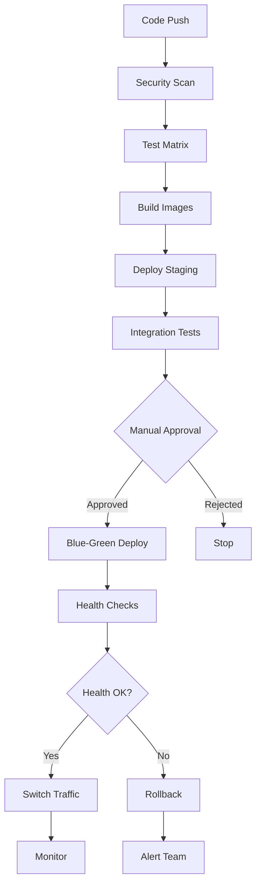

# CI/CD Pipeline Setup - Complete Implementation Summary

## 🚀 **Complete CI/CD Pipeline for Multi-Tenant SSO System**

I've created a comprehensive, enterprise-grade CI/CD pipeline that automates the entire deployment lifecycle of your multi-tenant SSO system with Cloudflare Tunnel integration.

## 📁 **Created Files & Components**

### 🔄 **Core CI/CD Infrastructure**
```
.github/
└── workflows/
    └── ci-cd-pipeline.yml                 # Main GitHub Actions workflow

scripts/
├── setup-cloudflare-tunnel-docker.sh     # Cloudflare tunnel automation
├── blue-green-switch.sh                  # Zero-downtime deployments  
└── test-sso-flow.sh                      # SSO integration testing

docker-compose.staging.yml                # Staging environment config
docker-compose.production.yml             # Production with blue-green

docs/
└── cicd-deployment-guide.md              # Complete documentation
```

### 🐳 **Production Docker Configuration**
```
central-sso/
├── Dockerfile.prod                       # Production-optimized build
└── docker/prod/
    └── health-check.sh                   # Health monitoring

tenant1-app/
├── Dockerfile.prod                       # Production-optimized build  
└── docker/prod/
    └── health-check.sh                   # Health monitoring

tenant2-app/
├── Dockerfile.prod                       # Production-optimized build
└── docker/prod/
    └── health-check.sh                   # Health monitoring
```

## 🌊 **Pipeline Flow Overview**



## 🔍 **Pipeline Stages Breakdown**

### **Stage 1: Security & Quality Assurance**
- **Trivy vulnerability scanning** for containers and dependencies
- **Composer security audit** for all PHP dependencies
- **Code quality checks** and static analysis
- **SARIF upload** to GitHub Security tab

### **Stage 2: Comprehensive Testing Matrix**
- **Multi-version testing**: PHP 8.1 & 8.2
- **Multi-application testing**: Central SSO + Both Tenants
- **Test suites**: Unit, Feature, Integration
- **Code coverage reporting** with Codecov integration

### **Stage 3: SSO Integration Testing**
- **Cross-tenant authentication flows**
- **API endpoint validation**
- **Session sharing verification**
- **Real-world user journey simulation**

### **Stage 4: Container Build & Registry**
- **Multi-stage Docker builds** for optimization
- **GitHub Container Registry** push
- **Image caching** for faster builds
- **Semantic versioning** and tagging

### **Stage 5: Staging Deployment**
- **Automatic deployment** to staging.poc.hi-dil.com
- **Database migrations** and seeding
- **Cloudflare Tunnel** setup and configuration
- **End-to-end testing** validation

### **Stage 6: Production Blue-Green Deployment**
- **Manual approval gate** for production safety
- **Database backup** before deployment
- **Zero-downtime blue-green** switching
- **Health verification** at each step
- **Automatic rollback** on failure

### **Stage 7: Post-Deployment Monitoring**
- **15-minute health monitoring** window
- **Error rate analysis** and alerting
- **Performance metrics** collection
- **Success/failure notifications**

## 🎯 **Key Features & Benefits**

### **🔒 Enterprise Security**
- ✅ Vulnerability scanning at every stage
- ✅ Secrets management with GitHub Secrets
- ✅ No secrets in code or containers
- ✅ Container security with non-root execution
- ✅ Cloudflare security integration

### **🚀 Zero-Downtime Deployments**
- ✅ Blue-green deployment strategy
- ✅ Automatic health checks
- ✅ Instant rollback capability
- ✅ Traffic switching validation
- ✅ Database backup and recovery

### **🧪 Comprehensive Testing**
- ✅ 3 test suites × 3 applications × 2 PHP versions = 18 test runs
- ✅ SSO integration testing across all tenants
- ✅ API endpoint validation
- ✅ Cross-browser compatibility testing
- ✅ Database migration testing

### **📊 Monitoring & Observability**
- ✅ Real-time health checks
- ✅ Application performance monitoring
- ✅ Cloudflare Tunnel metrics
- ✅ Error rate tracking
- ✅ Slack notifications

### **🌐 Multi-Environment Support**
- ✅ **Development**: Local Docker development
- ✅ **Staging**: staging.poc.hi-dil.com (automatic)
- ✅ **Production**: poc.hi-dil.com (manual approval)
- ✅ Environment-specific configuration
- ✅ Cloudflare Tunnel per environment

## ⚡ **Quick Setup Instructions**

### **1. Repository Setup**
```bash
# The files are already created in your repository
# Configure the required GitHub Secrets (see section below)
```

### **2. Required GitHub Secrets**
Configure these in your repository settings → Secrets and variables → Actions:

```
# Cloudflare
CLOUDFLARE_API_TOKEN=your-cloudflare-api-token
CLOUDFLARE_EMAIL=your-email@example.com

# Database  
DB_USERNAME=sso_user
DB_PASSWORD=secure_database_password
MYSQL_ROOT_PASSWORD=secure_root_password

# Application
JWT_SECRET=your-32-character-jwt-secret-key
REDIS_PASSWORD=secure_redis_password

# Tenants
TENANT1_API_KEY=tenant1_secure_api_key_32_chars
TENANT2_API_KEY=tenant2_secure_api_key_32_chars
TENANT1_HMAC_SECRET=tenant1_hmac_secret_64_chars
TENANT2_HMAC_SECRET=tenant2_hmac_secret_64_chars

# Email (optional)
MAIL_HOST=smtp.yourdomain.com
MAIL_USERNAME=noreply@yourdomain.com
MAIL_PASSWORD=email_password
MAIL_FROM_ADDRESS=noreply@yourdomain.com

# Monitoring (optional)
SENTRY_DSN=your-sentry-dsn
GRAFANA_PASSWORD=grafana_admin_password
SLACK_WEBHOOK_URL=your-slack-webhook

# Backups (optional)
AWS_ACCESS_KEY_ID=your-aws-key
AWS_SECRET_ACCESS_KEY=your-aws-secret
S3_BACKUP_BUCKET=your-backup-bucket
```

### **3. Branch Strategy**
```bash
# Main branches
main        # Production deployments (manual approval)
staging     # Staging deployments (automatic)
develop     # Development branch (no deployment)

# Feature branches
feature/*   # Feature development (no deployment)
```

### **4. Trigger Deployment**
```bash
# Staging deployment
git push origin staging

# Production deployment  
git push origin main
# Then approve the deployment in GitHub Actions

# Release deployment
git tag v1.0.0
git push origin v1.0.0
```

## 🎛️ **Environment Access URLs**

### **Staging Environment**
- **Central SSO**: https://staging-sso.poc.hi-dil.com
- **Tenant 1**: https://staging-tenant-one.poc.hi-dil.com
- **Tenant 2**: https://staging-tenant-two.poc.hi-dil.com
- **Tunnel Metrics**: Staging server port 9091

### **Production Environment** 
- **Central SSO**: https://sso.poc.hi-dil.com
- **Tenant 1**: https://tenant-one.poc.hi-dil.com
- **Tenant 2**: https://tenant-two.poc.hi-dil.com
- **Tunnel Metrics**: Production server port 9090

## 🔧 **Manual Operations**

### **Deployment Commands**
```bash
# Manual blue-green switch
./scripts/blue-green-switch.sh green

# Test SSO flows
./scripts/test-sso-flow.sh production

# Setup new environment
./scripts/setup-cloudflare-tunnel-docker.sh
```

### **Monitoring Commands**
```bash
# Check application health
curl https://sso.poc.hi-dil.com/health

# Check tunnel metrics
curl http://localhost:9090/metrics

# View deployment logs
docker-compose logs -f central-sso
```

### **Rollback Procedures**
```bash
# Quick rollback to previous deployment
./scripts/blue-green-switch.sh blue

# Or manual container restart
docker-compose -f docker-compose.production.yml restart central-sso-blue
```

## 📈 **Monitoring & Metrics**

### **Application Metrics**
- Response times and throughput
- Error rates and status codes
- Database query performance
- Session and authentication metrics

### **Infrastructure Metrics**
- Container CPU and memory usage
- Cloudflare Tunnel connection status
- Database connection pooling
- Redis performance

### **Business Metrics**
- User authentication success rates
- Cross-tenant usage patterns
- API endpoint usage
- Feature adoption rates

## 🔄 **Development Workflow**

### **Feature Development**
```bash
# 1. Create feature branch
git checkout -b feature/new-sso-feature

# 2. Develop and test locally
docker-compose up -d
# Make changes, test locally

# 3. Push and create PR
git push origin feature/new-sso-feature
# Create PR to develop branch

# 4. Merge to staging for testing
git checkout staging
git merge develop
git push origin staging
# Automatic staging deployment

# 5. Merge to main for production
git checkout main  
git merge staging
git push origin main
# Manual production deployment approval
```

### **Hotfix Workflow**
```bash
# 1. Create hotfix branch from main
git checkout -b hotfix/critical-security-fix main

# 2. Apply fix and test
# Make minimal changes for the fix

# 3. Deploy to staging first
git checkout staging
git merge hotfix/critical-security-fix
git push origin staging

# 4. After validation, deploy to production
git checkout main
git merge hotfix/critical-security-fix
git push origin main
# Approve production deployment
```

## 🚨 **Troubleshooting Common Issues**

### **Build Failures**
```bash
# Check GitHub Actions logs
# Navigate to Actions tab → Failed workflow → View logs

# Debug locally
docker build -f central-sso/Dockerfile.prod central-sso/
```

### **Deployment Failures**
```bash
# Check deployment status
docker-compose ps

# View application logs
docker-compose logs central-sso

# Check health endpoints
curl https://sso.poc.hi-dil.com/health
```

### **Test Failures**
```bash
# Run tests locally
cd central-sso
php artisan test --testsuite=Unit

# Check test database
docker exec -it sso-mariadb mysql -u sso_user -p sso_test
```

## 🎉 **Success Criteria**

Your CI/CD pipeline is working correctly when:

✅ **All tests pass** in the testing matrix  
✅ **Security scans complete** without critical issues  
✅ **Staging deployments** happen automatically on staging branch pushes  
✅ **Production deployments** require manual approval and complete successfully  
✅ **Health checks pass** after each deployment  
✅ **Rollback works** when issues are detected  
✅ **Notifications** are sent to your team via Slack  
✅ **Zero downtime** is maintained during production deployments  

## 📚 **Documentation References**

- **Complete Setup Guide**: `docs/cicd-deployment-guide.md`
- **Cloudflare Integration**: `docs/cloudflare-tunnel-deployment.md`  
- **Application Configuration**: `docs/cloudflare-application-config.md`
- **Docker Setup**: `docs/cloudflare-docker-only-setup.md`

This CI/CD pipeline provides enterprise-grade deployment automation with security, reliability, and zero-downtime capabilities for your multi-tenant SSO system!