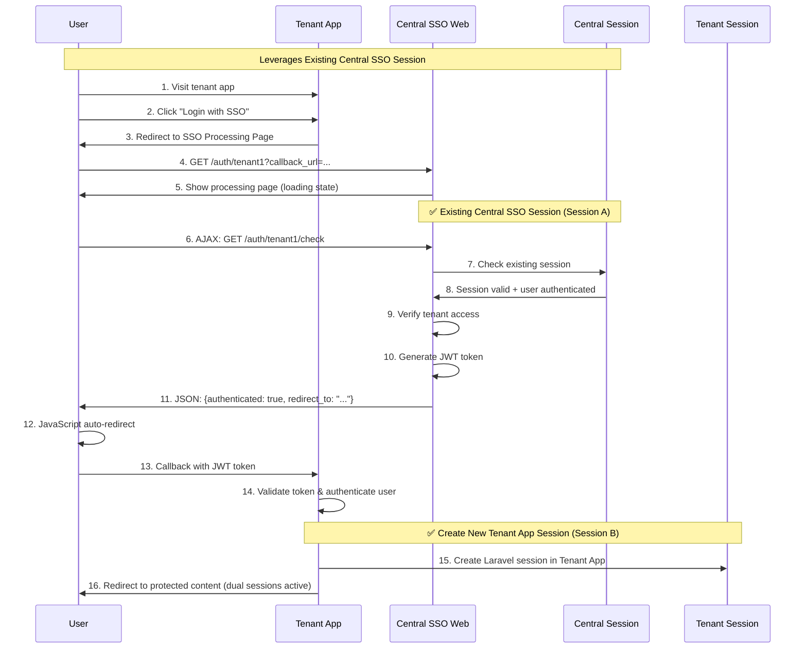
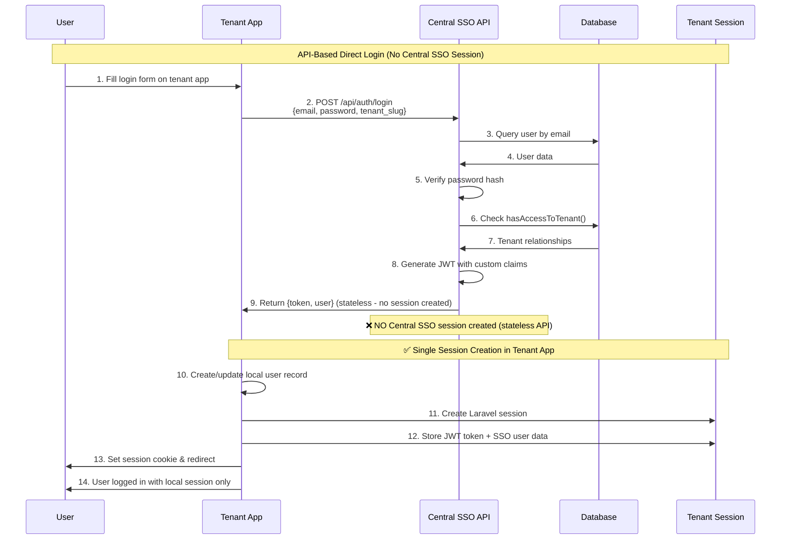
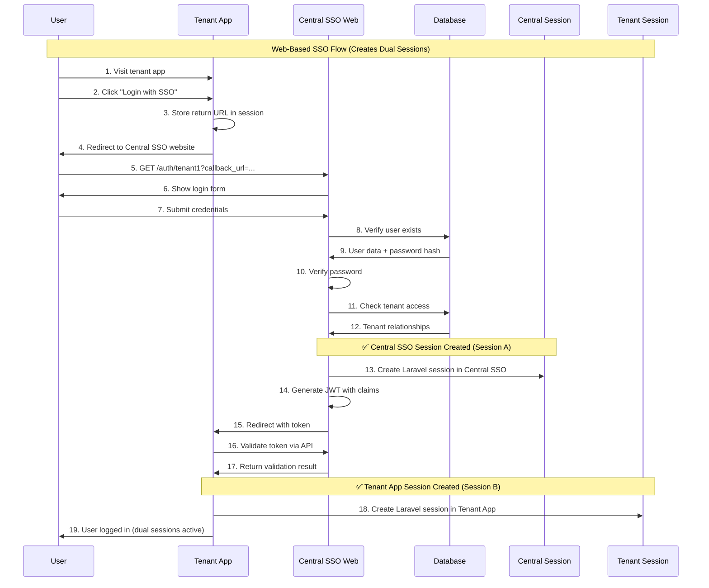

# Authentication Systems

Complete guide to authentication flows, session management, and security in the multi-tenant SSO system.

## 🏗️ Architecture Overview

The SSO system implements a **flexible session architecture** that varies by authentication method:
- **Direct Login (API)**: Single session in tenant app only (stateless central SSO)
- **SSO Redirect/Seamless**: Dual sessions in both central SSO and tenant app

```
┌─────────────────────────────────────────────────────────────────┐
│                   Authentication Architecture                   │
├─────────────────────────────────────────────────────────────────┤
│                                                                 │
│  ┌─────────────┐    ┌─────────────┐    ┌─────────────┐         │
│  │ Tenant App  │    │ Tenant App  │    │ Central SSO │         │
│  │ (Laravel)   │    │ (Laravel)   │    │ (Laravel)   │         │
│  │ Port 8001   │    │ Port 8002   │    │ Port 8000   │         │
│  └─────┬───────┘    └─────┬───────┘    └─────┬───────┘         │
│        │                  │                  │                 │
│        │         JWT Authentication          │                 │
│        └──────────────────┼──────────────────┘                 │
│                           │                                    │
│                  ┌────────┴────────┐                           │
│                  │   MariaDB       │                           │
│                  │ ┌─────────────┐ │                           │
│                  │ │ sso_main    │ │                           │
│                  │ │ tenant1_db  │ │                           │
│                  │ │ tenant2_db  │ │                           │
│                  │ └─────────────┘ │                           │
│                  └─────────────────┘                           │
└─────────────────────────────────────────────────────────────────┘
```

## 🔐 Authentication Methods

The system supports multiple authentication approaches to provide flexibility and optimal user experience:

### 1. **Seamless SSO Flow** (Primary Method)
- User clicks "Login with SSO" in tenant app
- JavaScript-based authentication checking
- Auto-login for authenticated users
- No unnecessary login forms

### 2. **Direct Login** (Dual-Session)
- User fills login form directly in tenant app
- Credentials validated through central SSO API
- Local Laravel session created
- Best performance for repeat visits

### 3. **Traditional SSO Redirect**
- Full redirect to central SSO for authentication
- Return to tenant app with JWT token
- Classic SSO experience

### 4. **API Authentication**
- Direct API calls with JWT tokens
- Programmatic access for integrations
- Stateless authentication

## 🔄 Authentication Flows

### Seamless SSO Flow (Web-Based - Leverages Existing Session)



**Benefits:**
- **Seamless UX**: No login forms for authenticated users
- **Fast Response**: JavaScript-based checking
- **Loading States**: Clear progress indication
- **Graceful Fallback**: Login form when needed

### Direct Login (API-Based - Single Session)



**Benefits:**
- **🎯 Centralized Authentication**: All credentials validated by central SSO API
- **⚡ Single Session**: Only tenant app session created (no central SSO session)
- **🚀 High Performance**: Stateless API calls, minimal server load
- **🔄 User Data Sync**: Auto-sync on login via API response
- **📊 Audit Trail**: All authentications tracked centrally
- **📈 Scalability**: No session storage in central SSO for API requests

### Traditional SSO Redirect (Web-Based - Dual Sessions)



## 🔑 JWT Token Management

### Token Structure

```json
{
  "header": {
    "typ": "JWT",
    "alg": "HS256"
  },
  "payload": {
    "sub": "25",
    "iss": "central-sso",
    "aud": "tenant-applications",
    "iat": 1693123456,
    "exp": 1693127056,
    "user_id": 25,
    "email": "superadmin@sso.com",
    "name": "Super Admin",
    "tenants": ["tenant1", "tenant2"],
    "current_tenant": "tenant1",
    "is_admin": true,
    "permissions": ["users.view", "tenants.manage"]
  }
}
```

### Token Validation Process

```php
// In tenant application
public function validateJWT($token, $tenantSlug)
{
    try {
        // Decode JWT token
        $payload = JWT::decode($token, $this->jwtSecret, ['HS256']);
        
        // Verify token is not expired
        if ($payload->exp < time()) {
            throw new TokenExpiredException();
        }
        
        // Verify user has access to this tenant
        if (!in_array($tenantSlug, $payload->tenants)) {
            throw new UnauthorizedTenantException();
        }
        
        return [
            'valid' => true,
            'user_id' => $payload->user_id,
            'user_data' => $payload
        ];
        
    } catch (Exception $e) {
        return ['valid' => false, 'error' => $e->getMessage()];
    }
}
```

### Token Refresh Strategy

```php
// Automatic token refresh
public function refreshTokenIfNeeded($token)
{
    $payload = JWT::decode($token, $this->jwtSecret, ['HS256']);
    
    // Refresh if token expires within 10 minutes
    if ($payload->exp - time() < 600) {
        $response = $this->ssoAPI->post('/api/auth/refresh', [
            'token' => $token
        ]);
        
        if ($response['success']) {
            session(['jwt_token' => $response['token']]);
            return $response['token'];
        }
    }
    
    return $token;
}
```

## 📊 Session Architecture Comparison

> **✅ CONFIRMED**: Analysis based on actual codebase implementation. API login endpoint (`POST /api/auth/login`) is completely stateless and creates no Central SSO session.

### Session Creation by Authentication Type

| Authentication Method | Central SSO Session | Tenant App Session | Total Sessions | Notes |
|----------------------|-------------------|------------------|---------------|-------|
| **Direct Login (API)** | ❌ **No session** | ✅ **Creates session** | **1 Session** | Stateless API call |
| **SSO Redirect** | ✅ **Creates session** | ✅ **Creates session** | **2 Sessions** | Web-based flow |
| **Seamless SSO** | ✅ **Reuses existing** | ✅ **Creates session** | **2 Sessions** | Leverages existing |
| **Pure API Access** | ❌ No session | ❌ No session | **0 Sessions** | Stateless only |

### Session Storage Locations

```php
// Direct Login - Single Session Architecture
// Central SSO: NO SESSION STORAGE (stateless API)
// Tenant App (Port 8001): 1 session file
[
    '_token' => 'tenant_csrf_token',
    'login_web_AUTH_ID' => 123,  // Local tenant user ID
    'jwt_token' => 'eyJ0eXAiOiJKV1QiLCJhbGciOiJIUzI1NiJ9...',
    'sso_user_data' => [
        'id' => 25,  // Central SSO user ID from JWT
        'email' => 'user@tenant1.com'
    ]
]

// SSO Redirect - Dual Session Architecture  
// Central SSO (Port 8000): 1 session file
[
    '_token' => 'central_csrf_token',
    'login_web_AUTH_ID' => 25,  // Central SSO user ID
    'authenticated_tenants' => ['tenant1', 'tenant2'],
    'current_tenant' => 'tenant1'
]

// Tenant App (Port 8001): 1 session file  
[
    '_token' => 'tenant_csrf_token',
    'login_web_AUTH_ID' => 123,  // Local tenant user ID
    'jwt_token' => 'eyJ0eXAiOiJKV1QiLCJhbGciOiJIUzI1NiJ9...',
    'sso_user_data' => [...]
]
```

### Performance & Scalability Impact

```php
// Performance comparison by authentication type
public function getPerformanceMetrics()
{
    return [
        'direct_login' => [
            'central_sso_load' => 'Low (stateless API only)',
            'session_files' => 1,
            'memory_usage' => 'Lower',
            'scalability' => 'Excellent (stateless)',
            'complexity' => 'Simple (single session)'
        ],
        'sso_redirect' => [
            'central_sso_load' => 'Higher (web sessions + API)',
            'session_files' => 2,
            'memory_usage' => 'Higher', 
            'scalability' => 'Good (but session overhead)',
            'complexity' => 'Complex (dual session sync)'
        ]
    ];
}
```

### API vs Web Interface Distinction

```php
// Direct Login - API Endpoint (No Session) - CONFIRMED STATELESS
// Route: POST /api/auth/login
public function login(Request $request)
{
    // ❌ NO session operations - completely stateless
    $user = User::where('email', $request->email)->first();
    
    if ($user && Hash::check($request->password, $user->password)) {
        // Generate JWT token (no session creation)
        $token = JWTAuth::customClaims($customClaims)->fromUser($user);
        
        // Record audit (no session ID - uses null)
        $this->auditService->recordLogin($user, $tenant, 'api', null);
        
        // Return JSON - no session storage in Central SSO
        return response()->json([
            'success' => true,
            'token' => $token,
            'user' => $userDto->toArray()
        ]);
    }
    
    return response()->json(['error' => 'Invalid credentials'], 401);
}

// Key differences from web login:
// ❌ No auth()->login() call
// ❌ No session()->put() operations  
// ❌ No Laravel session creation
// ❌ No session cookie setting
// ✅ Only JWT generation and JSON response

// SSO Redirect - Web Interface (Creates Session)  
// Route: GET /auth/tenant1
public function webLogin(Request $request)
{
    // ✅ Traditional web login - DOES create session
    if (auth()->attempt($credentials)) {
        // Laravel automatically creates session
        session()->regenerate();
        
        $token = $this->generateJWT(auth()->user());
        return redirect($callbackUrl . '?token=' . $token);
    }
    
    return back()->withErrors('Invalid credentials');
}
```

## 🗂️ Session Management

### Session Data Structure

The session architecture varies by authentication method. Direct Login creates single sessions, while SSO flows create dual sessions:

```php
// Laravel Session Storage
session([
    // Standard Laravel Auth
    '_token' => 'CSRF_TOKEN',
    'login_web_AUTH_ID' => 123,  // Local user ID
    'login_web_AUTH_PASSWORD_HASH' => 'hash',
    
    // SSO Integration Data
    'jwt_token' => 'eyJ0eXAiOiJKV1QiLCJhbGciOiJIUzI1NiJ9...',
    'sso_user_data' => [
        'id' => 25,           // Central SSO user ID
        'name' => 'Super Admin',
        'email' => 'superadmin@sso.com',
        'tenants' => ['tenant1', 'tenant2'],
        'current_tenant' => 'tenant1',
        'is_admin' => true
    ]
]);
```

### Session Lifecycle

```php
// During login - create session
public function createSession($user, $jwtToken, $ssoUserData)
{
    // Standard Laravel authentication
    auth()->login($user);
    
    // Store SSO data
    session([
        'jwt_token' => $jwtToken,
        'sso_user_data' => $ssoUserData
    ]);
    
    // Update local user data
    $user->update([
        'sso_user_id' => $ssoUserData['id'],
        'name' => $ssoUserData['name'],
        'email' => $ssoUserData['email'],
        'last_login_at' => now()
    ]);
}

// During request - check session
public function checkSession()
{
    if (!auth()->check()) {
        return false;
    }
    
    $jwtToken = session('jwt_token');
    if (!$jwtToken) {
        auth()->logout();
        return false;
    }
    
    // Optionally validate token with SSO
    $validation = $this->validateTokenWithSSO($jwtToken);
    if (!$validation['valid']) {
        auth()->logout();
        session()->flush();
        return false;
    }
    
    return true;
}
```

### Cross-Tenant Session Sharing

```php
// Middleware to handle cross-tenant access
public function handle($request, Closure $next)
{
    $currentTenant = config('app.tenant_slug');
    $userTenants = session('sso_user_data.tenants', []);
    
    // Check if user has access to current tenant
    if (!in_array($currentTenant, $userTenants)) {
        abort(403, 'Access denied for this tenant');
    }
    
    // Update current tenant in session
    session(['sso_user_data.current_tenant' => $currentTenant]);
    
    return $next($request);
}
```

## 🔒 Security Implementation

### Password Security

```php
// Password hashing (in Central SSO)
public function hashPassword($password)
{
    return Hash::make($password, [
        'rounds' => 12, // Bcrypt rounds
        'memory' => 1024,
        'time' => 2,
        'threads' => 2,
    ]);
}

// Password verification
public function verifyPassword($password, $hashedPassword)
{
    return Hash::check($password, $hashedPassword);
}
```

### CSRF Protection

```php
// In blade templates
<form method="POST" action="/login">
    @csrf
    <!-- form fields -->
</form>

// In middleware stack
protected $middlewareGroups = [
    'web' => [
        \App\Http\Middleware\VerifyCsrfToken::class,
    ],
];
```

### Rate Limiting

```php
// Authentication rate limiting
public function login(Request $request)
{
    $key = 'login_attempts:' . $request->ip();
    $attempts = Cache::get($key, 0);
    
    if ($attempts >= 5) {
        throw new TooManyRequestsException('Too many login attempts');
    }
    
    // Attempt authentication
    $result = $this->attemptAuth($request);
    
    if (!$result['success']) {
        Cache::put($key, $attempts + 1, 300); // 5 minutes
        throw new AuthenticationException('Invalid credentials');
    }
    
    Cache::forget($key);
    return $result;
}
```

### Input Validation

```php
// Request validation
public function login(LoginRequest $request)
{
    // LoginRequest validation rules
    return [
        'email' => 'required|email|max:255',
        'password' => 'required|string|min:8|max:255',
        'tenant_slug' => 'required|string|exists:tenants,slug'
    ];
}

// XSS Protection
public function sanitizeInput($input)
{
    return htmlspecialchars($input, ENT_QUOTES, 'UTF-8');
}
```

## 🔧 API Authentication

### API Login Endpoint

```php
// POST /api/auth/login
public function apiLogin(Request $request)
{
    $request->validate([
        'email' => 'required|email',
        'password' => 'required|string',
        'tenant_slug' => 'required|string'
    ]);
    
    // Find user
    $user = User::where('email', $request->email)->first();
    if (!$user || !Hash::check($request->password, $user->password)) {
        return response()->json(['error' => 'Invalid credentials'], 401);
    }
    
    // Check tenant access
    if (!$user->hasAccessToTenant($request->tenant_slug)) {
        return response()->json(['error' => 'Access denied'], 403);
    }
    
    // Generate JWT
    $token = $this->generateJWTToken($user, $request->tenant_slug);
    
    return response()->json([
        'success' => true,
        'token' => $token,
        'user' => $user->toArray(),
        'expires_in' => config('jwt.ttl') * 60
    ]);
}
```

### Token-Based API Access

```php
// API middleware for token validation
public function handle($request, Closure $next)
{
    $token = $request->bearerToken();
    
    if (!$token) {
        return response()->json(['error' => 'Token required'], 401);
    }
    
    try {
        $payload = JWT::decode($token, config('jwt.secret'), ['HS256']);
        $request->attributes->set('jwt_payload', $payload);
        $request->attributes->set('user_id', $payload->user_id);
        
    } catch (Exception $e) {
        return response()->json(['error' => 'Invalid token'], 401);
    }
    
    return $next($request);
}

// Using in API routes
Route::middleware('jwt.auth')->group(function () {
    Route::get('/profile', 'ProfileController@show');
    Route::post('/logout', 'AuthController@logout');
});
```

## 🔄 Logout Implementation

### Single Application Logout

```php
public function logout(Request $request)
{
    // Invalidate JWT token (add to blacklist)
    $token = session('jwt_token');
    if ($token) {
        $this->blacklistToken($token);
    }
    
    // Laravel logout
    auth()->logout();
    
    // Clear session
    session()->flush();
    
    // Regenerate session ID
    session()->regenerate();
    
    return redirect('/login');
}
```

### Global SSO Logout

```php
public function globalLogout(Request $request)
{
    $jwtToken = session('jwt_token');
    
    // Call Central SSO logout endpoint
    $response = Http::post(config('sso.central_url') . '/api/auth/logout', [
        'token' => $jwtToken
    ]);
    
    // Local logout
    auth()->logout();
    session()->flush();
    session()->regenerate();
    
    // Redirect to Central SSO for complete logout
    return redirect(config('sso.central_url') . '/logout?redirect=' . urlencode(request()->url()));
}
```

## 🧪 Testing Authentication

### Unit Tests

```php
public function test_user_can_login_with_valid_credentials()
{
    $user = User::factory()->create([
        'email' => 'test@example.com',
        'password' => Hash::make('password')
    ]);
    
    $response = $this->post('/api/auth/login', [
        'email' => 'test@example.com',
        'password' => 'password',
        'tenant_slug' => 'tenant1'
    ]);
    
    $response->assertOk()
            ->assertJsonStructure(['token', 'user', 'expires_in']);
}

public function test_jwt_token_validation()
{
    $user = User::factory()->create();
    $token = $this->generateJWTToken($user, 'tenant1');
    
    $response = $this->withHeaders([
        'Authorization' => 'Bearer ' . $token
    ])->get('/api/profile');
    
    $response->assertOk();
}
```

### Integration Tests

```php
public function test_cross_tenant_authentication_flow()
{
    // Login to tenant1
    $this->post('/login', [
        'email' => 'superadmin@sso.com',
        'password' => 'password'
    ]);
    
    // Access tenant2 with SSO
    $response = $this->get('http://localhost:8002/auth/sso');
    $response->assertRedirect(); // Should auto-login
    
    // Verify access to tenant2
    $this->followRedirects($response)
         ->assertSee('Tenant 2 Dashboard');
}
```

## 📊 Authentication Metrics

### Login Audit Tracking

```php
// Track all authentication attempts
public function recordLoginAttempt($email, $tenantSlug, $success, $metadata = [])
{
    LoginAudit::create([
        'email' => $email,
        'tenant_slug' => $tenantSlug,
        'success' => $success,
        'ip_address' => request()->ip(),
        'user_agent' => request()->userAgent(),
        'login_method' => $metadata['method'] ?? 'standard',
        'metadata' => json_encode($metadata),
        'attempted_at' => now()
    ]);
}

// Usage in authentication
public function authenticate($credentials)
{
    $success = $this->attemptAuth($credentials);
    
    $this->recordLoginAttempt(
        $credentials['email'],
        $credentials['tenant_slug'],
        $success,
        ['method' => 'direct_login']
    );
    
    return $success;
}
```

### Performance Monitoring

```php
// Monitor authentication performance
public function monitorAuthPerformance()
{
    $startTime = microtime(true);
    
    // Perform authentication
    $result = $this->authenticate($credentials);
    
    $duration = microtime(true) - $startTime;
    
    // Log performance metrics
    Log::info('Authentication performance', [
        'duration' => $duration,
        'success' => $result['success'],
        'method' => 'dual_session'
    ]);
    
    return $result;
}
```

---

## 🔗 Related Documentation

- **[Multi-Tenancy Design](multi-tenancy.md)** - Tenant architecture and isolation
- **[Database Design](database-design.md)** - Schema and relationships
- **[Security Guide](../guides/security.md)** - Security best practices
- **[API Reference](../reference/api.md)** - Complete API documentation