# SSO Architecture Challenges & Solutions

> **Executive Summary**: This document outlines critical architectural challenges in our current SSO implementation and provides visual solutions for management decision-making.

## 📋 Table of Contents

1. [Executive Summary](#executive-summary)
2. [Current Architecture Overview](#current-architecture-overview)
3. [Challenge #1: Cross-System Permission Verification](#challenge-1-cross-system-permission-verification)
4. [Challenge #2: Sub-Tenant Architecture](#challenge-2-sub-tenant-architecture)
5. [Proposed Solutions](#proposed-solutions)
6. [Business Impact & ROI](#business-impact--roi)
7. [Implementation Roadmap](#implementation-roadmap)
8. [Risk Assessment & Mitigation](#risk-assessment--mitigation)
9. [Executive Recommendations](#executive-recommendations)

---

## Executive Summary

Our current SSO system has **two critical architectural limitations** that are impacting business operations and creating security risks:

```mermaid
graph TB
    subgraph "Current Issues"
        P1[❌ Isolated Permission Systems]
        P2[❌ No Sub-Tenant Support]
        P3[❌ Manual Tenant Creation]
        P4[❌ Security Gaps]
    end
    
    subgraph "Business Impact"
        B1[🔥 Compliance Risk]
        B2[💰 High IT Costs]
        B3[⏱️ Slow Customer Onboarding]
        B4[🛡️ Security Vulnerabilities]
    end
    
    P1 --> B1
    P1 --> B4
    P2 --> B2
    P2 --> B3
    P3 --> B2
    P4 --> B1
    
    style B1 fill:#ff6666
    style B2 fill:#ff9999
    style B3 fill:#ffcc99
    style B4 fill:#ff6666
```

### Key Metrics
- **Current Setup Time**: 3 days per new tenant
- **IT Cost per Tenant**: $500
- **Annual Tenant Requests**: ~500
- **Estimated Annual Waste**: $250,000
- **Security Risk Level**: HIGH

---

## Current Architecture Overview

### System Landscape
```mermaid
graph TB
    subgraph "Current Flat Architecture - PROBLEMATIC"
        SSO[Central SSO Server<br/>🔐 Own Permission System]
        
        subgraph "Tenant Applications"
            T1[Tenant 1: Corporation A<br/>🔐 Own Permission System]
            T2[Tenant 2: Organization B<br/>🔐 Own Permission System]
        end
        
        subgraph "Isolated Databases"
            DB1[(Central SSO DB)]
            DB2[(Tenant 1 DB)]
            DB3[(Tenant 2 DB)]
        end
        
        SSO -.No Permission Bridge.- T1
        SSO -.No Permission Bridge.- T2
        T1 -.Cannot Create Tenants.- T3[❌ New Employer/Tenant]
        
        SSO --> DB1
        T1 --> DB2
        T2 --> DB3
    end
    
    style SSO fill:#ff9999
    style T1 fill:#ffcc99
    style T2 fill:#ffcc99
    style T3 fill:#ff6666,stroke-dasharray: 5 5
    style DB1 fill:#e6e6e6
    style DB2 fill:#e6e6e6
    style DB3 fill:#e6e6e6
```

### Current Authentication Flow
```mermaid
sequenceDiagram
    participant U as User
    participant T1 as Tenant 1 App
    participant SSO as Central SSO
    participant DB as Database
    
    Note over U,DB: Current Login Process - Works Fine
    U->>T1: 1. Login Request
    T1->>SSO: 2. Validate Credentials
    SSO->>DB: 3. Check User
    DB->>SSO: 4. User Data
    SSO->>T1: 5. JWT Token
    T1->>U: 6. Logged In ✓
    
    Note over U,DB: But what happens for admin operations?
```

---

## Challenge #1: Cross-System Permission Verification

### The Problem Explained

Currently, each system maintains its own permissions in isolation:

```mermaid
graph LR
    subgraph "Central SSO Permissions"
        SP1[user.view]
        SP2[user.create]
        SP3[tenant.manage]
        SP4[audit.view]
    end
    
    subgraph "Tenant 1 Permissions"
        TP1[employee.view]
        TP2[employee.edit]
        TP3[payroll.manage]
        TP4[report.generate]
    end
    
    subgraph "Gap: No Bridge"
        GAP[❌ No Connection<br/>❌ No Verification<br/>❌ Security Risk]
    end
    
    SP1 -.-> GAP
    TP1 -.-> GAP
    
    style GAP fill:#ff6666
```

### Real-World Problem Scenario

**Scenario**: Tenant 1 admin wants to update employee information

```mermaid
sequenceDiagram
    participant Admin as Tenant 1 Admin
    participant T1 as Tenant 1 App
    participant User as Employee Data
    participant SSO as Central SSO
    
    Note over Admin,SSO: ❌ CURRENT PROBLEM FLOW
    
    Admin->>T1: Update Employee Info
    Note right of Admin: Admin has permission<br/>in Tenant 1 system ✓
    
    T1->>T1: Check Local Permissions
    Note right of T1: Local check passes ✓
    
    T1->>User: Update Local Database
    Note right of User: Data updated locally ✓
    
    T1->>SSO: Sync to Central SSO
    Note right of SSO: ⚠️ NO PERMISSION CHECK!<br/>Central SSO blindly accepts<br/>any data from Tenant 1
    
    SSO->>SSO: Update Central Database
    Note right of SSO: 🚨 SECURITY RISK!<br/>No verification if Tenant 1<br/>admin should modify this user
    
    rect rgb(255, 200, 200)
        Note over Admin,SSO: CRITICAL GAP: Central SSO cannot verify<br/>if the Tenant 1 admin actually has permission<br/>to modify this specific user's data
    end
```

### Business Risks

```mermaid
graph TD
    subgraph "Security Risks"
        A[Unauthorized Data Changes] -->|Leads to| B[Data Breach]
        C[No Permission Verification] -->|Creates| D[Compliance Violations]
        E[Missing Audit Trail] -->|Results in| F[Legal Liability]
    end
    
    subgraph "Business Impact"
        B -->|Causes| G[💰 Financial Penalties]
        D -->|Triggers| H[🔍 Regulatory Scrutiny]
        F -->|Damages| I[📉 Company Reputation]
    end
    
    subgraph "Cost Estimates"
        G --> J[$50,000 - $500,000<br/>GDPR/SOX Fines]
        H --> K[$100,000+<br/>Audit Costs]
        I --> L[Unmeasurable<br/>Customer Loss]
    end
    
    style A fill:#ff6666
    style C fill:#ff6666
    style E fill:#ff6666
    style J fill:#ff0000
    style K fill:#ff0000
    style L fill:#ff0000
```

### Permission Verification Gap Analysis

```mermaid
flowchart TB
    subgraph "What We Have Now"
        H1[Tenant 1: Can edit employees] 
        H2[Central SSO: Stores user data]
        H3[No communication between systems]
    end
    
    subgraph "What We Need"
        N1[Unified permission checking]
        N2[Cross-system authorization]
        N3[Complete audit trail]
    end
    
    subgraph "The Gap"
        G1[🚫 Cannot verify permissions across systems]
        G2[🚫 No audit of cross-system operations]
        G3[🚫 Security vulnerabilities]
    end
    
    H1 -.-> G1
    H2 -.-> G2
    H3 -.-> G3
    
    G1 --> N1
    G2 --> N2
    G3 --> N3
    
    style G1 fill:#ff6666
    style G2 fill:#ff6666
    style G3 fill:#ff6666
    style N1 fill:#90EE90
    style N2 fill:#90EE90
    style N3 fill:#90EE90
```

---

## Challenge #2: Sub-Tenant Architecture

### The Business Requirement

**Current Need**: Tenant 1 (a corporation) wants to create multiple "employers" as separate tenants.

```mermaid
graph TB
    subgraph "Business Requirement"
        CORP[Tenant 1: Corporation]
        
        CORP -->|Wants to Create| E1[Employer A]
        CORP -->|Wants to Create| E2[Employer B]
        CORP -->|Wants to Create| E3[Employer C]
        
        CORP -->|Should Manage| E1
        CORP -->|Should Manage| E2
        CORP -->|Should Manage| E3
    end
    
    subgraph "Current System Limitation"
        CORP2[Tenant 1] 
        CORP2 -.❌ Cannot Create.-> E1X[Employer A]
        ADMIN[Only System Admin] -->|Manual Process| E1X
    end
    
    style E1X fill:#ff6666,stroke-dasharray: 5 5
    style ADMIN fill:#ffcc99
```

### Why Sub-Tenants Make Business Sense

```mermaid
graph LR
    subgraph "Organizational Hierarchy"
        subgraph "Parent Company"
            P[Corporation<br/>🏢 Tenant 1]
        end
        
        subgraph "Subsidiaries"
            S1[Employer A<br/>🏭 Sub-Tenant]
            S2[Employer B<br/>🏪 Sub-Tenant]
            S3[Employer C<br/>🏗️ Sub-Tenant]
        end
        
        P -->|Owns| S1
        P -->|Owns| S2
        P -->|Owns| S3
    end
    
    subgraph "Benefits"
        B1[✓ Clear Ownership]
        B2[✓ Permission Inheritance]
        B3[✓ Billing Hierarchy]
        B4[✓ Easier Management]
    end
    
    style P fill:#ADD8E6
    style S1 fill:#E6E6FA
    style S2 fill:#E6E6FA
    style S3 fill:#E6E6FA
    style B1 fill:#90EE90
    style B2 fill:#90EE90
    style B3 fill:#90EE90
    style B4 fill:#90EE90
```

### Current vs. Desired Architecture


### Current Manual Process Problems

```mermaid
flowchart LR
    subgraph "Current Manual Process - EXPENSIVE & SLOW"
        A[Business Request:<br/>New Employer Needed] 
        A -->|1. Email/Ticket| B[IT Admin]
        B -->|2. Manual Work<br/>2-3 Days| C[Database Entry]
        C -->|3. Manual Config<br/>1 Day| D[System Setup]
        D -->|4. Manual Testing<br/>1 Day| E[Access Configuration]
        E -->|5. Finally| F[Employer Ready]
    end
    
    subgraph "Problems"
        P1[💰 $500 per Setup]
        P2[⏱️ 3-5 Day Delay]
        P3[👨‍💻 IT Bottleneck]
        P4[❌ Error Prone]
        P5[📋 No Audit Trail]
    end
    
    F -.-> P1
    F -.-> P2
    F -.-> P3
    F -.-> P4
    F -.-> P5
    
    style A fill:#ffcc99
    style B fill:#ff9999
    style P1 fill:#ff6666
    style P2 fill:#ff6666
    style P3 fill:#ff9999
    style P4 fill:#ff6666
    style P5 fill:#ff6666
```

### Scalability Issue

```mermaid
graph TB
    subgraph "Growth Projection"
        Y1[Year 1: 50 Employers] 
        Y2[Year 2: 150 Employers]
        Y3[Year 3: 400 Employers]
        Y4[Year 4: 800 Employers]
    end
    
    subgraph "Manual Process Costs"
        C1[$25,000 IT Cost]
        C2[$75,000 IT Cost]
        C3[$200,000 IT Cost]
        C4[$400,000 IT Cost]
    end
    
    Y1 --> C1
    Y2 --> C2
    Y3 --> C3
    Y4 --> C4
    
    subgraph "Breaking Point"
        BREAK[🚨 System Breaks Down<br/>Cannot Scale Manually]
    end
    
    C3 --> BREAK
    C4 --> BREAK
    
    style BREAK fill:#ff0000
    style C3 fill:#ff6666
    style C4 fill:#ff0000
```

---

## Proposed Solutions

### Solution Architecture Overview

```mermaid
graph TB
    subgraph "Proposed Unified Architecture"
        SSO[Central SSO<br/>🔐 Master Permission System]
        API[Permission Verification API<br/>🔗 Cross-System Bridge]
        
        subgraph "Main Tenants"
            T1[Tenant 1: Corporation<br/>🔐 Local + Federated Permissions]
            T2[Tenant 2: Organization<br/>🔐 Local + Federated Permissions]
        end
        
        subgraph "Sub-Tenants (Hierarchical)"
            ST1[Employer A<br/>👶 Inherits from Tenant 1]
            ST2[Employer B<br/>👶 Inherits from Tenant 1]
            ST3[Employer C<br/>👶 Inherits from Tenant 1]
        end
        
        SSO <--> API
        API <--> T1
        API <--> T2
        
        T1 -->|Parent| ST1
        T1 -->|Parent| ST2
        T1 -->|Parent| ST3
        
        SSO -.Management.-> T1
        SSO -.Management.-> T2
    end
    
    style SSO fill:#90EE90
    style API fill:#87CEEB
    style T1 fill:#ADD8E6
    style T2 fill:#ADD8E6
    style ST1 fill:#E6E6FA
    style ST2 fill:#E6E6FA
    style ST3 fill:#E6E6FA
```

### Solution #1: Permission Verification API

```mermaid
sequenceDiagram
    participant Admin as Tenant 1 Admin
    participant T1 as Tenant 1 App
    participant API as Permission API
    participant SSO as Central SSO
    participant User as User Data
    
    Note over Admin,User: ✅ PROPOSED SECURE FLOW
    
    Admin->>T1: Update Employee Info
    Note right of Admin: Admin request to update data
    
    T1->>API: Verify Cross-System Permission
    Note right of T1: Before any changes,<br/>verify authorization
    
    API->>SSO: Check Admin Rights for User
    Note right of API: "Can Tenant 1 Admin<br/>modify this specific user?"
    
    SSO->>SSO: Validate Permission
    Note right of SSO: Check: User belongs to Tenant 1<br/>Check: Admin has user.edit permission<br/>Check: Operation is authorized
    
    SSO->>API: ✅ Permission Granted
    Note right of SSO: Authorization confirmed<br/>with audit logging
    
    API->>T1: ✅ Authorized to Proceed
    Note right of API: Safe to continue<br/>operation approved
    
    T1->>User: Update Data
    Note right T1: Now safely update<br/>with full authorization
    
    T1->>SSO: Sync with Audit Trail
    Note right of SSO: Complete audit trail:<br/>Who, What, When, Why<br/>Full traceability
    
    rect rgb(200, 255, 200)
        Note over Admin,User: SECURE: Every cross-system operation<br/>is verified and audited
    end
```

### Solution #2: Hierarchical Tenant Model

**Database Schema Enhancement:**


**Hierarchical Structure:**

```mermaid
graph TB
    subgraph "Hierarchical Tenant Structure"
        ROOT[Central SSO<br/>🏛️ Root Authority]
        
        subgraph "Level 1: Main Tenants"
            T1[Tenant 1: Corporation<br/>🏢 parent_tenant_id: NULL]
            T2[Tenant 2: Organization<br/>🏛️ parent_tenant_id: NULL]
        end
        
        subgraph "Level 2: Sub-Tenants"
            ST1[Employer A<br/>🏭 parent_tenant_id: tenant1]
            ST2[Employer B<br/>🏪 parent_tenant_id: tenant1]
            ST3[Employer C<br/>🏗️ parent_tenant_id: tenant1]
        end
        
        subgraph "Level 3: Sub-Sub-Tenants (Future)"
            SST1[Department X<br/>🏢 parent_tenant_id: employer-a]
            SST2[Branch Y<br/>🏬 parent_tenant_id: employer-b]
        end
        
        ROOT -.Controls.-> T1
        ROOT -.Controls.-> T2
        
        T1 -->|Owns & Manages| ST1
        T1 -->|Owns & Manages| ST2
        T1 -->|Owns & Manages| ST3
        
        ST1 -.Future.-> SST1
        ST2 -.Future.-> SST2
    end
    
    style ROOT fill:#90EE90
    style T1 fill:#ADD8E6
    style T2 fill:#ADD8E6
    style ST1 fill:#E6E6FA
    style ST2 fill:#E6E6FA
    style ST3 fill:#E6E6FA
    style SST1 fill:#F0F8FF,stroke-dasharray: 5 5
    style SST2 fill:#F0F8FF,stroke-dasharray: 5 5
```

### Solution #3: Automated Sub-Tenant Creation

```mermaid
sequenceDiagram
    participant Admin as Tenant 1 Admin
    participant T1 as Tenant 1 App
    participant API as Tenant Creation API
    participant Auth as Permission Service
    participant SSO as Central SSO
    participant DB as Database
    
    Note over Admin,DB: Automated Sub-Tenant Creation Flow
    
    Admin->>T1: Create New Employer
    Note right of Admin: "I need a new<br/>employer tenant"
    
    T1->>API: Request Sub-Tenant Creation
    Note right of T1: POST /api/tenants/create<br/>parent_tenant: "tenant1"
    
    API->>Auth: Verify Admin Rights
    Note right of API: "Can this admin<br/>create sub-tenants?"
    
    Auth->>SSO: Check Parent Tenant Permissions
    Note right of Auth: Verify: Admin belongs to Tenant 1<br/>Verify: Has "tenant.create" permission<br/>Verify: Can create sub-tenants
    
    SSO->>Auth: ✅ Permission Granted
    Note right of SSO: Admin authorized<br/>to create sub-tenants
    
    Auth->>API: ✅ Authorized
    Note right of Auth: Safe to proceed<br/>with tenant creation
    
    API->>DB: Create Sub-Tenant Record
    Note right of API: INSERT INTO tenants<br/>SET parent_tenant_id = 'tenant1'
    
    API->>DB: Set Up Permissions
    Note right of API: Grant Tenant 1 admins<br/>management rights over sub-tenant
    
    API->>SSO: Configure SSO Routes
    Note right of API: Set up authentication endpoints<br/>for new sub-tenant
    
    API->>T1: ✅ Sub-Tenant Created
    Note right of API: Return sub-tenant details<br/>and access information
    
    T1->>Admin: ✅ Employer Ready!
    Note right of T1: "Employer tenant created<br/>and ready to use"
    
    rect rgb(200, 255, 200)
        Note over Admin,DB: AUTOMATED: 5-minute self-service<br/>vs. 3-day manual process
    end
```

### Integrated Solution Benefits

```mermaid
graph TB
    subgraph "Current State"
        C1[❌ Manual Tenant Creation]
        C2[❌ Isolated Permissions]
        C3[❌ Security Gaps]
        C4[❌ High IT Costs]
    end
    
    subgraph "Proposed Solutions"
        S1[🤖 Automated Creation API]
        S2[🔗 Permission Bridge]
        S3[🛡️ Unified Security]
        S4[💰 Cost Reduction]
    end
    
    subgraph "Business Benefits"
        B1[⚡ 5-Minute Setup]
        B2[🔒 Complete Security]
        B3[📊 Full Audit Trail]
        B4[💡 Self-Service]
        B5[📈 Infinite Scalability]
    end
    
    C1 --> S1 --> B1
    C2 --> S2 --> B2
    C3 --> S3 --> B3
    C4 --> S4 --> B4
    
    S1 --> B5
    S2 --> B5
    
    style C1 fill:#ff6666
    style C2 fill:#ff6666
    style C3 fill:#ff6666
    style C4 fill:#ff6666
    style B1 fill:#90EE90
    style B2 fill:#90EE90
    style B3 fill:#90EE90
    style B4 fill:#90EE90
    style B5 fill:#00ff00
```

---

## Business Impact & ROI

### Cost-Benefit Analysis

```mermaid
graph TB
    subgraph "Current Annual Costs"
        AC1[500 Tenant Requests/Year]
        AC2[$500 per Tenant Setup]
        AC3[3 Days per Setup]
        AC4[2 IT Staff Hours per Setup]
        
        TOTAL_CURRENT[💰 Total: $250,000/year<br/>⏱️ Time: 1,500 hours/year<br/>🚫 Risk: HIGH]
    end
    
    subgraph "Proposed Solution Investment"
        I1[4-6 Week Development]
        I2[2 Senior Developers]
        I3[Testing & QA]
        I4[Documentation]
        
        TOTAL_INVESTMENT[💰 Total: $40,000 one-time<br/>⏱️ Time: 6 weeks<br/>✅ Risk: LOW]
    end
    
    subgraph "Future Annual Savings"
        S1[Automated Creation: $0 cost]
        S2[5-Minute Setup Time]
        S3[Zero IT Involvement]
        S4[Enhanced Security]
        
        TOTAL_SAVINGS[💰 Savings: $250,000/year<br/>⏱️ Time Saved: 1,500 hours<br/>🛡️ Risk: ELIMINATED]
    end
    
    AC1 --> TOTAL_CURRENT
    AC2 --> TOTAL_CURRENT
    AC3 --> TOTAL_CURRENT
    AC4 --> TOTAL_CURRENT
    
    I1 --> TOTAL_INVESTMENT
    I2 --> TOTAL_INVESTMENT
    I3 --> TOTAL_INVESTMENT
    I4 --> TOTAL_INVESTMENT
    
    S1 --> TOTAL_SAVINGS
    S2 --> TOTAL_SAVINGS
    S3 --> TOTAL_SAVINGS
    S4 --> TOTAL_SAVINGS
    
    style TOTAL_CURRENT fill:#ff6666
    style TOTAL_INVESTMENT fill:#ffcc99
    style TOTAL_SAVINGS fill:#00ff00
```

### ROI Calculation

```mermaid
graph LR
    subgraph "Investment"
        INV[$40,000<br/>One-time Cost]
    end
    
    subgraph "Year 1 Returns"
        Y1[$250,000<br/>Cost Savings]
        Y1_NET[$210,000<br/>Net Benefit]
    end
    
    subgraph "Year 2+ Returns"
        Y2[$250,000/year<br/>Ongoing Savings]
        Y2_NET[$250,000/year<br/>Pure Profit]
    end
    
    subgraph "ROI Metrics"
        ROI[📈 ROI: 625% First Year<br/>💰 Payback: 2 Months<br/>🎯 Break-even: 58 Days]
    end
    
    INV --> Y1
    Y1 --> Y1_NET
    Y1_NET --> Y2
    Y2 --> Y2_NET
    Y2_NET --> ROI
    
    style INV fill:#ffcc99
    style Y1_NET fill:#90EE90
    style Y2_NET fill:#00ff00
    style ROI fill:#00ff00,stroke:#000,stroke-width:3px
```

### Scalability Benefits

```mermaid
graph TB
    subgraph "Manual Process Limitations"
        M1[Current: 500 tenants/year MAX]
        M2[Requires: 2 Full-time IT Staff]
        M3[Cost: $500 per tenant]
        M4[Bottleneck: Human capacity]
    end
    
    subgraph "Automated Solution Capacity"
        A1[Future: Unlimited tenants/year]
        A2[Requires: 0 IT Staff]
        A3[Cost: $0 per tenant]
        A4[Scalability: Infinite]
    end
    
    subgraph "Business Growth Impact"
        G1[Enable: 5,000 tenants/year]
        G2[Support: 10x Business Growth]
        G3[Revenue: $2.5M additional/year]
        G4[Competitive: Market Leadership]
    end
    
    M1 -.Blocks.-> G1
    M2 -.Blocks.-> G2
    M3 -.Blocks.-> G3
    M4 -.Blocks.-> G4
    
    A1 --> G1
    A2 --> G2
    A3 --> G3
    A4 --> G4
    
    style M1 fill:#ff6666
    style M2 fill:#ff6666
    style M3 fill:#ff6666
    style M4 fill:#ff6666
    style G1 fill:#00ff00
    style G2 fill:#00ff00
    style G3 fill:#00ff00
    style G4 fill:#00ff00
```

### Compliance & Security Value

```mermaid
graph TB
    subgraph "Current Security Risks"
        R1[🚨 Unauthorized Data Access]
        R2[📋 No Audit Trail]
        R3[⚠️ Compliance Violations]
        R4[💸 Potential Fines: $500K]
    end
    
    subgraph "Proposed Security Benefits"
        B1[🔒 Complete Authorization]
        B2[📊 Full Audit Logging]
        B3[✅ Compliance Ready]
        B4[🛡️ Risk Elimination]
    end
    
    subgraph "Business Value"
        V1[💰 Avoid Fines: $500K]
        V2[🏆 Pass All Audits]
        V3[🤝 Customer Trust]
        V4[🚀 Competitive Advantage]
        V5[📈 Revenue Growth]
    end
    
    R1 --> B1 --> V1
    R2 --> B2 --> V2
    R3 --> B3 --> V3
    R4 --> B4 --> V4
    
    V1 --> V5
    V2 --> V5
    V3 --> V5
    V4 --> V5
    
    style R1 fill:#ff6666
    style R2 fill:#ff6666
    style R3 fill:#ff6666
    style R4 fill:#ff0000
    style V5 fill:#00ff00,stroke:#000,stroke-width:3px
```

---

## Implementation Roadmap

### Project Timeline

```mermaid
gantt
    title SSO Architecture Enhancement - Implementation Timeline
    dateFormat  YYYY-MM-DD
    section Phase 1: Foundation
    Database Schema Updates      :milestone, m1, 2024-01-01, 0d
    Add parent_tenant_id column  :a1, 2024-01-01, 1w
    Update tenant models         :a2, after a1, 1w
    Basic hierarchy queries      :a3, after a2, 1w
    Testing Phase 1              :a4, after a3, 3d
    
    section Phase 2: Permission API
    API Design & Specification   :milestone, m2, after a4, 0d
    Permission verification API  :b1, after a4, 2w
    Cross-system auth middleware :b2, after b1, 1w
    API security implementation  :b3, after b2, 1w
    Testing Phase 2              :b4, after b3, 5d
    
    section Phase 3: Sub-Tenant Creation
    Tenant Creation API Design   :milestone, m3, after b4, 0d
    Automated creation endpoints :c1, after b4, 2w
    Permission inheritance logic :c2, after c1, 1w
    Self-service portal UI       :c3, after c2, 2w
    Testing Phase 3              :c4, after c3, 5d
    
    section Phase 4: Deployment
    Production Deployment        :milestone, m4, after c4, 0d
    Gradual rollout strategy     :d1, after c4, 1w
    Production testing           :d2, after d1, 3d
    Full system activation       :d3, after d2, 2d
    Documentation & training     :d4, after d3, 3d
    
    section Milestones
    Foundation Complete          :milestone, after a4, 0d
    Permission API Complete      :milestone, after b4, 0d
    Sub-Tenant API Complete      :milestone, after c4, 0d
    Production Ready             :milestone, after d4, 0d
```

### Resource Requirements

```mermaid
graph TB
    subgraph "Development Team"
        T1[👨‍💻 Senior Backend Developer<br/>Laravel/PHP Expert]
        T2[👩‍💻 Senior Frontend Developer<br/>UI/UX for Admin Portal]
        T3[🔧 DevOps Engineer<br/>Deployment & Security]
        T4[🧪 QA Engineer<br/>Testing & Validation]
    end
    
    subgraph "Time Allocation"
        W1[Week 1-3: Database & Models]
        W2[Week 4-6: Permission API]
        W3[Week 7-9: Sub-Tenant Creation]
        W4[Week 10-11: Testing & Deployment]
    end
    
    subgraph "Budget Breakdown"
        B1[💰 Development: $32,000]
        B2[💰 Testing: $4,000]
        B3[💰 Infrastructure: $2,000]
        B4[💰 Training: $2,000]
        BTOTAL[💰 Total: $40,000]
    end
    
    T1 --> W1
    T1 --> W2
    T2 --> W3
    T3 --> W4
    T4 --> W4
    
    W1 --> B1
    W2 --> B1
    W3 --> B1
    W4 --> B2
    
    B1 --> BTOTAL
    B2 --> BTOTAL
    B3 --> BTOTAL
    B4 --> BTOTAL
    
    style BTOTAL fill:#90EE90
```

### Implementation Phases Detail

```mermaid
flowchart TD
    subgraph "Phase 1: Foundation (3 weeks)"
        P1A[Database Schema Enhancement]
        P1B[Tenant Model Updates]
        P1C[Basic Hierarchy Support]
        P1D[Unit Testing]
        
        P1A --> P1B --> P1C --> P1D
    end
    
    subgraph "Phase 2: Permission API (4 weeks)"
        P2A[API Design & Documentation]
        P2B[Permission Verification Logic]
        P2C[Cross-System Authentication]
        P2D[Security Implementation]
        P2E[Integration Testing]
        
        P2A --> P2B --> P2C --> P2D --> P2E
    end
    
    subgraph "Phase 3: Sub-Tenant Creation (5 weeks)"
        P3A[Tenant Creation API]
        P3B[Permission Inheritance]
        P3C[Self-Service Portal]
        P3D[Admin Dashboard]
        P3E[End-to-End Testing]
        
        P3A --> P3B --> P3C --> P3D --> P3E
    end
    
    subgraph "Phase 4: Production (2 weeks)"
        P4A[Deployment Strategy]
        P4B[Gradual Rollout]
        P4C[Production Monitoring]
        P4D[Documentation & Training]
        
        P4A --> P4B --> P4C --> P4D
    end
    
    P1D --> P2A
    P2E --> P3A
    P3E --> P4A
    
    style P1D fill:#90EE90
    style P2E fill:#90EE90
    style P3E fill:#90EE90
    style P4D fill:#00ff00
```

---

## Risk Assessment & Mitigation

### Risk Matrix

```mermaid
graph TB
    subgraph "High Impact, High Probability"
        HR1[Data Migration Errors]
        HR2[API Security Vulnerabilities]
    end
    
    subgraph "High Impact, Low Probability"
        HL1[Complete System Failure]
        HL2[Data Loss During Migration]
    end
    
    subgraph "Low Impact, High Probability"
        LH1[Minor Bug Fixes Needed]
        LH2[Performance Tuning Required]
    end
    
    subgraph "Low Impact, Low Probability"
        LL1[Documentation Updates]
        LL2[Training Material Revisions]
    end
    
    style HR1 fill:#ff6666
    style HR2 fill:#ff6666
    style HL1 fill:#ff9999
    style HL2 fill:#ff9999
    style LH1 fill:#ffcc99
    style LH2 fill:#ffcc99
    style LL1 fill:#ffffcc
    style LL2 fill:#ffffcc
```

### Risk Mitigation Strategies

```mermaid
flowchart LR
    subgraph "Identified Risks"
        R1[Data Migration Risk]
        R2[Downtime Risk]
        R3[Security Risk]
        R4[Performance Risk]
        R5[Adoption Risk]
    end
    
    subgraph "Mitigation Strategies"
        M1[🔄 Incremental Migration<br/>Zero-downtime deployment]
        M2[🔒 Security Testing<br/>Penetration testing]
        M3[📊 Performance Testing<br/>Load testing]
        M4[📚 Training Program<br/>Change management]
        M5[🔙 Rollback Plan<br/>Feature flags]
    end
    
    subgraph "Success Metrics"
        S1[✅ 99.9% Uptime]
        S2[✅ Zero Security Issues]
        S3[✅ <200ms Response Time]
        S4[✅ 95% User Adoption]
        S5[✅ Zero Data Loss]
    end
    
    R1 --> M1 --> S1
    R2 --> M1 --> S5
    R3 --> M2 --> S2
    R4 --> M3 --> S3
    R5 --> M4 --> S4
    R1 --> M5 --> S5
    
    style M1 fill:#90EE90
    style M2 fill:#90EE90
    style M3 fill:#90EE90
    style M4 fill:#90EE90
    style M5 fill:#90EE90
```

### Rollback Strategy

```mermaid
sequenceDiagram
    participant Ops as Operations Team
    participant Monitor as Monitoring
    participant System as Production System
    participant Backup as Backup System
    
    Note over Ops,Backup: Emergency Rollback Procedure
    
    Monitor->>Ops: 🚨 Alert: Critical Issue Detected
    Ops->>System: Assess Issue Severity
    
    alt Critical Issue Confirmed
        Ops->>System: Trigger Rollback Procedure
        System->>System: Disable New Features
        System->>Backup: Restore Previous Version
        Backup->>System: Deploy Last Known Good State
        System->>Monitor: System Status Check
        Monitor->>Ops: ✅ System Restored
        
        Note over Ops,Backup: Rollback Complete: <15 minutes
    else Minor Issue
        Ops->>System: Apply Hotfix
        System->>Monitor: Verify Fix
        Note over Ops,Monitor: Issue Resolved In-Place
    end
```

---

## Executive Recommendations

### Immediate Actions Required

```mermaid
flowchart TD
    subgraph "Critical - Start Immediately"
        A1[🚨 Approve $40K Budget]
        A2[👥 Assign Development Team]
        A3[📅 Set Project Start Date]
    end
    
    subgraph "High Priority - Next 30 Days"
        B1[🔍 Conduct Security Audit]
        B2[📊 Baseline Current Metrics]
        B3[🎯 Define Success Criteria]
    end
    
    subgraph "Medium Priority - Next 60 Days"
        C1[📚 Plan User Training]
        C2[🔧 Prepare Infrastructure]
        C3[📋 Create Change Management Plan]
    end
    
    A1 --> B1
    A2 --> B2
    A3 --> B3
    
    B1 --> C1
    B2 --> C2
    B3 --> C3
    
    style A1 fill:#ff6666
    style A2 fill:#ff6666
    style A3 fill:#ff6666
```

### Decision Framework

```mermaid
graph TB
    subgraph "Option A: Do Nothing"
        A1[Continue Manual Process]
        A2[Accept Security Risks]
        A3[Limit Business Growth]
        A4[Annual Cost: $250K]
        A5[Risk Level: HIGH]
    end
    
    subgraph "Option B: Implement Solution"
        B1[Automate Tenant Creation]
        B2[Secure Permission System]
        B3[Enable Unlimited Growth]
        B4[One-time Cost: $40K]
        B5[Risk Level: LOW]
    end
    
    subgraph "Recommendation"
        R1[✅ RECOMMENDED: Option B]
        R2[💰 625% ROI]
        R3[🚀 Future-Proof Solution]
        R4[🛡️ Enhanced Security]
    end
    
    A1 -.-> R1
    A4 -.-> R2
    A5 -.-> R4
    
    B1 --> R1
    B4 --> R2
    B3 --> R3
    B5 --> R4
    
    style A1 fill:#ff6666
    style A2 fill:#ff6666
    style A3 fill:#ff6666
    style A4 fill:#ff6666
    style A5 fill:#ff6666
    style R1 fill:#00ff00
    style R2 fill:#00ff00
    style R3 fill:#00ff00
    style R4 fill:#00ff00
```

### Success Metrics & KPIs

```mermaid
graph TB
    subgraph "Technical KPIs"
        T1[📊 Tenant Creation Time: 3 days → 5 minutes]
        T2[💰 Cost per Tenant: $500 → $0]
        T3[🔒 Security Incidents: Current risk → Zero]
        T4[⚡ System Uptime: Target 99.9%]
    end
    
    subgraph "Business KPIs"
        B1[📈 Customer Satisfaction: +40%]
        B2[🚀 Business Growth: 10x capacity]
        B3[💪 Competitive Advantage: Market leader]
        B4[💰 Annual Savings: $250K]
    end
    
    subgraph "Strategic KPIs"
        S1[🏆 Market Position: Innovation leader]
        S2[🔮 Future Readiness: Unlimited scale]
        S3[🤝 Customer Retention: +25%]
        S4[📊 ROI Achievement: 625%]
    end
    
    T1 --> B1
    T2 --> B4
    T3 --> S3
    T4 --> S2
    
    B1 --> S1
    B2 --> S2
    B3 --> S1
    B4 --> S4
    
    style S1 fill:#00ff00
    style S2 fill:#00ff00
    style S3 fill:#00ff00
    style S4 fill:#00ff00,stroke:#000,stroke-width:3px
```

---

## Conclusion

The current SSO architecture faces two critical challenges that are limiting business growth and creating security risks:

1. **Cross-System Permission Verification**: Isolated permission systems create security gaps and compliance risks
2. **Sub-Tenant Architecture**: Lack of hierarchical tenant support limits scalability and increases costs

### The Business Case is Clear:

- **Investment**: $40,000 one-time cost
- **Annual Savings**: $250,000 per year
- **ROI**: 625% in first year
- **Payback Period**: 2 months
- **Risk Reduction**: Elimination of major security vulnerabilities

### Recommendation:

**Proceed immediately** with the proposed solution to:
- Automate tenant creation (5 minutes vs. 3 days)
- Implement secure cross-system permissions
- Enable unlimited business scalability
- Eliminate security and compliance risks

**The cost of inaction far exceeds the investment required.**

---

*For technical implementation details, see the related architecture documentation and API specifications.*