# SSO Architecture Challenges & Solutions

> **Executive Summary**: This document outlines critical architectural challenges in our current SSO implementation and provides visual solutions for management decision-making.

## 📋 Table of Contents

1. [Executive Summary](#executive-summary)
2. [Current Architecture Overview](#current-architecture-overview)
3. [Challenge #1: Cross-System Permission Verification](#challenge-1-cross-system-permission-verification)
4. [Challenge #2: Sub-Tenant Architecture](#challenge-2-sub-tenant-architecture)
5. [Proposed Solutions](#proposed-solutions)
6. [Technical Implementation Recommendations](#technical-implementation-recommendations)

---

## Executive Summary

Our current SSO system has **two critical architectural limitations** that are impacting business operations and creating security risks:

```mermaid
graph TB
    subgraph "Current Issues"
        P1[❌ Isolated Permission Systems]
        P2[❌ No Sub-Tenant Support]
        P3[❌ Manual Tenant Creation]
        P4[❌ Security Gaps]
    end
    
    subgraph "Business Impact"
        B1[🔥 Compliance Risk]
        B2[💰 High IT Costs]
        B3[⏱️ Slow Customer Onboarding]
        B4[🛡️ Security Vulnerabilities]
    end
    
    P1 --> B1
    P1 --> B4
    P2 --> B2
    P2 --> B3
    P3 --> B2
    P4 --> B1
    
    style B1 fill:#ff6666
    style B2 fill:#cc0000
    style B3 fill:#ff6600
    style B4 fill:#ff6666
```

### Key Metrics
- **Current Setup Time**: 3 days per new tenant
- **IT Cost per Tenant**: $500
- **Annual Tenant Requests**: ~500
- **Estimated Annual Waste**: $250,000
- **Security Risk Level**: HIGH

---

## Current Architecture Overview

### System Landscape
```mermaid
graph TB
    subgraph "Current Flat Architecture - PROBLEMATIC"
        SSO[Central SSO Server<br/>🔐 Own Permission System]
        
        subgraph "Tenant Applications"
            T1[Tenant 1: Corporation A<br/>🔐 Own Permission System]
            T2[Tenant 2: Organization B<br/>🔐 Own Permission System]
        end
        
        subgraph "Isolated Databases"
            DB1[(Central SSO DB)]
            DB2[(Tenant 1 DB)]
            DB3[(Tenant 2 DB)]
        end
        
        SSO -.No Permission Bridge.- T1
        SSO -.No Permission Bridge.- T2
        T1 -.Cannot Create Tenants.- T3[❌ New Employer/Tenant]
        
        SSO --> DB1
        T1 --> DB2
        T2 --> DB3
    end
    
    style SSO fill:#cc0000
    style T1 fill:#ff6600
    style T2 fill:#ff6600
    style T3 fill:#ff6666,stroke-dasharray: 5 5
    style DB1 fill:#666666
    style DB2 fill:#666666
    style DB3 fill:#666666
```

### Current Authentication Flow
```mermaid
sequenceDiagram
    participant U as User
    participant T1 as Tenant 1 App
    participant SSO as Central SSO
    participant DB as Database
    
    Note over U,DB: Current Login Process - Works Fine
    U->>T1: 1. Login Request
    T1->>SSO: 2. Validate Credentials
    SSO->>DB: 3. Check User
    DB->>SSO: 4. User Data
    SSO->>T1: 5. JWT Token
    T1->>U: 6. Logged In ✓
    
    Note over U,DB: But what happens for admin operations?
```

---

## Challenge #1: Cross-System Permission Verification

### The Problem Explained

Currently, each system maintains its own permissions in isolation:

```mermaid
graph LR
    subgraph "Central SSO Permissions"
        SP1[user.view]
        SP2[user.create]
        SP3[tenant.manage]
        SP4[audit.view]
    end
    
    subgraph "Tenant 1 Permissions"
        TP1[employee.view]
        TP2[employee.edit]
        TP3[payroll.manage]
        TP4[report.generate]
    end
    
    subgraph "Gap: No Bridge"
        GAP[❌ No Connection<br/>❌ No Verification<br/>❌ Security Risk]
    end
    
    SP1 -.-> GAP
    TP1 -.-> GAP
    
    style GAP fill:#ff6666
```

### Real-World Problem Scenario

**Scenario**: Tenant 1 admin wants to update employee information

```mermaid
sequenceDiagram
    participant Admin as Tenant 1 Admin
    participant T1 as Tenant 1 App
    participant User as Employee Data
    participant SSO as Central SSO
    
    Note over Admin,SSO: ❌ CURRENT PROBLEM FLOW
    
    Admin->>T1: Update Employee Info
    Note right of Admin: Admin has permission<br/>in Tenant 1 system ✓
    
    T1->>T1: Check Local Permissions
    Note right of T1: Local check passes ✓
    
    T1->>User: Update Local Database
    Note right of User: Data updated locally ✓
    
    T1->>SSO: Sync to Central SSO
    Note right of SSO: ⚠️ NO PERMISSION CHECK!<br/>Central SSO blindly accepts<br/>any data from Tenant 1
    
    SSO->>SSO: Update Central Database
    Note right of SSO: 🚨 SECURITY RISK!<br/>No verification if Tenant 1<br/>admin should modify this user
    
    rect rgb(255, 200, 200)
        Note over Admin,SSO: CRITICAL GAP: Central SSO cannot verify<br/>if the Tenant 1 admin actually has permission<br/>to modify this specific user's data
    end
```

### Business Risks

```mermaid
graph TD
    subgraph "Security Risks"
        A[Unauthorized Data Changes] -->|Leads to| B[Data Breach]
        C[No Permission Verification] -->|Creates| D[Compliance Violations]
        E[Missing Audit Trail] -->|Results in| F[Legal Liability]
    end
    
    subgraph "Business Impact"
        B -->|Causes| G[💰 Financial Penalties]
        D -->|Triggers| H[🔍 Regulatory Scrutiny]
        F -->|Damages| I[📉 Company Reputation]
    end
    
    subgraph "Cost Estimates"
        G --> J[$50,000 - $500,000<br/>GDPR/SOX Fines]
        H --> K[$100,000+<br/>Audit Costs]
        I --> L[Unmeasurable<br/>Customer Loss]
    end
    
    style A fill:#ff6666
    style C fill:#ff6666
    style E fill:#ff6666
    style J fill:#ff0000
    style K fill:#ff0000
    style L fill:#ff0000
```

### Permission Verification Gap Analysis

```mermaid
flowchart TB
    subgraph "What We Have Now"
        H1[Tenant 1: Can edit employees] 
        H2[Central SSO: Stores user data]
        H3[No communication between systems]
    end
    
    subgraph "What We Need"
        N1[Unified permission checking]
        N2[Cross-system authorization]
        N3[Complete audit trail]
    end
    
    subgraph "The Gap"
        G1[🚫 Cannot verify permissions across systems]
        G2[🚫 No audit of cross-system operations]
        G3[🚫 Security vulnerabilities]
    end
    
    H1 -.-> G1
    H2 -.-> G2
    H3 -.-> G3
    
    G1 --> N1
    G2 --> N2
    G3 --> N3
    
    style G1 fill:#ff6666
    style G2 fill:#ff6666
    style G3 fill:#ff6666
    style N1 fill:#008800
    style N2 fill:#008800
    style N3 fill:#008800
```

---

## Challenge #2: Sub-Tenant Architecture

### The Business Requirement

**Current Need**: Tenant 1 (a corporation) wants to create multiple "employers" as separate tenants.

```mermaid
graph TB
    subgraph "Business Requirement"
        CORP[Tenant 1: Corporation]
        
        CORP -->|Wants to Create| E1[Employer A]
        CORP -->|Wants to Create| E2[Employer B]
        CORP -->|Wants to Create| E3[Employer C]
        
        CORP -->|Should Manage| E1
        CORP -->|Should Manage| E2
        CORP -->|Should Manage| E3
    end
    
    subgraph "Current System Limitation"
        CORP2[Tenant 1] 
        CORP2 -.❌ Cannot Create.-> E1X[Employer A]
        ADMIN[Only System Admin] -->|Manual Process| E1X
    end
    
    style E1X fill:#ff6666,stroke-dasharray: 5 5
    style ADMIN fill:#ff6600
```

### Why Sub-Tenants Make Business Sense

```mermaid
graph LR
    subgraph "Organizational Hierarchy"
        subgraph "Parent Company"
            P[Corporation<br/>🏢 Tenant 1]
        end
        
        subgraph "Subsidiaries"
            S1[Employer A<br/>🏭 Sub-Tenant]
            S2[Employer B<br/>🏪 Sub-Tenant]
            S3[Employer C<br/>🏗️ Sub-Tenant]
        end
        
        P -->|Owns| S1
        P -->|Owns| S2
        P -->|Owns| S3
    end
    
    subgraph "Benefits"
        B1[✓ Clear Ownership]
        B2[✓ Permission Inheritance]
        B3[✓ Billing Hierarchy]
        B4[✓ Easier Management]
    end
    
    style P fill:#0066cc
    style S1 fill:#6633cc
    style S2 fill:#6633cc
    style S3 fill:#6633cc
    style B1 fill:#008800
    style B2 fill:#008800
    style B3 fill:#008800
    style B4 fill:#008800
```

### Current vs. Desired Architecture


### Current Manual Process Problems

```mermaid
flowchart LR
    subgraph "Current Manual Process - EXPENSIVE & SLOW"
        A[Business Request:<br/>New Employer Needed] 
        A -->|1. Email/Ticket| B[IT Admin]
        B -->|2. Manual Work<br/>2-3 Days| C[Database Entry]
        C -->|3. Manual Config<br/>1 Day| D[System Setup]
        D -->|4. Manual Testing<br/>1 Day| E[Access Configuration]
        E -->|5. Finally| F[Employer Ready]
    end
    
    subgraph "Problems"
        P1[💰 $500 per Setup]
        P2[⏱️ 3-5 Day Delay]
        P3[👨‍💻 IT Bottleneck]
        P4[❌ Error Prone]
        P5[📋 No Audit Trail]
    end
    
    F -.-> P1
    F -.-> P2
    F -.-> P3
    F -.-> P4
    F -.-> P5
    
    style A fill:#ff6600
    style B fill:#cc0000
    style P1 fill:#ff6666
    style P2 fill:#ff6666
    style P3 fill:#cc0000
    style P4 fill:#ff6666
    style P5 fill:#ff6666
```

### Scalability Issue

```mermaid
graph TB
    subgraph "Growth Projection"
        Y1[Year 1: 50 Employers] 
        Y2[Year 2: 150 Employers]
        Y3[Year 3: 400 Employers]
        Y4[Year 4: 800 Employers]
    end
    
    subgraph "Manual Process Costs"
        C1[$25,000 IT Cost]
        C2[$75,000 IT Cost]
        C3[$200,000 IT Cost]
        C4[$400,000 IT Cost]
    end
    
    Y1 --> C1
    Y2 --> C2
    Y3 --> C3
    Y4 --> C4
    
    subgraph "Breaking Point"
        BREAK[🚨 System Breaks Down<br/>Cannot Scale Manually]
    end
    
    C3 --> BREAK
    C4 --> BREAK
    
    style BREAK fill:#ff0000
    style C3 fill:#ff6666
    style C4 fill:#ff0000
```

---

## Proposed Solutions

### Solution Architecture Overview

```mermaid
graph TB
    subgraph "Proposed Unified Architecture"
        SSO[Central SSO<br/>🔐 Master Permission System]
        API[Permission Verification API<br/>🔗 Cross-System Bridge]
        
        subgraph "Main Tenants"
            T1[Tenant 1: Corporation<br/>🔐 Local + Federated Permissions]
            T2[Tenant 2: Organization<br/>🔐 Local + Federated Permissions]
        end
        
        subgraph "Sub-Tenants (Hierarchical)"
            ST1[Employer A<br/>👶 Inherits from Tenant 1]
            ST2[Employer B<br/>👶 Inherits from Tenant 1]
            ST3[Employer C<br/>👶 Inherits from Tenant 1]
        end
        
        SSO <--> API
        API <--> T1
        API <--> T2
        
        T1 -->|Parent| ST1
        T1 -->|Parent| ST2
        T1 -->|Parent| ST3
        
        SSO -.Management.-> T1
        SSO -.Management.-> T2
    end
    
    style SSO fill:#008800
    style API fill:#0088cc
    style T1 fill:#0066cc
    style T2 fill:#0066cc
    style ST1 fill:#6633cc
    style ST2 fill:#6633cc
    style ST3 fill:#6633cc
```

### Solution #1: Permission Verification API


### Solution #2: Hierarchical Tenant Model

**Database Schema Enhancement:**


**Hierarchical Structure:**

```mermaid
graph TB
    subgraph "Hierarchical Tenant Structure"
        ROOT[Central SSO<br/>🏛️ Root Authority]
        
        subgraph "Level 1: Main Tenants"
            T1[Tenant 1: Corporation<br/>🏢 parent_tenant_id: NULL]
            T2[Tenant 2: Organization<br/>🏛️ parent_tenant_id: NULL]
        end
        
        subgraph "Level 2: Sub-Tenants"
            ST1[Employer A<br/>🏭 parent_tenant_id: tenant1]
            ST2[Employer B<br/>🏪 parent_tenant_id: tenant1]
            ST3[Employer C<br/>🏗️ parent_tenant_id: tenant1]
        end
        
        subgraph "Level 3: Sub-Sub-Tenants (Future)"
            SST1[Department X<br/>🏢 parent_tenant_id: employer-a]
            SST2[Branch Y<br/>🏬 parent_tenant_id: employer-b]
        end
        
        ROOT -.Controls.-> T1
        ROOT -.Controls.-> T2
        
        T1 -->|Owns & Manages| ST1
        T1 -->|Owns & Manages| ST2
        T1 -->|Owns & Manages| ST3
        
        ST1 -.Future.-> SST1
        ST2 -.Future.-> SST2
    end
    
    style ROOT fill:#008800
    style T1 fill:#0066cc
    style T2 fill:#0066cc
    style ST1 fill:#6633cc
    style ST2 fill:#6633cc
    style ST3 fill:#6633cc
    style SST1 fill:#4488cc,stroke-dasharray: 5 5
    style SST2 fill:#4488cc,stroke-dasharray: 5 5
```

### Solution #3: Automated Sub-Tenant Creation

```mermaid
sequenceDiagram
    participant Admin as Tenant 1 Admin
    participant T1 as Tenant 1 App
    participant API as Tenant Creation API
    participant Auth as Permission Service
    participant SSO as Central SSO
    participant DB as Database
    
    Note over Admin,DB: Automated Sub-Tenant Creation Flow
    
    Admin->>T1: Create New Employer
    Note right of Admin: "I need a new<br/>employer tenant"
    
    T1->>API: Request Sub-Tenant Creation
    Note right of T1: POST /api/tenants/create<br/>parent_tenant: "tenant1"
    
    API->>Auth: Verify Admin Rights
    Note right of API: "Can this admin<br/>create sub-tenants?"
    
    Auth->>SSO: Check Parent Tenant Permissions
    Note right of Auth: Verify: Admin belongs to Tenant 1<br/>Verify: Has "tenant.create" permission<br/>Verify: Can create sub-tenants
    
    SSO->>Auth: ✅ Permission Granted
    Note right of SSO: Admin authorized<br/>to create sub-tenants
    
    Auth->>API: ✅ Authorized
    Note right of Auth: Safe to proceed<br/>with tenant creation
    
    API->>DB: Create Sub-Tenant Record
    Note right of API: INSERT INTO tenants<br/>SET parent_tenant_id = 'tenant1'
    
    API->>DB: Set Up Permissions
    Note right of API: Grant Tenant 1 admins<br/>management rights over sub-tenant
    
    API->>SSO: Configure SSO Routes
    Note right of API: Set up authentication endpoints<br/>for new sub-tenant
    
    API->>T1: ✅ Sub-Tenant Created
    Note right of API: Return sub-tenant details<br/>and access information
    
    T1->>Admin: ✅ Employer Ready!
    Note right of T1: "Employer tenant created<br/>and ready to use"
    
    rect rgb(200, 255, 200)
        Note over Admin,DB: AUTOMATED: 5-minute self-service<br/>vs. 3-day manual process
    end
```

### Integrated Solution Benefits

```mermaid
graph TB
    subgraph "Current State"
        C1[❌ Manual Tenant Creation]
        C2[❌ Isolated Permissions]
        C3[❌ Security Gaps]
        C4[❌ High IT Costs]
    end
    
    subgraph "Proposed Solutions"
        S1[🤖 Automated Creation API]
        S2[🔗 Permission Bridge]
        S3[🛡️ Unified Security]
        S4[💰 Cost Reduction]
    end
    
    subgraph "Business Benefits"
        B1[⚡ 5-Minute Setup]
        B2[🔒 Complete Security]
        B3[📊 Full Audit Trail]
        B4[💡 Self-Service]
        B5[📈 Infinite Scalability]
    end
    
    C1 --> S1 --> B1
    C2 --> S2 --> B2
    C3 --> S3 --> B3
    C4 --> S4 --> B4
    
    S1 --> B5
    S2 --> B5
    
    style C1 fill:#ff6666
    style C2 fill:#ff6666
    style C3 fill:#ff6666
    style C4 fill:#ff6666
    style B1 fill:#008800
    style B2 fill:#008800
    style B3 fill:#008800
    style B4 fill:#008800
    style B5 fill:#006600
```

---

## Technical Summary

The proposed solutions address both architectural challenges through:

1. **Cross-System Permission Verification**: Implementation of a unified permission API that validates operations across tenant boundaries
2. **Hierarchical Sub-Tenant Support**: Database schema enhancements and automated creation APIs for scalable tenant management

---


## Technical Implementation Recommendations

### Architecture Decision Summary

```mermaid
graph TB
    subgraph "Current Issues"
        I1[🚫 Isolated Permission Systems]
        I2[🚫 No Sub-Tenant Support]
        I3[🚫 Manual Tenant Creation]
    end
    
    subgraph "Recommended Solutions"
        S1[🔗 Permission Verification API]
        S2[🏗️ Hierarchical Tenant Model]
        S3[🤖 Automated Creation API]
    end
    
    subgraph "Technical Benefits"
        B1[✅ Cross-System Authorization]
        B2[✅ Scalable Tenant Management]
        B3[✅ Zero Manual Intervention]
    end
    
    I1 --> S1 --> B1
    I2 --> S2 --> B2
    I3 --> S3 --> B3
    
    style I1 fill:#cc0000
    style I2 fill:#cc0000
    style I3 fill:#cc0000
    style B1 fill:#008800
    style B2 fill:#008800
    style B3 fill:#008800
```

### Implementation Priority


---

## Conclusion

The current SSO architecture has two fundamental limitations that require architectural enhancement:

### 1. **Cross-System Permission Verification**
- **Issue**: Isolated permission systems between Central SSO and tenant applications
- **Risk**: Security gaps and unauthorized data access
- **Solution**: Unified Permission Verification API with cross-system authorization

### 2. **Sub-Tenant Architecture** 
- **Issue**: Flat tenant structure prevents hierarchical relationships
- **Limitation**: Manual tenant creation process doesn't scale
- **Solution**: Hierarchical tenant model with automated provisioning APIs

### Technical Implementation Path

```mermaid
graph LR
    A[Current State<br/>Isolated Systems] -->|Phase 1| B[Database Schema<br/>Enhancement]
    B -->|Phase 2| C[Permission & Creation<br/>APIs]
    C -->|Phase 3| D[Integrated Solution<br/>Production Ready]
    
    style A fill:#cc0000
    style B fill:#ff6600
    style C fill:#0066cc
    style D fill:#008800
```

### Next Steps

1. **Database Schema Updates**: Add `parent_tenant_id` column and hierarchical support
2. **API Development**: Build permission verification and tenant creation endpoints
3. **Integration**: Update existing tenant applications to use new APIs
4. **Testing & Rollout**: Comprehensive testing followed by production deployment

The proposed solutions provide a scalable, secure foundation for multi-tenant architecture that eliminates current limitations while maintaining backward compatibility.

---

*For detailed implementation specifications, see the related architecture documentation and API reference guides.*