# SSO Architecture Challenges & Solutions

> **Executive Summary**: This document outlines critical architectural challenges in our current SSO implementation and provides visual solutions for management decision-making.

## 📋 Table of Contents

1. [Historical Context](#historical-context)
2. [Executive Summary](#executive-summary)
3. [Current Architecture Overview](#current-architecture-overview)
4. [Challenge #1: Cross-System Permission Verification](#challenge-1-cross-system-permission-verification)
5. [Challenge #2: Sub-Tenant Architecture](#challenge-2-sub-tenant-architecture)
6. [Proposed Solutions](#proposed-solutions)
7. [Technical Implementation Recommendations](#technical-implementation-recommendations)

---

## Historical Context

**Why This SSO POC Was Created**: This document addresses *current architectural challenges* in our SSO implementation, but it's important to understand that **this entire POC exists to solve fundamental problems** from the previous system architecture.

### 🚨 The Original Problems That Led to This POC

**Before this SSO POC**, the system had critical issues:

- **Shared Database Security Risks**: Multiple tenants/projects accessed the same central database, creating potential data exposure and security vulnerabilities
- **Database Table Pollution**: Business logic tables (`organizations`, `clients`, `employers`, `status`) were mixed with authentication tables in the central database
- **Separation of Concerns Violations**: Authentication and business logic were tightly coupled
- **Developer Confusion**: New projects encountered unrelated business tables when integrating

### ✅ What This POC Achieved

This SSO POC successfully solved those original problems by implementing:

- **API-Driven Architecture**: Clean separation between authentication and business logic
- **Database Isolation**: Each tenant/project manages its own business data
- **Clean SSO Database**: Only authentication-related tables in the central SSO system
- **Proper IAM Service**: Clear boundaries between identity management and business applications

👉 **[Complete Background Story](project-motivation.md)** - Detailed explanation of why this POC was developed

### 📍 Current State

Having solved the original architectural problems, we now focus on **advanced challenges** within this clean architecture to further improve the system. The challenges below represent the *next phase* of evolution, not fundamental flaws.

---

## Executive Summary

Our current SSO system has **two critical architectural limitations** that are impacting business operations and creating security risks:

```mermaid
graph TB
    subgraph "Current Issues"
        P1[❌ Isolated Permission Systems]
        P2[❌ No Sub-Tenant Support]
        P3[❌ Manual Tenant Creation]
        P4[❌ Security Gaps]
    end
    
    subgraph "Business Impact"
        B1[🔥 Compliance Risk]
        B2[💰 High IT Costs]
        B3[⏱️ Slow Customer Onboarding]
        B4[🛡️ Security Vulnerabilities]
    end
    
    P1 --> B1
    P1 --> B4
    P2 --> B2
    P2 --> B3
    P3 --> B2
    P4 --> B1
    
    style B1 fill:#ff6666
    style B2 fill:#cc0000
    style B3 fill:#ff6600
    style B4 fill:#ff6666
```

### Key Metrics
- **Current Setup Time**: 3 days per new tenant
- **IT Cost per Tenant**: $500
- **Annual Tenant Requests**: ~500
- **Estimated Annual Waste**: $250,000
- **Security Risk Level**: HIGH

---

## Current Architecture Overview

### System Landscape
```mermaid
graph TB
    subgraph "Current Flat Architecture - PROBLEMATIC"
        SSO[Central SSO Server<br/>🔐 Own Permission System]
        
        subgraph "Tenant Applications"
            T1[Tenant 1: Corporation A<br/>🔐 Own Permission System]
            T2[Tenant 2: Organization B<br/>🔐 Own Permission System]
        end
        
        subgraph "Isolated Databases"
            DB1[(Central SSO DB)]
            DB2[(Tenant 1 DB)]
            DB3[(Tenant 2 DB)]
        end
        
        SSO -.No Permission Bridge.- T1
        SSO -.No Permission Bridge.- T2
        T1 -.Cannot Create Tenants.- T3[❌ New Employer/Tenant]
        
        SSO --> DB1
        T1 --> DB2
        T2 --> DB3
    end
    
    style SSO fill:#cc0000
    style T1 fill:#ff6600
    style T2 fill:#ff6600
    style T3 fill:#ff6666,stroke-dasharray: 5 5
    style DB1 fill:#666666
    style DB2 fill:#666666
    style DB3 fill:#666666
```

### Current Authentication Flow
```mermaid
sequenceDiagram
    participant U as User
    participant T1 as Tenant 1 App
    participant SSO as Central SSO
    participant DB as Database
    
    Note over U,DB: Current Login Process - Works Fine
    U->>T1: 1. Login Request
    T1->>SSO: 2. Validate Credentials
    SSO->>DB: 3. Check User
    DB->>SSO: 4. User Data
    SSO->>T1: 5. JWT Token
    T1->>U: 6. Logged In ✓
    
    Note over U,DB: But what happens for admin operations?
```

---

## Challenge #1: Dual-Session Permission Duplication

### The Actual Architecture Problem

The system currently uses a **dual-session architecture** where both Central SSO and Tenant apps maintain separate sessions AND separate permission systems for the same user operations:


### Real-World Problem Scenario

**Scenario**: Tenant 1 admin wants to update user information

```mermaid
sequenceDiagram
    participant Admin as Tenant 1 Admin
    participant T1 as Tenant 1 App
    participant T1_SESSION as Tenant Session B
    participant T1_PERMS as Tenant Permissions
    participant SSO as Central SSO
    participant SSO_SESSION as SSO Session A
    participant SSO_PERMS as SSO Permissions
    participant DB as User Database
    
    Note over Admin,DB: ❌ CURRENT DUAL-SESSION PROBLEM
    
    Admin->>T1: Request: Update User Info
    Note right of Admin: Admin wants to edit user data
    
    T1->>T1_SESSION: Check Session B
    Note right of T1_SESSION: Tenant session exists ✓
    
    T1->>T1_PERMS: Check Permission: employees.edit
    Note right of T1_PERMS: Tenant permission exists ✓
    
    T1->>SSO: API Call: Update User Data
    Note right of T1: Using stored SSO Session A token
    
    SSO->>SSO_SESSION: Validate Session A Token
    Note right of SSO_SESSION: SSO session valid ✓
    
    SSO->>SSO_PERMS: Check Permission: users.edit
    Note right of SSO_PERMS: ❌ Admin might NOT have<br/>SSO permission even though<br/>they have tenant permission!
    
    alt Admin has BOTH permissions
        SSO->>DB: Update User Data ✅
        DB->>SSO: Success
        SSO->>T1: Success Response
    else Admin missing SSO permission
        SSO->>T1: ❌ 403 Forbidden
        Note right of SSO: Same user, same operation,<br/>but admin needs permission<br/>in BOTH systems!
    end
    
    rect rgb(255, 200, 200)
        Note over Admin,DB: DUPLICATION PROBLEM:<br/>Admin needs employees.edit in Tenant<br/>AND users.edit in Central SSO<br/>for the SAME operation
    end
```

### Maintenance & Operational Problems

```mermaid
graph TD
    subgraph "Permission Management Issues"
        A[Duplicate Permission Definitions] -->|Creates| B[Maintenance Overhead]
        C[Role Assignment Confusion] -->|Leads to| D[Admin Errors]
        E[Permission Drift] -->|Results in| F[Inconsistent Access]
    end
    
    subgraph "Operational Impact"
        B -->|Causes| G[⏰ Double Admin Work]
        D -->|Creates| H[🔧 Support Tickets]
        F -->|Triggers| I[🚨 Access Issues]
    end
    
    subgraph "Technical Debt"
        G --> J[Complex Permission Logic<br/>in Multiple Systems]
        H --> K[Error-Prone Manual<br/>Permission Synchronization]
        I --> L[Debugging Nightmares<br/>Across Systems]
    end
    
    style A fill:#ff6666
    style C fill:#ff6666
    style E fill:#ff6666
    style J fill:#cc0000
    style K fill:#cc0000
    style L fill:#cc0000
```

### Permission Verification Gap Analysis

```mermaid
flowchart TB
    subgraph "What We Have Now"
        H1[Tenant 1: Can edit employees] 
        H2[Central SSO: Stores user data]
        H3[No communication between systems]
    end
    
    subgraph "What We Need"
        N1[Unified permission checking]
        N2[Cross-system authorization]
        N3[Complete audit trail]
    end
    
    subgraph "The Gap"
        G1[🚫 Cannot verify permissions across systems]
        G2[🚫 No audit of cross-system operations]
        G3[🚫 Security vulnerabilities]
    end
    
    H1 -.-> G1
    H2 -.-> G2
    H3 -.-> G3
    
    G1 --> N1
    G2 --> N2
    G3 --> N3
    
    style G1 fill:#ff6666
    style G2 fill:#ff6666
    style G3 fill:#ff6666
    style N1 fill:#008800
    style N2 fill:#008800
    style N3 fill:#008800
```

---

## Challenge #2: Sub-Tenant Architecture

### The Business Requirement

**Current Need**: Tenant 1 (a corporation) wants to create multiple "employers" as separate tenants.

```mermaid
graph TB
    subgraph "Business Requirement"
        CORP[Tenant 1: Corporation]
        
        CORP -->|Wants to Create| E1[Employer A]
        CORP -->|Wants to Create| E2[Employer B]
        CORP -->|Wants to Create| E3[Employer C]
        
        CORP -->|Should Manage| E1
        CORP -->|Should Manage| E2
        CORP -->|Should Manage| E3
    end
    
    subgraph "Current System Limitation"
        CORP2[Tenant 1] 
        CORP2 -.❌ Cannot Create.-> E1X[Employer A]
        ADMIN[Only System Admin] -->|Manual Process| E1X
    end
    
    style E1X fill:#ff6666,stroke-dasharray: 5 5
    style ADMIN fill:#ff6600
```

### Why Sub-Tenants Make Business Sense

```mermaid
graph LR
    subgraph "Organizational Hierarchy"
        subgraph "Parent Company"
            P[Corporation<br/>🏢 Tenant 1]
        end
        
        subgraph "Subsidiaries"
            S1[Employer A<br/>🏭 Sub-Tenant]
            S2[Employer B<br/>🏪 Sub-Tenant]
            S3[Employer C<br/>🏗️ Sub-Tenant]
        end
        
        P -->|Owns| S1
        P -->|Owns| S2
        P -->|Owns| S3
    end
    
    subgraph "Benefits"
        B1[✓ Clear Ownership]
        B2[✓ Permission Inheritance]
        B3[✓ Billing Hierarchy]
        B4[✓ Easier Management]
    end
    
    style P fill:#0066cc
    style S1 fill:#6633cc
    style S2 fill:#6633cc
    style S3 fill:#6633cc
    style B1 fill:#008800
    style B2 fill:#008800
    style B3 fill:#008800
    style B4 fill:#008800
```

### Current vs. Desired Architecture


### Current Manual Process Problems

```mermaid
flowchart LR
    subgraph "Current Manual Process - EXPENSIVE & SLOW"
        A[Business Request:<br/>New Employer Needed] 
        A -->|1. Email/Ticket| B[IT Admin]
        B -->|2. Manual Work<br/>2-3 Days| C[Database Entry]
        C -->|3. Manual Config<br/>1 Day| D[System Setup]
        D -->|4. Manual Testing<br/>1 Day| E[Access Configuration]
        E -->|5. Finally| F[Employer Ready]
    end
    
    subgraph "Problems"
        P1[💰 $500 per Setup]
        P2[⏱️ 3-5 Day Delay]
        P3[👨‍💻 IT Bottleneck]
        P4[❌ Error Prone]
        P5[📋 No Audit Trail]
    end
    
    F -.-> P1
    F -.-> P2
    F -.-> P3
    F -.-> P4
    F -.-> P5
    
    style A fill:#ff6600
    style B fill:#cc0000
    style P1 fill:#ff6666
    style P2 fill:#ff6666
    style P3 fill:#cc0000
    style P4 fill:#ff6666
    style P5 fill:#ff6666
```

### Scalability Issue

```mermaid
graph TB
    subgraph "Growth Projection"
        Y1[Year 1: 50 Employers] 
        Y2[Year 2: 150 Employers]
        Y3[Year 3: 400 Employers]
        Y4[Year 4: 800 Employers]
    end
    
    subgraph "Manual Process Costs"
        C1[$25,000 IT Cost]
        C2[$75,000 IT Cost]
        C3[$200,000 IT Cost]
        C4[$400,000 IT Cost]
    end
    
    Y1 --> C1
    Y2 --> C2
    Y3 --> C3
    Y4 --> C4
    
    subgraph "Breaking Point"
        BREAK[🚨 System Breaks Down<br/>Cannot Scale Manually]
    end
    
    C3 --> BREAK
    C4 --> BREAK
    
    style BREAK fill:#ff0000
    style C3 fill:#ff6666
    style C4 fill:#ff0000
```

---

## Solutions for Permission Duplication

### Solution Overview

The goal is to eliminate duplicate permissions for the same operations while maintaining the dual-session architecture. Here are the recommended approaches:

```mermaid
graph TB
    subgraph "Current Problem"
        PROB[Duplicate Permissions<br/>employees.edit + users.edit<br/>for Same Operation]
    end
    
    subgraph "Solution Options"
        S1[🔗 Permission Delegation<br/>Tenant → Central SSO]
        S2[🔄 Permission Federation<br/>Central SSO → Tenant]
        S3[🎭 Permission Proxy<br/>Remove Tenant User Perms]
        S4[📋 Shared Permission Config<br/>Synchronized Definitions]
    end
    
    subgraph "Result"
        RESULT[✅ Single Permission Check<br/>✅ No Duplication<br/>✅ Consistent Access]
    end
    
    PROB --> S1 --> RESULT
    PROB --> S2 --> RESULT
    PROB --> S3 --> RESULT
    PROB --> S4 --> RESULT
    
    style PROB fill:#cc0000
    style RESULT fill:#008800
    style S1 fill:#0066cc
    style S2 fill:#6633cc
    style S3 fill:#0088cc
    style S4 fill:#4488cc
```

### Solution #1: Permission Delegation Pattern

**Concept**: Tenant apps delegate user CRUD operations to Central SSO instead of maintaining duplicate permissions.

#### Architecture Flow


#### Laravel Implementation

**1. Tenant App User Controller (Delegating Approach)**

```php
<?php

namespace App\Http\Controllers;

use App\Services\SSOUserService;
use Illuminate\Http\Request;

class UserController extends Controller
{
    protected $ssoUserService;
    
    public function __construct(SSOUserService $ssoUserService)
    {
        $this->ssoUserService = $ssoUserService;
    }
    
    /**
     * Display users - Only check local view permission for UI
     */
    public function index()
    {
        // Only check if admin can see the user management UI
        $this->authorize('view', User::class);
        
        // Delegate data fetching to Central SSO
        try {
            $users = $this->ssoUserService->getAllUsers();
            return response()->json($users);
        } catch (\Exception $e) {
            return response()->json(['error' => 'Unable to fetch users'], 500);
        }
    }
    
    /**
     * Update user - Delegate to Central SSO (NO local permission check)
     */
    public function update(Request $request, $userId)
    {
        // NO permission check here - delegate entirely to Central SSO
        try {
            $updatedUser = $this->ssoUserService->updateUser(
                $userId, 
                $request->validated()
            );
            
            // Optional: Update local cache
            $this->syncLocalUserCache($updatedUser);
            
            return response()->json([
                'success' => true,
                'user' => $updatedUser,
                'message' => 'User updated successfully'
            ]);
            
        } catch (SSOPermissionException $e) {
            return response()->json([
                'error' => 'You do not have permission to edit users'
            ], 403);
            
        } catch (SSONotFoundException $e) {
            return response()->json([
                'error' => 'User not found'
            ], 404);
        }
    }
    
    /**
     * Delete user - Delegate to Central SSO
     */
    public function destroy($userId)
    {
        try {
            $this->ssoUserService->deleteUser($userId);
            
            // Remove from local cache
            $this->removeFromLocalCache($userId);
            
            return response()->json([
                'success' => true,
                'message' => 'User deleted successfully'
            ]);
            
        } catch (SSOPermissionException $e) {
            return response()->json([
                'error' => 'You do not have permission to delete users'
            ], 403);
        }
    }
    
    /**
     * Sync user data to local cache for faster access
     */
    private function syncLocalUserCache($userData)
    {
        \App\Models\User::updateOrCreate(
            ['sso_user_id' => $userData['id']],
            [
                'name' => $userData['name'],
                'email' => $userData['email'],
                'updated_at' => now()
            ]
        );
    }
    
    private function removeFromLocalCache($ssoUserId)
    {
        \App\Models\User::where('sso_user_id', $ssoUserId)->delete();
    }
}
```

**2. SSO User Service (Tenant App)**

```php
<?php

namespace App\Services;

use Illuminate\Support\Facades\Http;
use App\Exceptions\SSOPermissionException;
use App\Exceptions\SSONotFoundException;

class SSOUserService
{
    protected $ssoUrl;
    protected $timeout;
    
    public function __construct()
    {
        $this->ssoUrl = config('sso.central_url');
        $this->timeout = config('sso.api_timeout', 30);
    }
    
    /**
     * Get all users from Central SSO
     */
    public function getAllUsers()
    {
        $response = Http::withToken($this->getSSOToken())
            ->timeout($this->timeout)
            ->get("{$this->ssoUrl}/api/users", [
                'tenant' => config('app.tenant_slug')
            ]);
            
        $this->handleSSOResponse($response);
        
        return $response->json('data');
    }
    
    /**
     * Update user via Central SSO API
     */
    public function updateUser($userId, array $data)
    {
        $response = Http::withToken($this->getSSOToken())
            ->timeout($this->timeout)
            ->put("{$this->ssoUrl}/api/users/{$userId}", array_merge($data, [
                'tenant' => config('app.tenant_slug'),
                'updated_by' => auth()->id()
            ]));
            
        $this->handleSSOResponse($response);
        
        return $response->json('data');
    }
    
    /**
     * Delete user via Central SSO API
     */
    public function deleteUser($userId)
    {
        $response = Http::withToken($this->getSSOToken())
            ->timeout($this->timeout)
            ->delete("{$this->ssoUrl}/api/users/{$userId}", [
                'tenant' => config('app.tenant_slug'),
                'deleted_by' => auth()->id()
            ]);
            
        $this->handleSSOResponse($response);
        
        return $response->json('data');
    }
    
    /**
     * Get SSO token from session
     */
    private function getSSOToken()
    {
        $token = session('sso_token') ?? session('jwt_token');
        
        if (!$token) {
            throw new \Exception('No SSO token found. Please re-authenticate.');
        }
        
        return $token;
    }
    
    /**
     * Handle SSO API responses and throw appropriate exceptions
     */
    private function handleSSOResponse($response)
    {
        if ($response->status() === 403) {
            throw new SSOPermissionException(
                $response->json('message') ?? 'Permission denied'
            );
        }
        
        if ($response->status() === 404) {
            throw new SSONotFoundException(
                $response->json('message') ?? 'Resource not found'
            );
        }
        
        if (!$response->successful()) {
            throw new \Exception(
                'SSO API error: ' . $response->json('message', 'Unknown error')
            );
        }
    }
}
```

**3. Central SSO User Controller (Single Permission Check)**

```php
<?php

namespace CentralSSO\Http\Controllers\Api;

use CentralSSO\Models\User;
use Illuminate\Http\Request;
use Illuminate\Http\Controller;

class UserController extends Controller
{
    /**
     * Update user - Single permission check point
     */
    public function update(Request $request, $userId)
    {
        // SINGLE PERMISSION CHECK - No duplication!
        $this->authorize('users.edit');
        
        $user = User::findOrFail($userId);
        $requestedTenant = $request->input('tenant');
        
        // Verify admin can edit users in this tenant
        if (!$this->canManageUserInTenant($user, $requestedTenant)) {
            return response()->json([
                'error' => 'Cannot manage user in this tenant'
            ], 403);
        }
        
        // Validate the request
        $validated = $request->validate([
            'name' => 'sometimes|required|string|max:255',
            'email' => 'sometimes|required|email|unique:users,email,' . $userId,
            'is_active' => 'sometimes|boolean',
        ]);
        
        // Update user
        $user->update($validated);
        
        // Log the change for audit
        activity()
            ->performedOn($user)
            ->causedBy(auth()->user())
            ->withProperties([
                'tenant' => $requestedTenant,
                'updated_by_tenant_admin' => true,
                'changes' => $user->getChanges()
            ])
            ->log('User updated via tenant delegation');
        
        // Broadcast event to notify tenant applications
        event(new \CentralSSO\Events\UserUpdated($user, $requestedTenant));
        
        return response()->json([
            'success' => true,
            'data' => $user->fresh(),
            'message' => 'User updated successfully'
        ]);
    }
    
    /**
     * Delete user - Single permission check
     */
    public function destroy(Request $request, $userId)
    {
        $this->authorize('users.delete');
        
        $user = User::findOrFail($userId);
        $requestedTenant = $request->input('tenant');
        
        if (!$this->canManageUserInTenant($user, $requestedTenant)) {
            return response()->json([
                'error' => 'Cannot delete user in this tenant'
            ], 403);
        }
        
        // Soft delete to maintain audit trail
        $user->delete();
        
        // Log deletion
        activity()
            ->performedOn($user)
            ->causedBy(auth()->user())
            ->withProperties([
                'tenant' => $requestedTenant,
                'deleted_by_tenant_admin' => true
            ])
            ->log('User deleted via tenant delegation');
        
        // Notify tenant applications
        event(new \CentralSSO\Events\UserDeleted($user, $requestedTenant));
        
        return response()->json([
            'success' => true,
            'message' => 'User deleted successfully'
        ]);
    }
    
    /**
     * Check if authenticated user can manage target user in specified tenant
     */
    private function canManageUserInTenant(User $targetUser, string $tenantSlug)
    {
        $authUser = auth()->user();
        
        // Check if auth user has access to the tenant
        if (!$authUser->hasAccessToTenant($tenantSlug)) {
            return false;
        }
        
        // Check if target user belongs to the tenant
        if (!$targetUser->hasAccessToTenant($tenantSlug)) {
            return false;
        }
        
        // Prevent self-deletion by accident
        if ($targetUser->id === $authUser->id && request()->isMethod('DELETE')) {
            return false;
        }
        
        return true;
    }
}
```

**4. Permission Policy (Tenant App) - Only for UI Display**

```php
<?php

namespace App\Policies;

use App\Models\User;
use Illuminate\Auth\Access\HandlesAuthorization;

class UserPolicy
{
    use HandlesAuthorization;
    
    /**
     * Check if user can view the user management interface
     * This is only for UI display - NOT for CRUD operations
     */
    public function view(User $user)
    {
        // Simple check - can they see the users page?
        return $user->hasRole('admin') || $user->hasRole('hr-manager');
    }
    
    /**
     * DON'T implement create, update, delete here!
     * These operations are delegated to Central SSO
     */
    
    // public function create(User $user) - NOT IMPLEMENTED
    // public function update(User $user, User $model) - NOT IMPLEMENTED  
    // public function delete(User $user, User $model) - NOT IMPLEMENTED
}
```

#### Benefits of Permission Delegation

✅ **Eliminates Duplication**: Only Central SSO checks `users.edit` permission
✅ **Maintains Dual Sessions**: Both sessions remain intact
✅ **Single Source of Truth**: All user permissions managed in Central SSO
✅ **Reduced Maintenance**: No need to sync permissions between systems
✅ **Consistent Access Control**: Same permission logic everywhere
✅ **Complete Audit Trail**: All operations logged in Central SSO

### Solution #2: Federated Permission Model

**Concept**: Central SSO becomes the authoritative source for user permissions. Tenant apps query Central SSO for permission checks instead of maintaining local permissions.

#### Architecture Flow


#### Laravel Implementation

**1. Permission Service (Tenant App)**

```php
<?php

namespace App\Services;

use Illuminate\Support\Facades\Http;
use Illuminate\Support\Facades\Cache;

class SSOPermissionService
{
    protected $ssoUrl;
    protected $cacheTimeout;
    
    public function __construct()
    {
        $this->ssoUrl = config('sso.central_url');
        $this->cacheTimeout = config('sso.permission_cache_timeout', 300); // 5 minutes
    }
    
    /**
     * Check if user has specific permission for tenant operations
     */
    public function hasPermission($userId, string $permission, string $context = null): bool
    {
        $cacheKey = "user_permission_{$userId}_{$permission}_" . config('app.tenant_slug');
        
        return Cache::remember($cacheKey, $this->cacheTimeout, function () use ($userId, $permission, $context) {
            return $this->queryPermissionFromSSO($userId, $permission, $context);
        });
    }
    
    /**
     * Check multiple permissions at once
     */
    public function hasAnyPermission($userId, array $permissions): bool
    {
        foreach ($permissions as $permission) {
            if ($this->hasPermission($userId, $permission)) {
                return true;
            }
        }
        
        return false;
    }
    
    /**
     * Get all permissions for a user in current tenant
     */
    public function getUserPermissions($userId): array
    {
        $cacheKey = "user_all_permissions_{$userId}_" . config('app.tenant_slug');
        
        return Cache::remember($cacheKey, $this->cacheTimeout, function () use ($userId) {
            try {
                $response = Http::withToken($this->getSSOToken())
                    ->get("{$this->ssoUrl}/api/permissions/user/{$userId}", [
                        'tenant' => config('app.tenant_slug')
                    ]);
                
                if ($response->successful()) {
                    return $response->json('permissions', []);
                }
                
                return [];
            } catch (\Exception $e) {
                \Log::error('Failed to fetch user permissions', [
                    'user_id' => $userId,
                    'error' => $e->getMessage()
                ]);
                
                return [];
            }
        });
    }
    
    /**
     * Query permission from Central SSO
     */
    private function queryPermissionFromSSO($userId, string $permission, string $context = null): bool
    {
        try {
            $response = Http::withToken($this->getSSOToken())
                ->post("{$this->ssoUrl}/api/permissions/check", [
                    'user_id' => $userId,
                    'permission' => $permission,
                    'tenant' => config('app.tenant_slug'),
                    'context' => $context
                ]);
            
            if ($response->successful()) {
                return $response->json('allowed', false);
            }
            
            // Default deny on API failure
            \Log::warning('Permission check failed, defaulting to deny', [
                'user_id' => $userId,
                'permission' => $permission,
                'response_status' => $response->status()
            ]);
            
            return false;
            
        } catch (\Exception $e) {
            \Log::error('Permission service error', [
                'user_id' => $userId,
                'permission' => $permission,
                'error' => $e->getMessage()
            ]);
            
            return false;
        }
    }
    
    /**
     * Invalidate permission cache for user
     */
    public function invalidateUserPermissions($userId)
    {
        $pattern = "user_*_permission_{$userId}_*_" . config('app.tenant_slug');
        Cache::tags(['permissions', 'user_' . $userId])->flush();
    }
    
    private function getSSOToken()
    {
        return session('sso_token') ?? session('jwt_token');
    }
}
```

**2. Permission Middleware (Tenant App)**

```php
<?php

namespace App\Http\Middleware;

use Closure;
use App\Services\SSOPermissionService;

class CheckSSOPermission
{
    protected $permissionService;
    
    public function __construct(SSOPermissionService $permissionService)
    {
        $this->permissionService = $permissionService;
    }
    
    /**
     * Handle permission check via Central SSO
     */
    public function handle($request, Closure $next, string $permission)
    {
        $user = auth()->user();
        
        if (!$user) {
            return response()->json(['error' => 'Unauthenticated'], 401);
        }
        
        // Query Central SSO for permission
        $hasPermission = $this->permissionService->hasPermission(
            $user->sso_user_id ?? $user->id,
            $permission,
            $request->route()->getName() // Context for audit
        );
        
        if (!$hasPermission) {
            return response()->json([
                'error' => 'You do not have permission to perform this action',
                'required_permission' => $permission
            ], 403);
        }
        
        // Store permission in request for controllers
        $request->attributes->set('verified_permission', $permission);
        
        return $next($request);
    }
}
```

**3. Updated User Controller (Tenant App)**

```php
<?php

namespace App\Http\Controllers;

use App\Services\SSOPermissionService;
use Illuminate\Http\Request;

class UserController extends Controller
{
    protected $permissionService;
    
    public function __construct(SSOPermissionService $permissionService)
    {
        $this->permissionService = $permissionService;
        
        // Apply permission middleware to routes
        $this->middleware('sso.permission:users.view')->only(['index', 'show']);
        $this->middleware('sso.permission:users.edit')->only(['update']);
        $this->middleware('sso.permission:users.delete')->only(['destroy']);
        $this->middleware('sso.permission:users.create')->only(['store']);
    }
    
    /**
     * Display users (permission already checked by middleware)
     */
    public function index()
    {
        // Permission already verified by middleware
        $users = User::where('tenant_slug', config('app.tenant_slug'))->get();
        
        return response()->json($users);
    }
    
    /**
     * Update user (permission already checked by middleware)
     */
    public function update(Request $request, $userId)
    {
        // Permission already verified - proceed with update
        $user = User::findOrFail($userId);
        
        $validated = $request->validate([
            'name' => 'sometimes|required|string|max:255',
            'email' => 'sometimes|required|email',
        ]);
        
        $user->update($validated);
        
        // Log the action with verified permission
        $verifiedPermission = $request->attributes->get('verified_permission');
        activity()
            ->performedOn($user)
            ->causedBy(auth()->user())
            ->withProperties([
                'verified_permission' => $verifiedPermission,
                'tenant' => config('app.tenant_slug')
            ])
            ->log('User updated via federated permission');
        
        return response()->json([
            'success' => true,
            'user' => $user,
            'message' => 'User updated successfully'
        ]);
    }
}
```

**4. Central SSO Permission API**

```php
<?php

namespace CentralSSO\Http\Controllers\Api;

use CentralSSO\Models\User;
use Illuminate\Http\Request;

class PermissionController extends Controller
{
    /**
     * Check specific permission for user in tenant context
     */
    public function checkPermission(Request $request)
    {
        $request->validate([
            'user_id' => 'required|integer',
            'permission' => 'required|string',
            'tenant' => 'required|string',
            'context' => 'nullable|string'
        ]);
        
        $user = User::find($request->user_id);
        if (!$user) {
            return response()->json(['allowed' => false, 'reason' => 'User not found'], 404);
        }
        
        // Check if user has access to the tenant
        if (!$user->hasAccessToTenant($request->tenant)) {
            return response()->json(['allowed' => false, 'reason' => 'No tenant access'], 403);
        }
        
        // Check the specific permission using Laravel's authorization
        $allowed = $user->can($request->permission);
        
        // Log the permission check for audit
        activity()
            ->performedOn($user)
            ->causedBy($user)
            ->withProperties([
                'permission' => $request->permission,
                'tenant' => $request->tenant,
                'context' => $request->context,
                'result' => $allowed ? 'allowed' : 'denied'
            ])
            ->log('Permission checked via federation');
        
        return response()->json([
            'allowed' => $allowed,
            'permission' => $request->permission,
            'user_id' => $request->user_id,
            'tenant' => $request->tenant
        ]);
    }
    
    /**
     * Get all permissions for user in tenant context
     */
    public function getUserPermissions(Request $request, $userId)
    {
        $request->validate([
            'tenant' => 'required|string'
        ]);
        
        $user = User::find($userId);
        if (!$user) {
            return response()->json(['permissions' => []], 404);
        }
        
        if (!$user->hasAccessToTenant($request->tenant)) {
            return response()->json(['permissions' => []], 403);
        }
        
        // Get user's permissions via Spatie or similar package
        $permissions = $user->getAllPermissions()->pluck('name')->toArray();
        
        return response()->json([
            'permissions' => $permissions,
            'user_id' => $userId,
            'tenant' => $request->tenant
        ]);
    }
}
```

**5. Route Definitions**

```php
<?php

// routes/web.php (Tenant App)
Route::middleware(['auth:web', 'tenant.access'])->group(function () {
    Route::apiResource('users', UserController::class);
    
    // Alternative explicit permission routes
    Route::get('/users', [UserController::class, 'index'])
        ->middleware('sso.permission:users.view');
    
    Route::put('/users/{id}', [UserController::class, 'update'])
        ->middleware('sso.permission:users.edit');
});

// routes/api.php (Central SSO)
Route::middleware(['auth:api'])->prefix('permissions')->group(function () {
    Route::post('/check', [PermissionController::class, 'checkPermission']);
    Route::get('/user/{userId}', [PermissionController::class, 'getUserPermissions']);
});
```

#### Benefits of Federated Permission Model

✅ **Single Source of Truth**: All permissions managed in Central SSO
✅ **Real-time Permission Updates**: Changes reflect immediately across tenants
✅ **Granular Control**: Context-aware permission checking
✅ **Performance Optimization**: Permission caching reduces API calls
✅ **Audit Compliance**: All permission checks logged centrally
✅ **Maintains Dual Sessions**: No changes to session architecture

### Solution #3: Permission Proxy Pattern

**Concept**: Completely remove user-related permissions from tenant apps. All user operations are proxied through a service that handles both data operations and permission checking via Central SSO.

#### Architecture Flow

```mermaid
sequenceDiagram
    participant Admin as Tenant 1 Admin
    participant T1 as Tenant 1 App
    participant PROXY as User Proxy Service
    participant SSO as Central SSO API
    participant DB as User Database
    
    Note over Admin,DB: ✅ PERMISSION PROXY FLOW
    
    Admin->>T1: User Operation Request
    Note right of Admin: Any user CRUD operation
    
    T1->>PROXY: Proxy Request
    Note right of T1: No local permission check<br/>Delegate everything to proxy
    
    PROXY->>SSO: Combined Operation
    Note right of PROXY: Single API call:<br/>Check permission + Perform operation
    
    SSO->>SSO: Permission Check
    Note right of SSO: users.edit permission check
    
    alt Permission Granted
        SSO->>DB: Execute Operation
        DB->>SSO: Success
        SSO->>PROXY: Result + Permission Confirmed
        PROXY->>T1: Success Response
        T1->>Admin: ✅ Operation Complete
    else Permission Denied
        SSO->>PROXY: ❌ 403 Forbidden
        PROXY->>T1: ❌ Access Denied  
        T1->>Admin: ❌ No Permission
    end
    
    rect rgb(200, 255, 200)
        Note over Admin,DB: SOLUTION: Zero user permissions<br/>in tenant apps
    end
```

#### Laravel Implementation

**1. User Proxy Service (Tenant App)**

```php
<?php

namespace App\Services;

use Illuminate\Support\Facades\Http;
use App\Exceptions\ProxyException;

class UserProxyService
{
    protected $ssoUrl;
    
    public function __construct()
    {
        $this->ssoUrl = config('sso.central_url');
    }
    
    /**
     * Get users - Proxy to Central SSO
     */
    public function getUsers(array $filters = []): array
    {
        $response = Http::withToken($this->getSSOToken())
            ->get("{$this->ssoUrl}/api/proxy/users", array_merge($filters, [
                'tenant' => config('app.tenant_slug'),
                'requested_by' => auth()->id()
            ]));
            
        $this->handleProxyResponse($response);
        
        return $response->json('data', []);
    }
    
    /**
     * Create user - Proxy to Central SSO with permission check
     */
    public function createUser(array $userData): array
    {
        $response = Http::withToken($this->getSSOToken())
            ->post("{$this->ssoUrl}/api/proxy/users", array_merge($userData, [
                'tenant' => config('app.tenant_slug'),
                'requested_by' => auth()->id()
            ]));
            
        $this->handleProxyResponse($response);
        
        return $response->json('data');
    }
    
    /**
     * Update user - Proxy to Central SSO with permission check  
     */
    public function updateUser(int $userId, array $userData): array
    {
        $response = Http::withToken($this->getSSOToken())
            ->put("{$this->ssoUrl}/api/proxy/users/{$userId}", array_merge($userData, [
                'tenant' => config('app.tenant_slug'),
                'requested_by' => auth()->id()
            ]));
            
        $this->handleProxyResponse($response);
        
        return $response->json('data');
    }
    
    /**
     * Delete user - Proxy to Central SSO with permission check
     */
    public function deleteUser(int $userId): bool
    {
        $response = Http::withToken($this->getSSOToken())
            ->delete("{$this->ssoUrl}/api/proxy/users/{$userId}", [
                'tenant' => config('app.tenant_slug'),
                'requested_by' => auth()->id()
            ]);
            
        $this->handleProxyResponse($response);
        
        return $response->json('success', false);
    }
    
    /**
     * Bulk operations - All proxied
     */
    public function bulkUpdateUsers(array $userIds, array $updates): array
    {
        $response = Http::withToken($this->getSSOToken())
            ->patch("{$this->ssoUrl}/api/proxy/users/bulk", [
                'user_ids' => $userIds,
                'updates' => $updates,
                'tenant' => config('app.tenant_slug'),
                'requested_by' => auth()->id()
            ]);
            
        $this->handleProxyResponse($response);
        
        return $response->json('data', []);
    }
    
    private function getSSOToken()
    {
        return session('sso_token') ?? session('jwt_token');
    }
    
    private function handleProxyResponse($response)
    {
        if ($response->status() === 403) {
            throw new ProxyException('Permission denied: ' . $response->json('message'), 403);
        }
        
        if ($response->status() === 404) {
            throw new ProxyException('Resource not found: ' . $response->json('message'), 404);
        }
        
        if (!$response->successful()) {
            throw new ProxyException(
                'Proxy operation failed: ' . $response->json('message', 'Unknown error'),
                $response->status()
            );
        }
    }
}
```

**2. Simplified User Controller (Tenant App) - No Permissions Needed**

```php
<?php

namespace App\Http\Controllers;

use App\Services\UserProxyService;
use App\Exceptions\ProxyException;
use Illuminate\Http\Request;

class UserController extends Controller
{
    protected $proxyService;
    
    public function __construct(UserProxyService $proxyService)
    {
        $this->proxyService = $proxyService;
        
        // NO permission middleware needed!
        // All permission checks handled by proxy service
    }
    
    /**
     * Display users - No local permission check
     */
    public function index(Request $request)
    {
        try {
            $users = $this->proxyService->getUsers($request->only(['search', 'status', 'limit']));
            
            return response()->json([
                'success' => true,
                'users' => $users
            ]);
            
        } catch (ProxyException $e) {
            return response()->json([
                'success' => false,
                'error' => $e->getMessage()
            ], $e->getCode());
        }
    }
    
    /**
     * Create user - No local permission check
     */
    public function store(Request $request)
    {
        $validated = $request->validate([
            'name' => 'required|string|max:255',
            'email' => 'required|email',
            'is_active' => 'sometimes|boolean'
        ]);
        
        try {
            $user = $this->proxyService->createUser($validated);
            
            return response()->json([
                'success' => true,
                'user' => $user,
                'message' => 'User created successfully'
            ], 201);
            
        } catch (ProxyException $e) {
            return response()->json([
                'success' => false,
                'error' => $e->getMessage()
            ], $e->getCode());
        }
    }
    
    /**
     * Update user - No local permission check
     */
    public function update(Request $request, $userId)
    {
        $validated = $request->validate([
            'name' => 'sometimes|required|string|max:255',
            'email' => 'sometimes|required|email',
            'is_active' => 'sometimes|boolean'
        ]);
        
        try {
            $user = $this->proxyService->updateUser($userId, $validated);
            
            return response()->json([
                'success' => true,
                'user' => $user,
                'message' => 'User updated successfully'
            ]);
            
        } catch (ProxyException $e) {
            return response()->json([
                'success' => false,
                'error' => $e->getMessage()
            ], $e->getCode());
        }
    }
    
    /**
     * Delete user - No local permission check
     */
    public function destroy($userId)
    {
        try {
            $this->proxyService->deleteUser($userId);
            
            return response()->json([
                'success' => true,
                'message' => 'User deleted successfully'
            ]);
            
        } catch (ProxyException $e) {
            return response()->json([
                'success' => false,
                'error' => $e->getMessage()
            ], $e->getCode());
        }
    }
    
    /**
     * Bulk operations - All proxied
     */
    public function bulkUpdate(Request $request)
    {
        $validated = $request->validate([
            'user_ids' => 'required|array',
            'user_ids.*' => 'integer',
            'updates' => 'required|array'
        ]);
        
        try {
            $results = $this->proxyService->bulkUpdateUsers(
                $validated['user_ids'],
                $validated['updates']
            );
            
            return response()->json([
                'success' => true,
                'results' => $results,
                'message' => 'Bulk update completed'
            ]);
            
        } catch (ProxyException $e) {
            return response()->json([
                'success' => false,
                'error' => $e->getMessage()
            ], $e->getCode());
        }
    }
}
```

**3. Central SSO Proxy Controller (Handles Permission + Operation)**

```php
<?php

namespace CentralSSO\Http\Controllers\Api;

use CentralSSO\Models\User;
use Illuminate\Http\Request;
use Illuminate\Http\Controller;

class UserProxyController extends Controller
{
    /**
     * Get users with permission check
     */
    public function index(Request $request)
    {
        // Single permission check
        $this->authorize('users.view');
        
        $tenant = $request->input('tenant');
        $requestedBy = $request->input('requested_by');
        
        // Verify requesting user can access this tenant
        if (!$this->canAccessTenant(auth()->user(), $tenant)) {
            return response()->json(['error' => 'No tenant access'], 403);
        }
        
        // Get users for the tenant
        $query = User::whereHas('tenants', function ($q) use ($tenant) {
            $q->where('slug', $tenant);
        });
        
        // Apply filters
        if ($request->has('search')) {
            $search = $request->input('search');
            $query->where(function ($q) use ($search) {
                $q->where('name', 'like', "%{$search}%")
                  ->orWhere('email', 'like', "%{$search}%");
            });
        }
        
        if ($request->has('status')) {
            $query->where('is_active', $request->boolean('status'));
        }
        
        $users = $query->limit($request->input('limit', 50))->get();
        
        // Log the access
        activity()
            ->causedBy(auth()->user())
            ->withProperties([
                'tenant' => $tenant,
                'requested_by' => $requestedBy,
                'filters' => $request->only(['search', 'status', 'limit'])
            ])
            ->log('Users accessed via proxy');
        
        return response()->json([
            'success' => true,
            'data' => $users
        ]);
    }
    
    /**
     * Create user with permission check
     */
    public function store(Request $request)
    {
        // Single permission check
        $this->authorize('users.create');
        
        $tenant = $request->input('tenant');
        $requestedBy = $request->input('requested_by');
        
        if (!$this->canAccessTenant(auth()->user(), $tenant)) {
            return response()->json(['error' => 'No tenant access'], 403);
        }
        
        $validated = $request->validate([
            'name' => 'required|string|max:255',
            'email' => 'required|email|unique:users',
            'is_active' => 'sometimes|boolean'
        ]);
        
        // Create user
        $user = User::create($validated);
        
        // Assign to tenant
        $tenantModel = \CentralSSO\Models\Tenant::where('slug', $tenant)->first();
        if ($tenantModel) {
            $user->tenants()->attach($tenantModel->id);
        }
        
        // Log the creation
        activity()
            ->performedOn($user)
            ->causedBy(auth()->user())
            ->withProperties([
                'tenant' => $tenant,
                'requested_by' => $requestedBy,
                'created_via' => 'proxy'
            ])
            ->log('User created via proxy');
        
        return response()->json([
            'success' => true,
            'data' => $user->fresh()
        ], 201);
    }
    
    /**
     * Update user with permission check
     */
    public function update(Request $request, $userId)
    {
        // Single permission check
        $this->authorize('users.edit');
        
        $user = User::findOrFail($userId);
        $tenant = $request->input('tenant');
        $requestedBy = $request->input('requested_by');
        
        if (!$this->canAccessTenant(auth()->user(), $tenant)) {
            return response()->json(['error' => 'No tenant access'], 403);
        }
        
        // Verify target user belongs to tenant
        if (!$user->hasAccessToTenant($tenant)) {
            return response()->json(['error' => 'User not in tenant'], 403);
        }
        
        $validated = $request->validate([
            'name' => 'sometimes|required|string|max:255',
            'email' => 'sometimes|required|email|unique:users,email,' . $userId,
            'is_active' => 'sometimes|boolean'
        ]);
        
        $user->update($validated);
        
        // Log the update
        activity()
            ->performedOn($user)
            ->causedBy(auth()->user())
            ->withProperties([
                'tenant' => $tenant,
                'requested_by' => $requestedBy,
                'updated_via' => 'proxy',
                'changes' => $user->getChanges()
            ])
            ->log('User updated via proxy');
        
        return response()->json([
            'success' => true,
            'data' => $user->fresh()
        ]);
    }
    
    /**
     * Delete user with permission check
     */
    public function destroy(Request $request, $userId)
    {
        // Single permission check
        $this->authorize('users.delete');
        
        $user = User::findOrFail($userId);
        $tenant = $request->input('tenant');
        $requestedBy = $request->input('requested_by');
        
        if (!$this->canAccessTenant(auth()->user(), $tenant)) {
            return response()->json(['error' => 'No tenant access'], 403);
        }
        
        if (!$user->hasAccessToTenant($tenant)) {
            return response()->json(['error' => 'User not in tenant'], 403);
        }
        
        // Soft delete
        $user->delete();
        
        // Log the deletion
        activity()
            ->performedOn($user)
            ->causedBy(auth()->user())
            ->withProperties([
                'tenant' => $tenant,
                'requested_by' => $requestedBy,
                'deleted_via' => 'proxy'
            ])
            ->log('User deleted via proxy');
        
        return response()->json([
            'success' => true,
            'message' => 'User deleted successfully'
        ]);
    }
    
    private function canAccessTenant($user, $tenantSlug)
    {
        return $user->hasAccessToTenant($tenantSlug);
    }
}
```

**4. Remove Permission Definitions (Tenant App Migration)**

```php
<?php

use Illuminate\Database\Migrations\Migration;

class RemoveUserPermissionsFromTenant extends Migration
{
    /**
     * Run the migration to remove user-related permissions
     */
    public function up()
    {
        // Remove all user-related permissions from tenant app
        if (class_exists('\Spatie\Permission\Models\Permission')) {
            \Spatie\Permission\Models\Permission::whereIn('name', [
                'users.view',
                'users.create', 
                'users.edit',
                'users.delete',
                'employees.view',
                'employees.create',
                'employees.edit', 
                'employees.delete'
            ])->delete();
        }
    }
    
    /**
     * Reverse the migration
     */
    public function down()
    {
        // Recreate basic permissions if needed
        if (class_exists('\Spatie\Permission\Models\Permission')) {
            $permissions = [
                'users.view' => 'View users interface',
                // Note: Only view permission for UI display
                // All CRUD operations handled by proxy
            ];
            
            foreach ($permissions as $name => $description) {
                \Spatie\Permission\Models\Permission::create([
                    'name' => $name,
                    'description' => $description
                ]);
            }
        }
    }
}
```

#### Benefits of Permission Proxy Pattern

✅ **Zero Permission Duplication**: No user permissions in tenant apps
✅ **Simplified Tenant Code**: Controllers have no permission logic
✅ **Centralized Authorization**: All checks happen in Central SSO
✅ **Atomic Operations**: Permission check + data operation in single call
✅ **Reduced Complexity**: Fewer moving parts in tenant applications
✅ **Easier Maintenance**: Permission changes only affect Central SSO

### Solution #4: Shared Permission Configuration

**Concept**: Create a shared permission configuration system where both Central SSO and tenant apps use the same permission definitions but maintain their independent authorization logic.

#### Architecture Flow

```mermaid
sequenceDiagram
    participant Admin as Tenant 1 Admin
    participant T1 as Tenant 1 App
    participant CONFIG as Shared Config
    participant SSO as Central SSO
    participant DB as User Database
    
    Note over Admin,DB: ✅ SHARED PERMISSION CONFIGURATION
    
    Admin->>T1: Update User Request
    Note right of Admin: Admin wants to edit user
    
    T1->>CONFIG: Get Permission Rules
    Note right of T1: Load shared permission mapping<br/>employees.edit → users.edit
    
    T1->>T1: Check Local Permission
    Note right of T1: authorize('employees.edit')<br/>which maps to users.edit
    
    alt Permission Granted Locally
        T1->>SSO: Forward Request + Context
        Note right of T1: POST /api/users/update<br/>with tenant context
        
        SSO->>CONFIG: Get Permission Rules
        Note right of SSO: Load same permission mapping<br/>employees.edit → users.edit
        
        SSO->>SSO: Check SSO Permission
        Note right of SSO: authorize('users.edit')<br/>using shared mapping
        
        alt Both Systems Authorized
            SSO->>DB: Update User Data
            DB->>SSO: Success
            SSO->>T1: ✅ Update Successful
            T1->>Admin: ✅ User Updated
        else SSO Permission Denied
            SSO->>T1: ❌ Forbidden at SSO
            T1->>Admin: ❌ Access Denied
        end
    else Local Permission Denied
        T1->>Admin: ❌ Access Denied Locally
    end
    
    rect rgb(200, 255, 200)
        Note over Admin,DB: SOLUTION: Both systems use same<br/>permission configuration
    end
```

#### Laravel Implementation

**1. Shared Permission Configuration**

```php
<?php
// config/shared_permissions.php (identical in both systems)

return [
    'permission_mappings' => [
        // Tenant-specific operations map to central operations
        'employees.view' => 'users.view',
        'employees.create' => 'users.create', 
        'employees.edit' => 'users.edit',
        'employees.delete' => 'users.delete',
        'staff.manage' => 'users.edit',
        'workforce.view' => 'users.view',
        
        // Same for other entities
        'departments.manage' => 'tenants.manage',
        'reports.view' => 'analytics.view',
    ],
    
    'operation_contexts' => [
        'tenant1' => [
            'local_terms' => ['employees', 'staff', 'workforce'],
            'central_term' => 'users'
        ],
        'tenant2' => [
            'local_terms' => ['members', 'personnel'],
            'central_term' => 'users'
        ]
    ],
    
    'permission_hierarchy' => [
        'users.delete' => ['users.edit', 'users.view'],
        'users.edit' => ['users.view'],
        'users.create' => ['users.view'],
    ]
];
```

**2. Shared Permission Service**

```php
<?php

namespace App\Services;

class SharedPermissionService
{
    protected $mappings;
    protected $contexts;
    
    public function __construct()
    {
        $this->mappings = config('shared_permissions.permission_mappings', []);
        $this->contexts = config('shared_permissions.operation_contexts', []);
    }
    
    /**
     * Map a tenant permission to central permission
     */
    public function mapToCanonical(string $tenantPermission): string
    {
        return $this->mappings[$tenantPermission] ?? $tenantPermission;
    }
    
    /**
     * Get all equivalent permissions for a canonical permission
     */
    public function getAllEquivalents(string $canonicalPermission): array
    {
        $equivalents = [$canonicalPermission];
        
        foreach ($this->mappings as $tenant => $canonical) {
            if ($canonical === $canonicalPermission) {
                $equivalents[] = $tenant;
            }
        }
        
        return array_unique($equivalents);
    }
    
    /**
     * Check if user has permission using shared configuration
     */
    public function hasPermission($user, string $permission, string $context = null): bool
    {
        $canonicalPermission = $this->mapToCanonical($permission);
        
        // Check direct permission
        if ($user->can($canonicalPermission)) {
            return true;
        }
        
        // Check hierarchy (higher permissions include lower ones)
        $hierarchy = config('shared_permissions.permission_hierarchy', []);
        foreach ($hierarchy as $higher => $lowerPermissions) {
            if (in_array($canonicalPermission, $lowerPermissions) && $user->can($higher)) {
                return true;
            }
        }
        
        return false;
    }
    
    /**
     * Get contextual permission name for tenant
     */
    public function getContextualPermission(string $canonicalPermission, string $tenantSlug): string
    {
        $context = $this->contexts[$tenantSlug] ?? null;
        
        if (!$context) {
            return $canonicalPermission;
        }
        
        // Convert canonical to tenant-specific term
        foreach ($this->mappings as $tenantPerm => $canonicalPerm) {
            if ($canonicalPerm === $canonicalPermission) {
                $parts = explode('.', $tenantPerm);
                if (in_array($parts[0], $context['local_terms'])) {
                    return $tenantPerm;
                }
            }
        }
        
        return $canonicalPermission;
    }
}
```

**3. Enhanced Authorization Middleware (Tenant App)**

```php
<?php

namespace App\Http\Middleware;

use App\Services\SharedPermissionService;
use Closure;

class SharedPermissionMiddleware
{
    protected $permissionService;
    
    public function __construct(SharedPermissionService $permissionService)
    {
        $this->permissionService = $permissionService;
    }
    
    public function handle($request, Closure $next, $permission)
    {
        if (!auth()->check()) {
            return response()->json(['error' => 'Unauthorized'], 401);
        }
        
        $user = auth()->user();
        $tenantSlug = config('app.tenant_slug');
        
        // Check permission using shared configuration
        if (!$this->permissionService->hasPermission($user, $permission, $tenantSlug)) {
            // Log the denial with context
            activity()
                ->causedBy($user)
                ->withProperties([
                    'permission' => $permission,
                    'canonical_permission' => $this->permissionService->mapToCanonical($permission),
                    'tenant' => $tenantSlug,
                    'ip_address' => $request->ip(),
                    'user_agent' => $request->userAgent()
                ])
                ->log('Permission denied');
                
            return response()->json(['error' => 'Insufficient permissions'], 403);
        }
        
        return $next($request);
    }
}
```

**4. Tenant Controller Using Shared Config**

```php
<?php

namespace App\Http\Controllers;

use App\Services\SharedPermissionService;
use App\Services\SSOUserService;
use Illuminate\Http\Request;

class EmployeeController extends Controller
{
    protected $permissionService;
    protected $ssoUserService;
    
    public function __construct(
        SharedPermissionService $permissionService,
        SSOUserService $ssoUserService
    ) {
        $this->permissionService = $permissionService;
        $this->ssoUserService = $ssoUserService;
    }
    
    /**
     * Update employee using shared permission configuration
     */
    public function update(Request $request, $employeeId)
    {
        $tenantSlug = config('app.tenant_slug');
        $tenantPermission = 'employees.edit';
        
        // Check local permission using shared config
        if (!$this->permissionService->hasPermission(auth()->user(), $tenantPermission, $tenantSlug)) {
            return response()->json(['error' => 'Insufficient local permissions'], 403);
        }
        
        // Get canonical permission for SSO call
        $canonicalPermission = $this->permissionService->mapToCanonical($tenantPermission);
        
        try {
            // Forward to Central SSO with permission context
            $result = $this->ssoUserService->updateUser($employeeId, [
                'data' => $request->validated(),
                'tenant' => $tenantSlug,
                'requested_by' => auth()->user()->id,
                'permission_context' => [
                    'tenant_permission' => $tenantPermission,
                    'canonical_permission' => $canonicalPermission
                ]
            ]);
            
            // Log successful operation with shared config context
            activity()
                ->causedBy(auth()->user())
                ->withProperties([
                    'employee_id' => $employeeId,
                    'tenant_permission' => $tenantPermission,
                    'canonical_permission' => $canonicalPermission,
                    'tenant' => $tenantSlug,
                    'changes' => $request->validated()
                ])
                ->log('Employee updated via shared config');
            
            return response()->json([
                'success' => true,
                'data' => $result,
                'permission_context' => [
                    'used_permission' => $tenantPermission,
                    'mapped_to' => $canonicalPermission
                ]
            ]);
            
        } catch (\Exception $e) {
            return response()->json([
                'error' => 'Update failed: ' . $e->getMessage(),
                'permission_context' => [
                    'tenant_permission' => $tenantPermission,
                    'canonical_permission' => $canonicalPermission
                ]
            ], 500);
        }
    }
}
```

**5. Central SSO Controller with Shared Config**

```php
<?php

namespace App\Http\Controllers\Api;

use App\Services\SharedPermissionService;
use Illuminate\Http\Request;

class SharedUserController extends Controller
{
    protected $permissionService;
    
    public function __construct(SharedPermissionService $permissionService)
    {
        $this->permissionService = $permissionService;
    }
    
    /**
     * Update user with shared permission validation
     */
    public function update(Request $request, $userId)
    {
        $permissionContext = $request->input('permission_context', []);
        $tenantSlug = $request->input('tenant');
        $canonicalPermission = $permissionContext['canonical_permission'] ?? 'users.edit';
        
        // Validate using shared configuration
        if (!$this->permissionService->hasPermission(auth()->user(), $canonicalPermission)) {
            return response()->json([
                'error' => 'Insufficient central permissions',
                'required_permission' => $canonicalPermission,
                'tenant_context' => $permissionContext
            ], 403);
        }
        
        $user = User::findOrFail($userId);
        
        // Verify tenant access
        if (!$user->hasAccessToTenant($tenantSlug)) {
            return response()->json(['error' => 'User not in tenant'], 403);
        }
        
        $validated = $request->validate([
            'data' => 'required|array',
            'data.name' => 'sometimes|required|string|max:255',
            'data.email' => 'sometimes|required|email|unique:users,email,' . $userId,
            'data.is_active' => 'sometimes|boolean'
        ]);
        
        $user->update($validated['data']);
        
        // Log with shared configuration context
        activity()
            ->performedOn($user)
            ->causedBy(auth()->user())
            ->withProperties([
                'tenant' => $tenantSlug,
                'requested_by' => $request->input('requested_by'),
                'permission_mapping' => $permissionContext,
                'canonical_permission' => $canonicalPermission,
                'changes' => $user->getChanges(),
                'updated_via' => 'shared_config'
            ])
            ->log('User updated via shared permission config');
        
        return response()->json([
            'success' => true,
            'data' => $user->fresh(),
            'permission_context' => $permissionContext
        ]);
    }
}
```

#### Benefits of Shared Permission Configuration

✅ **Consistent Permission Logic**: Both systems use identical permission mappings
✅ **Flexible Tenant Terminology**: Tenants can use domain-specific terms (employees, staff, etc.)
✅ **Dual Authorization**: Both local and central permission checks for maximum security
✅ **Configuration Management**: Single source of truth for permission definitions
✅ **Contextual Awareness**: System understands tenant-specific terminology
✅ **Audit Transparency**: Clear logging of permission mappings and contexts

### Solution Comparison Summary

| Solution | Permission Duplication | Implementation Complexity | Maintenance | Performance |
|----------|----------------------|---------------------------|-------------|-------------|
| **Permission Delegation** | ❌ Eliminated | 🟡 Medium | ✅ Low | 🟡 Good |
| **Federated Permission** | ❌ Eliminated | 🟡 Medium | 🟡 Medium | ⚠️ API Latency |
| **Permission Proxy** | ❌ Eliminated | ✅ Low | ✅ Very Low | ✅ Excellent |
| **Shared Configuration** | ❌ Eliminated | 🟡 Medium | 🟡 Medium | ✅ Good |

### Recommended Implementation Path

**Phase 1: Choose Primary Solution**
- **Recommended**: Start with **Permission Delegation** (Solution #1)
- **Why**: Good balance of control, performance, and maintainability
- **Timeline**: 2-3 weeks implementation

**Phase 2: Gradual Migration**
- Migrate user operations one by one from tenant apps to Central SSO
- Keep tenant apps for tenant-specific data operations only
- Maintain backward compatibility during transition

**Phase 3: Optional Enhancement** 
- Consider **Permission Proxy** (Solution #3) for complete simplification
- Evaluate **Federated Permission** (Solution #2) if real-time changes needed

## Complete Implementation Example: Permission Delegation Migration

This section provides a complete, step-by-step implementation of **Solution #1: Permission Delegation** with actual code that can be deployed to resolve the dual-session permission duplication problem.

### Migration Overview

```mermaid
graph LR
    subgraph "Current State"
        A[Tenant App<br/>employees.edit] --> A1[❌ Duplicate Check]
        B[Central SSO<br/>users.edit] --> B1[❌ Duplicate Check]
    end
    
    subgraph "Target State"  
        C[Tenant App<br/>NO Permission Check] --> D[Central SSO API<br/>✅ Single Check]
        D --> E[✅ users.edit authorized]
    end
    
    A1 -.->|Migration| C
    B1 -.->|Migration| D
    
    style A1 fill:#cc0000
    style B1 fill:#cc0000
    style E fill:#008800
```

### Step 1: Central SSO API Enhancement

**File: `apps/central-sso/app/Http/Controllers/Api/DelegatedUserController.php`**

```php
<?php

namespace App\Http\Controllers\Api;

use App\Http\Controllers\Controller;
use App\Models\User;
use App\Models\Tenant;
use App\Services\AuditService;
use Illuminate\Http\Request;
use Illuminate\Support\Facades\Hash;

class DelegatedUserController extends Controller
{
    protected $auditService;
    
    public function __construct(AuditService $auditService)
    {
        $this->auditService = $auditService;
    }
    
    /**
     * Create user with centralized permission checking
     * Route: POST /api/delegated/users
     */
    public function store(Request $request)
    {
        // SINGLE PERMISSION CHECK - NO DUPLICATION!
        $this->authorize('users.create');
        
        $validated = $request->validate([
            'name' => 'required|string|max:255',
            'email' => 'required|email|unique:users,email',
            'password' => 'required|string|min:8',
            'tenant_slug' => 'required|string|exists:tenants,slug',
            'tenant_admin_id' => 'required|integer|exists:users,id'
        ]);
        
        // Verify requesting admin has access to tenant
        $tenant = Tenant::where('slug', $validated['tenant_slug'])->firstOrFail();
        $requestingAdmin = User::findOrFail($validated['tenant_admin_id']);
        
        if (!$requestingAdmin->hasAccessToTenant($validated['tenant_slug'])) {
            return response()->json(['error' => 'Admin does not have access to this tenant'], 403);
        }
        
        // Create user
        $user = User::create([
            'name' => $validated['name'],
            'email' => $validated['email'],
            'password' => Hash::make($validated['password']),
            'is_admin' => false
        ]);
        
        // Assign to tenant
        $user->tenants()->attach($tenant->id);
        
        // Log the creation
        $this->auditService->recordActivity([
            'module' => 'User Management',
            'action' => 'User Created via Delegation',
            'details' => [
                'user_id' => $user->id,
                'created_by' => $requestingAdmin->id,
                'tenant' => $validated['tenant_slug'],
                'email' => $validated['email'],
                'delegation_source' => 'tenant_admin'
            ],
            'user_id' => $requestingAdmin->id,
            'tenant_id' => $tenant->id,
            'ip_address' => $request->ip()
        ]);
        
        return response()->json([
            'success' => true,
            'message' => 'User created successfully',
            'data' => [
                'id' => $user->id,
                'name' => $user->name,
                'email' => $user->email,
                'tenant_access' => [$validated['tenant_slug']],
                'created_via' => 'delegation'
            ]
        ], 201);
    }
    
    /**
     * Update user with centralized permission checking  
     * Route: PUT /api/delegated/users/{user}
     */
    public function update(Request $request, User $user)
    {
        // SINGLE PERMISSION CHECK - NO DUPLICATION!
        $this->authorize('users.edit');
        
        $validated = $request->validate([
            'name' => 'sometimes|required|string|max:255',
            'email' => 'sometimes|required|email|unique:users,email,' . $user->id,
            'is_active' => 'sometimes|boolean',
            'tenant_slug' => 'required|string|exists:tenants,slug',
            'tenant_admin_id' => 'required|integer|exists:users,id'
        ]);
        
        // Verify requesting admin and user both have access to tenant
        $tenant = Tenant::where('slug', $validated['tenant_slug'])->firstOrFail();
        $requestingAdmin = User::findOrFail($validated['tenant_admin_id']);
        
        if (!$requestingAdmin->hasAccessToTenant($validated['tenant_slug'])) {
            return response()->json(['error' => 'Admin does not have access to this tenant'], 403);
        }
        
        if (!$user->hasAccessToTenant($validated['tenant_slug'])) {
            return response()->json(['error' => 'User does not belong to this tenant'], 403);
        }
        
        // Store old values for audit
        $oldValues = $user->only(['name', 'email', 'is_active']);
        
        // Update user
        $user->update(collect($validated)->except(['tenant_slug', 'tenant_admin_id'])->toArray());
        
        // Log the update with changes
        $this->auditService->recordActivity([
            'module' => 'User Management',
            'action' => 'User Updated via Delegation',
            'details' => [
                'user_id' => $user->id,
                'updated_by' => $requestingAdmin->id,
                'tenant' => $validated['tenant_slug'],
                'changes' => $user->getChanges(),
                'old_values' => $oldValues,
                'delegation_source' => 'tenant_admin'
            ],
            'user_id' => $requestingAdmin->id,
            'tenant_id' => $tenant->id,
            'ip_address' => $request->ip()
        ]);
        
        return response()->json([
            'success' => true,
            'message' => 'User updated successfully',
            'data' => [
                'id' => $user->id,
                'name' => $user->name,
                'email' => $user->email,
                'is_active' => $user->is_active ?? true,
                'updated_via' => 'delegation',
                'changes_made' => array_keys($user->getChanges())
            ]
        ]);
    }
    
    /**
     * Delete user with centralized permission checking
     * Route: DELETE /api/delegated/users/{user}
     */
    public function destroy(Request $request, User $user)
    {
        // SINGLE PERMISSION CHECK - NO DUPLICATION!
        $this->authorize('users.delete');
        
        $validated = $request->validate([
            'tenant_slug' => 'required|string|exists:tenants,slug',
            'tenant_admin_id' => 'required|integer|exists:users,id'
        ]);
        
        // Verify requesting admin and user both have access to tenant
        $tenant = Tenant::where('slug', $validated['tenant_slug'])->firstOrFail();
        $requestingAdmin = User::findOrFail($validated['tenant_admin_id']);
        
        if (!$requestingAdmin->hasAccessToTenant($validated['tenant_slug'])) {
            return response()->json(['error' => 'Admin does not have access to this tenant'], 403);
        }
        
        if (!$user->hasAccessToTenant($validated['tenant_slug'])) {
            return response()->json(['error' => 'User does not belong to this tenant'], 403);
        }
        
        // Store user data for audit before deletion
        $userData = [
            'id' => $user->id,
            'name' => $user->name,
            'email' => $user->email,
            'tenants' => $user->tenants->pluck('slug')->toArray()
        ];
        
        // Remove from tenant (soft removal from tenant relationship)
        $user->tenants()->detach($tenant->id);
        
        // If user has no more tenants, soft delete the user
        if ($user->tenants()->count() === 0) {
            $user->delete();
        }
        
        // Log the deletion
        $this->auditService->recordActivity([
            'module' => 'User Management', 
            'action' => 'User Deleted via Delegation',
            'details' => [
                'deleted_user_data' => $userData,
                'deleted_by' => $requestingAdmin->id,
                'tenant' => $validated['tenant_slug'],
                'deletion_type' => $user->trashed() ? 'full_deletion' : 'tenant_removal',
                'delegation_source' => 'tenant_admin'
            ],
            'user_id' => $requestingAdmin->id,
            'tenant_id' => $tenant->id,
            'ip_address' => $request->ip()
        ]);
        
        return response()->json([
            'success' => true,
            'message' => 'User deleted successfully',
            'data' => [
                'deleted_user' => $userData,
                'deletion_type' => $user->trashed() ? 'Complete removal' : 'Removed from tenant only',
                'deleted_via' => 'delegation'
            ]
        ]);
    }
}
```

### Step 2: Central SSO Routes Configuration  

**File: `apps/central-sso/routes/api.php`**

```php
<?php

use App\Http\Controllers\Api\DelegatedUserController;
use Illuminate\Support\Facades\Route;

// Delegation API routes - these handle tenant app requests
Route::prefix('delegated')->middleware(['auth:api', 'tenant.api'])->group(function () {
    // User management delegation endpoints
    Route::apiResource('users', DelegatedUserController::class);
    
    // Additional delegation endpoints can be added here
    // Route::apiResource('tenants', DelegatedTenantController::class);
    // Route::apiResource('roles', DelegatedRoleController::class);
});

// API Key validation middleware for tenant requests
Route::middleware(['api.key', 'hmac.signature'])->group(function () {
    Route::prefix('delegated')->group(function () {
        Route::apiResource('users', DelegatedUserController::class);
    });
});
```

### Step 3: Tenant App Service Layer

**File: `apps/tenant1-app/app/Services/DelegatedUserService.php`**

```php
<?php

namespace App\Services;

use Illuminate\Support\Facades\Http;
use Illuminate\Support\Facades\Log;

class DelegatedUserService
{
    protected $centralSsoUrl;
    protected $tenantSlug;
    protected $apiKey;
    protected $hmacSecret;
    
    public function __construct()
    {
        $this->centralSsoUrl = config('sso.central_url');
        $this->tenantSlug = config('sso.tenant_slug');
        $this->apiKey = config('sso.api_key');
        $this->hmacSecret = config('sso.hmac_secret');
    }
    
    /**
     * Create user by delegating to Central SSO
     */
    public function createUser(array $userData)
    {
        $currentUser = auth()->user();
        
        $payload = array_merge($userData, [
            'tenant_slug' => $this->tenantSlug,
            'tenant_admin_id' => $currentUser->sso_user_id // Map to Central SSO user ID
        ]);
        
        try {
            $response = $this->makeSecureApiCall('POST', '/api/delegated/users', $payload);
            
            if ($response['success']) {
                // Create local user record for tenant app
                $localUser = \App\Models\User::create([
                    'sso_user_id' => $response['data']['id'],
                    'name' => $response['data']['name'],
                    'email' => $response['data']['email'],
                    'last_synced_at' => now()
                ]);
                
                Log::info('User created via delegation', [
                    'local_id' => $localUser->id,
                    'sso_id' => $response['data']['id'],
                    'tenant' => $this->tenantSlug,
                    'created_by' => $currentUser->id
                ]);
                
                return [
                    'success' => true,
                    'data' => $localUser,
                    'sso_data' => $response['data']
                ];
            }
            
            return $response;
            
        } catch (\Exception $e) {
            Log::error('Delegation user creation failed', [
                'error' => $e->getMessage(),
                'tenant' => $this->tenantSlug,
                'payload' => $payload
            ]);
            
            return [
                'success' => false,
                'error' => 'Failed to create user: ' . $e->getMessage()
            ];
        }
    }
    
    /**
     * Update user by delegating to Central SSO
     */
    public function updateUser($userId, array $userData)
    {
        $currentUser = auth()->user();
        $localUser = \App\Models\User::findOrFail($userId);
        
        $payload = array_merge($userData, [
            'tenant_slug' => $this->tenantSlug,
            'tenant_admin_id' => $currentUser->sso_user_id
        ]);
        
        try {
            $response = $this->makeSecureApiCall(
                'PUT', 
                '/api/delegated/users/' . $localUser->sso_user_id, 
                $payload
            );
            
            if ($response['success']) {
                // Update local user record
                $localUser->update([
                    'name' => $response['data']['name'],
                    'email' => $response['data']['email'],
                    'is_active' => $response['data']['is_active'],
                    'last_synced_at' => now()
                ]);
                
                Log::info('User updated via delegation', [
                    'local_id' => $localUser->id,
                    'sso_id' => $localUser->sso_user_id,
                    'tenant' => $this->tenantSlug,
                    'updated_by' => $currentUser->id,
                    'changes' => $response['data']['changes_made'] ?? []
                ]);
                
                return [
                    'success' => true,
                    'data' => $localUser,
                    'sso_data' => $response['data']
                ];
            }
            
            return $response;
            
        } catch (\Exception $e) {
            Log::error('Delegation user update failed', [
                'error' => $e->getMessage(),
                'tenant' => $this->tenantSlug,
                'user_id' => $userId,
                'sso_user_id' => $localUser->sso_user_id
            ]);
            
            return [
                'success' => false,
                'error' => 'Failed to update user: ' . $e->getMessage()
            ];
        }
    }
    
    /**
     * Delete user by delegating to Central SSO
     */
    public function deleteUser($userId)
    {
        $currentUser = auth()->user();
        $localUser = \App\Models\User::findOrFail($userId);
        
        $payload = [
            'tenant_slug' => $this->tenantSlug,
            'tenant_admin_id' => $currentUser->sso_user_id
        ];
        
        try {
            $response = $this->makeSecureApiCall(
                'DELETE',
                '/api/delegated/users/' . $localUser->sso_user_id,
                $payload
            );
            
            if ($response['success']) {
                // Delete local user record
                $localUser->delete();
                
                Log::info('User deleted via delegation', [
                    'local_id' => $localUser->id,
                    'sso_id' => $localUser->sso_user_id,
                    'tenant' => $this->tenantSlug,
                    'deleted_by' => $currentUser->id,
                    'deletion_type' => $response['data']['deletion_type'] ?? 'unknown'
                ]);
                
                return [
                    'success' => true,
                    'message' => $response['message'],
                    'data' => $response['data']
                ];
            }
            
            return $response;
            
        } catch (\Exception $e) {
            Log::error('Delegation user deletion failed', [
                'error' => $e->getMessage(),
                'tenant' => $this->tenantSlug,
                'user_id' => $userId,
                'sso_user_id' => $localUser->sso_user_id
            ]);
            
            return [
                'success' => false,
                'error' => 'Failed to delete user: ' . $e->getMessage()
            ];
        }
    }
    
    /**
     * Make secure API call with HMAC signature
     */
    protected function makeSecureApiCall($method, $endpoint, $payload = [])
    {
        $timestamp = time();
        $requestId = 'req_' . date('Ymd_His') . '_' . uniqid();
        
        $headers = [
            'Content-Type' => 'application/json',
            'X-API-Key' => $this->apiKey,
            'X-Timestamp' => $timestamp,
            'X-Request-ID' => $requestId,
            'X-Tenant-ID' => $this->tenantSlug
        ];
        
        // Generate HMAC signature
        $canonicalRequest = $this->createCanonicalRequest($method, $endpoint, $headers, $payload);
        $signature = hash_hmac('sha256', $canonicalRequest, $this->hmacSecret);
        $headers['X-Signature'] = $signature;
        
        $response = Http::withHeaders($headers)
            ->timeout(30)
            ->{strtolower($method)}($this->centralSsoUrl . $endpoint, $payload);
        
        if ($response->successful()) {
            return $response->json();
        }
        
        throw new \Exception('API call failed: ' . $response->body(), $response->status());
    }
    
    /**
     * Create canonical request string for HMAC
     */
    protected function createCanonicalRequest($method, $path, $headers, $body)
    {
        $canonicalHeaders = '';
        $signedHeaders = '';
        
        $headersToSign = ['content-type', 'x-timestamp', 'x-tenant-id', 'x-request-id'];
        
        foreach ($headersToSign as $header) {
            $headerKey = str_replace('x-', 'X-', ucwords($header, '-'));
            if (isset($headers[$headerKey])) {
                $canonicalHeaders .= $header . ':' . $headers[$headerKey] . "\n";
                $signedHeaders .= ($signedHeaders ? ';' : '') . $header;
            }
        }
        
        $bodyHash = hash('sha256', is_array($body) ? json_encode($body) : $body);
        
        return $method . "\n" .
               $path . "\n" .
               "\n" . // Query string (empty)
               $canonicalHeaders . "\n" .
               $signedHeaders . "\n" .
               $bodyHash;
    }
}
```

### Step 4: Updated Tenant App Controller (No Permission Checks!)

**File: `apps/tenant1-app/app/Http/Controllers/UserController.php`**

```php
<?php

namespace App\Http\Controllers;

use App\Services\DelegatedUserService;
use Illuminate\Http\Request;

class UserController extends Controller  
{
    protected $delegatedUserService;
    
    public function __construct(DelegatedUserService $delegatedUserService)
    {
        $this->delegatedUserService = $delegatedUserService;
        
        // ONLY check if user can VIEW the interface
        // NO permission checks for CRUD operations!
        $this->middleware('can:users.view')->only(['index', 'show']);
    }
    
    /**
     * Create user - NO PERMISSION CHECK HERE!
     * All authorization delegated to Central SSO
     */
    public function store(Request $request)
    {
        // NO permission check - delegated to Central SSO!
        // Central SSO will check 'users.create' permission
        
        $validated = $request->validate([
            'name' => 'required|string|max:255',
            'email' => 'required|email',
            'password' => 'required|string|min:8|confirmed'
        ]);
        
        $result = $this->delegatedUserService->createUser($validated);
        
        if ($result['success']) {
            return response()->json([
                'message' => 'User created successfully',
                'data' => $result['data'],
                'created_via' => 'delegation'
            ], 201);
        }
        
        return response()->json([
            'error' => $result['error']
        ], $result['status'] ?? 500);
    }
    
    /**
     * Update user - NO PERMISSION CHECK HERE!
     * All authorization delegated to Central SSO  
     */
    public function update(Request $request, $userId)
    {
        // NO permission check - delegated to Central SSO!
        // Central SSO will check 'users.edit' permission
        
        $validated = $request->validate([
            'name' => 'sometimes|required|string|max:255',
            'email' => 'sometimes|required|email',
            'is_active' => 'sometimes|boolean'
        ]);
        
        $result = $this->delegatedUserService->updateUser($userId, $validated);
        
        if ($result['success']) {
            return response()->json([
                'message' => 'User updated successfully',
                'data' => $result['data'],
                'updated_via' => 'delegation'
            ]);
        }
        
        return response()->json([
            'error' => $result['error']
        ], $result['status'] ?? 500);
    }
    
    /**
     * Delete user - NO PERMISSION CHECK HERE!
     * All authorization delegated to Central SSO
     */
    public function destroy($userId)
    {
        // NO permission check - delegated to Central SSO!
        // Central SSO will check 'users.delete' permission
        
        $result = $this->delegatedUserService->deleteUser($userId);
        
        if ($result['success']) {
            return response()->json([
                'message' => $result['message'],
                'deleted_via' => 'delegation'
            ]);
        }
        
        return response()->json([
            'error' => $result['error']
        ], $result['status'] ?? 500);
    }
}
```

### Step 5: Migration Commands

**Create the migration command:**

```bash
# In Central SSO
php artisan make:command MigrateToDelegatedPermissions

# In each Tenant App  
php artisan make:command RemoveLocalPermissions
```

**File: `apps/central-sso/app/Console/Commands/MigrateToDelegatedPermissions.php`**

```php
<?php

namespace App\Console\Commands;

use Illuminate\Console\Command;
use Spatie\Permission\Models\Permission;

class MigrateToDelegatedPermissions extends Command
{
    protected $signature = 'sso:migrate-delegation';
    protected $description = 'Migrate to delegated permission system';
    
    public function handle()
    {
        $this->info('🚀 Starting migration to delegated permission system...');
        
        // Ensure all required permissions exist in Central SSO
        $permissions = [
            'users.view' => 'View users',
            'users.create' => 'Create users', 
            'users.edit' => 'Edit users',
            'users.delete' => 'Delete users'
        ];
        
        foreach ($permissions as $name => $description) {
            Permission::firstOrCreate(
                ['name' => $name],
                ['description' => $description]
            );
            $this->info("✅ Permission created: {$name}");
        }
        
        $this->info('✨ Migration completed successfully!');
        $this->info('📋 Next steps:');
        $this->info('   1. Run tenant migration: php artisan tenant:remove-permissions');
        $this->info('   2. Update tenant app controllers');
        $this->info('   3. Test the delegation flow');
    }
}
```

**File: `apps/tenant1-app/app/Console/Commands/RemoveLocalPermissions.php`**

```php
<?php

namespace App\Console\Commands;

use Illuminate\Console\Command;
use Spatie\Permission\Models\Permission;

class RemoveLocalPermissions extends Command
{
    protected $signature = 'tenant:remove-permissions';
    protected $description = 'Remove local user permissions (keep only view permissions)';
    
    public function handle()
    {
        $this->info('🧹 Removing local user management permissions...');
        
        // Remove CRUD permissions, keep only view permissions  
        $permissionsToRemove = [
            'users.create',
            'users.edit', 
            'users.delete',
            'employees.create',
            'employees.edit',
            'employees.delete'
        ];
        
        foreach ($permissionsToRemove as $permission) {
            $permissionModel = Permission::where('name', $permission)->first();
            if ($permissionModel) {
                $permissionModel->delete();
                $this->info("✅ Removed permission: {$permission}");
            }
        }
        
        // Ensure view permission exists for UI display
        Permission::firstOrCreate(
            ['name' => 'users.view'],
            ['description' => 'View users interface (display only)']
        );
        
        $this->info('✨ Local permissions cleaned up!');
        $this->info('📋 Remaining permissions are for UI display only');
        $this->info('🔄 All CRUD operations now delegated to Central SSO');
    }
}
```

### Step 6: Deployment and Testing Scripts

**File: `scripts/deploy-delegation.sh`**

```bash
#!/bin/bash

echo "🚀 Deploying Permission Delegation Solution..."

# Step 1: Update Central SSO
echo "📡 Updating Central SSO..."
cd apps/central-sso
composer install --no-dev
php artisan config:cache
php artisan route:cache
php artisan sso:migrate-delegation

# Step 2: Update Tenant Apps
for tenant in tenant1-app tenant2-app; do
    echo "🏢 Updating $tenant..."
    cd ../../../apps/$tenant
    composer install --no-dev
    php artisan config:cache
    php artisan route:cache
    php artisan tenant:remove-permissions
done

echo "✅ Deployment completed!"
echo "🧪 Run test suite: ./scripts/test-delegation.sh"
```

**File: `scripts/test-delegation.sh`**

```bash
#!/bin/bash

echo "🧪 Testing Permission Delegation Implementation..."

# Test 1: Direct tenant permission check (should fail)
echo "Test 1: Direct tenant user creation (should delegate)..."
curl -X POST http://localhost:8001/api/users \
  -H "Content-Type: application/json" \
  -H "Authorization: Bearer $TENANT_TOKEN" \
  -d '{
    "name": "Test User",
    "email": "test@example.com", 
    "password": "password123",
    "password_confirmation": "password123"
  }'

# Test 2: Central SSO delegation endpoint
echo "Test 2: Central SSO delegation endpoint..."
curl -X POST http://localhost:8000/api/delegated/users \
  -H "Content-Type: application/json" \
  -H "Authorization: Bearer $SSO_TOKEN" \
  -d '{
    "name": "Delegated User",
    "email": "delegated@example.com",
    "password": "password123", 
    "tenant_slug": "tenant1",
    "tenant_admin_id": 1
  }'

echo "✅ Tests completed! Check logs for results."
```

### Expected Results After Migration

```mermaid
graph TD
    subgraph "Before Migration (❌ Problem)"
        A1[Tenant 1 Admin] -->|employees.edit| B1[Tenant 1 App]
        B1 -->|❌ Check employees.edit| C1[DUPLICATE CHECK]
        B1 -->|Call Central SSO| D1[Central SSO] 
        D1 -->|❌ Check users.edit| E1[DUPLICATE CHECK]
    end
    
    subgraph "After Migration (✅ Solution)"
        A2[Tenant 1 Admin] -->|employees.edit| B2[Tenant 1 App]
        B2 -->|⚡ NO Permission Check| D2[Central SSO API]
        D2 -->|✅ Single Check: users.edit| E2[AUTHORIZED]
        E2 --> F2[✅ User Updated]
    end
    
    style C1 fill:#cc0000
    style E1 fill:#cc0000
    style E2 fill:#008800
    style F2 fill:#008800
```

---

## Technical Summary

The proposed solutions address both architectural challenges through:

1. **Cross-System Permission Verification**: Implementation of a unified permission API that validates operations across tenant boundaries
2. **Hierarchical Sub-Tenant Support**: Database schema enhancements and automated creation APIs for scalable tenant management

---


## Technical Implementation Recommendations

### Architecture Decision Summary

```mermaid
graph TB
    subgraph "Current Issues"
        I1[🚫 Isolated Permission Systems]
        I2[🚫 No Sub-Tenant Support]
        I3[🚫 Manual Tenant Creation]
    end
    
    subgraph "Recommended Solutions"
        S1[🔗 Permission Verification API]
        S2[🏗️ Hierarchical Tenant Model]
        S3[🤖 Automated Creation API]
    end
    
    subgraph "Technical Benefits"
        B1[✅ Cross-System Authorization]
        B2[✅ Scalable Tenant Management]
        B3[✅ Zero Manual Intervention]
    end
    
    I1 --> S1 --> B1
    I2 --> S2 --> B2
    I3 --> S3 --> B3
    
    style I1 fill:#cc0000
    style I2 fill:#cc0000
    style I3 fill:#cc0000
    style B1 fill:#008800
    style B2 fill:#008800
    style B3 fill:#008800
```

### Implementation Priority

```mermaid
graph LR
    subgraph "Phase 1: Foundation"
        P1A[Database Schema<br/>parent_tenant_id column]
        P1B[Tenant Model Updates<br/>Hierarchy support]
    end
    
    subgraph "Phase 2: APIs"
        P2A[Permission Verification API<br/>Cross-system auth]
        P2B[Tenant Creation API<br/>Automated provisioning]
    end
    
    subgraph "Phase 3: Integration"
        P3A[Update Tenant Apps<br/>Use new APIs]
        P3B[Migration & Testing<br/>Production rollout]
    end
    
    P1A --> P1B --> P2A
    P1B --> P2B
    P2A --> P3A
    P2B --> P3A --> P3B
    
    style P1A fill:#0066cc
    style P1B fill:#0066cc
    style P2A fill:#6633cc
    style P2B fill:#6633cc
    style P3A fill:#008800
    style P3B fill:#008800
```

---

## Conclusion

The current SSO architecture has two fundamental limitations that require architectural enhancement:

### 1. **Cross-System Permission Verification**
- **Issue**: Isolated permission systems between Central SSO and tenant applications
- **Risk**: Security gaps and unauthorized data access
- **Solution**: Unified Permission Verification API with cross-system authorization

### 2. **Sub-Tenant Architecture** 
- **Issue**: Flat tenant structure prevents hierarchical relationships
- **Limitation**: Manual tenant creation process doesn't scale
- **Solution**: Hierarchical tenant model with automated provisioning APIs

### Technical Implementation Path

```mermaid
graph LR
    A[Current State<br/>Isolated Systems] -->|Phase 1| B[Database Schema<br/>Enhancement]
    B -->|Phase 2| C[Permission & Creation<br/>APIs]
    C -->|Phase 3| D[Integrated Solution<br/>Production Ready]
    
    style A fill:#cc0000
    style B fill:#ff6600
    style C fill:#0066cc
    style D fill:#008800
```

### Next Steps

1. **Database Schema Updates**: Add `parent_tenant_id` column and hierarchical support
2. **API Development**: Build permission verification and tenant creation endpoints
3. **Integration**: Update existing tenant applications to use new APIs
4. **Testing & Rollout**: Comprehensive testing followed by production deployment

The proposed solutions provide a scalable, secure foundation for multi-tenant architecture that eliminates current limitations while maintaining backward compatibility.

---

*For detailed implementation specifications, see the related architecture documentation and API reference guides.*