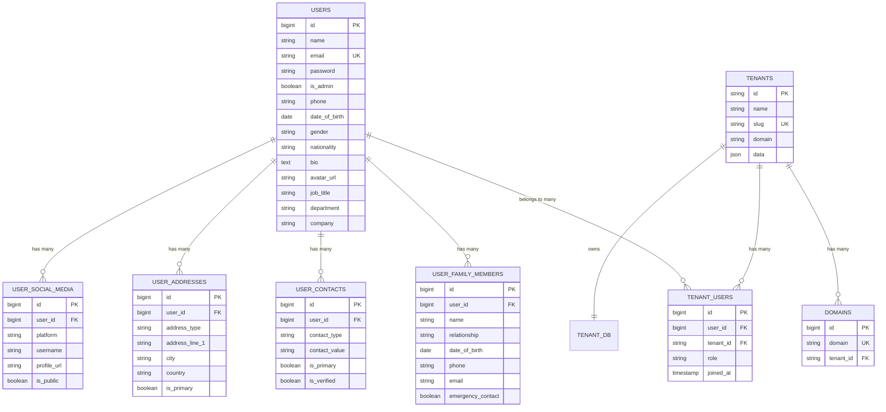

# Database Schema

## Database Structure Overview

The multi-tenant SSO system uses separate databases for complete data isolation:

- **Central Database** (`sso_main`): User identities, tenant definitions, and cross-tenant relationships
- **Tenant Databases** (`tenant1_db`, `tenant2_db`): Tenant-specific data and local sessions

## Central Database Schema (`sso_main`)

### Users Table
Primary user identity management with extended profile information.

```sql
CREATE TABLE users (
    id BIGINT UNSIGNED AUTO_INCREMENT PRIMARY KEY,
    name VARCHAR(255) NOT NULL,
    email VARCHAR(255) NOT NULL UNIQUE,
    email_verified_at TIMESTAMP NULL,
    password VARCHAR(255) NOT NULL,
    is_admin BOOLEAN DEFAULT FALSE,
    remember_token VARCHAR(100) NULL,
    
    -- Profile Information
    phone VARCHAR(20) NULL,
    date_of_birth DATE NULL,
    gender ENUM('male', 'female', 'other', 'prefer_not_to_say') NULL,
    nationality VARCHAR(2) NULL, -- ISO 3166-1 alpha-2 country code
    bio TEXT NULL,
    avatar_url VARCHAR(500) NULL,
    
    -- Address Information
    address_line_1 VARCHAR(255) NULL,
    address_line_2 VARCHAR(255) NULL,
    city VARCHAR(100) NULL,
    state_province VARCHAR(100) NULL,
    postal_code VARCHAR(20) NULL,
    country VARCHAR(2) NULL, -- ISO 3166-1 alpha-2 country code
    
    -- Emergency Contact
    emergency_contact_name VARCHAR(255) NULL,
    emergency_contact_phone VARCHAR(20) NULL,
    emergency_contact_relationship VARCHAR(50) NULL,
    
    -- Professional Information
    job_title VARCHAR(100) NULL,
    department VARCHAR(100) NULL,
    company VARCHAR(255) NULL,
    work_location VARCHAR(255) NULL,
    hire_date DATE NULL,
    employment_status ENUM('active', 'inactive', 'terminated', 'on_leave') DEFAULT 'active',
    
    created_at TIMESTAMP NULL,
    updated_at TIMESTAMP NULL,
    
    INDEX idx_email (email),
    INDEX idx_admin (is_admin),
    INDEX idx_phone (phone),
    INDEX idx_company (company),
    INDEX idx_employment_status (employment_status)
);
```

### User Family Members Table
Extended family and emergency contact information.

```sql
CREATE TABLE user_family_members (
    id BIGINT UNSIGNED AUTO_INCREMENT PRIMARY KEY,
    user_id BIGINT UNSIGNED NOT NULL,
    name VARCHAR(255) NOT NULL,
    relationship VARCHAR(50) NOT NULL, -- spouse, child, parent, sibling, etc.
    date_of_birth DATE NULL,
    phone VARCHAR(20) NULL,
    email VARCHAR(255) NULL,
    address TEXT NULL,
    emergency_contact BOOLEAN DEFAULT FALSE,
    notes TEXT NULL,
    created_at TIMESTAMP NULL,
    updated_at TIMESTAMP NULL,
    
    FOREIGN KEY (user_id) REFERENCES users(id) ON DELETE CASCADE,
    INDEX idx_user_id (user_id),
    INDEX idx_relationship (relationship),
    INDEX idx_emergency_contact (emergency_contact)
);
```

### User Contacts Table
Multiple contact methods for users.

```sql
CREATE TABLE user_contacts (
    id BIGINT UNSIGNED AUTO_INCREMENT PRIMARY KEY,
    user_id BIGINT UNSIGNED NOT NULL,
    contact_type VARCHAR(50) NOT NULL, -- mobile_phone, work_phone, home_phone, work_email, personal_email, etc.
    contact_value VARCHAR(255) NOT NULL,
    is_primary BOOLEAN DEFAULT FALSE,
    is_verified BOOLEAN DEFAULT FALSE,
    notes TEXT NULL,
    created_at TIMESTAMP NULL,
    updated_at TIMESTAMP NULL,
    
    FOREIGN KEY (user_id) REFERENCES users(id) ON DELETE CASCADE,
    INDEX idx_user_id (user_id),
    INDEX idx_contact_type (contact_type),
    INDEX idx_is_primary (is_primary),
    INDEX idx_is_verified (is_verified)
);
```

### User Addresses Table
Multiple addresses for users (home, work, billing, shipping, etc.).

```sql
CREATE TABLE user_addresses (
    id BIGINT UNSIGNED AUTO_INCREMENT PRIMARY KEY,
    user_id BIGINT UNSIGNED NOT NULL,
    address_type VARCHAR(50) NOT NULL, -- home, work, billing, shipping, etc.
    address_line_1 VARCHAR(255) NOT NULL,
    address_line_2 VARCHAR(255) NULL,
    city VARCHAR(100) NOT NULL,
    state_province VARCHAR(100) NULL,
    postal_code VARCHAR(20) NULL,
    country VARCHAR(2) NOT NULL, -- ISO 3166-1 alpha-2 country code
    is_primary BOOLEAN DEFAULT FALSE,
    notes TEXT NULL,
    created_at TIMESTAMP NULL,
    updated_at TIMESTAMP NULL,
    
    FOREIGN KEY (user_id) REFERENCES users(id) ON DELETE CASCADE,
    INDEX idx_user_id (user_id),
    INDEX idx_address_type (address_type),
    INDEX idx_country (country),
    INDEX idx_is_primary (is_primary)
);
```

### User Social Media Table
Social media profiles and professional networks.

```sql
CREATE TABLE user_social_media (
    id BIGINT UNSIGNED AUTO_INCREMENT PRIMARY KEY,
    user_id BIGINT UNSIGNED NOT NULL,
    platform VARCHAR(50) NOT NULL, -- linkedin, twitter, facebook, github, etc.
    username VARCHAR(100) NOT NULL,
    profile_url VARCHAR(500) NULL,
    is_public BOOLEAN DEFAULT TRUE,
    notes TEXT NULL,
    created_at TIMESTAMP NULL,
    updated_at TIMESTAMP NULL,
    
    FOREIGN KEY (user_id) REFERENCES users(id) ON DELETE CASCADE,
    INDEX idx_user_id (user_id),
    INDEX idx_platform (platform),
    INDEX idx_username (username),
    INDEX idx_is_public (is_public)
);
```

### Tenants Table
Tenant configuration and metadata.

```sql
CREATE TABLE tenants (
    id VARCHAR(255) PRIMARY KEY,
    name VARCHAR(255) NOT NULL,
    slug VARCHAR(255) NOT NULL UNIQUE,
    domain VARCHAR(255) NOT NULL,
    data JSON NULL,
    created_at TIMESTAMP NULL,
    updated_at TIMESTAMP NULL,
    
    INDEX idx_slug (slug),
    INDEX idx_domain (domain)
);
```

### Tenant Users Pivot Table
Many-to-many relationship between users and tenants.

```sql
CREATE TABLE tenant_users (
    id BIGINT UNSIGNED AUTO_INCREMENT PRIMARY KEY,
    user_id BIGINT UNSIGNED NOT NULL,
    tenant_id VARCHAR(255) NOT NULL,
    role VARCHAR(255) DEFAULT 'user',
    joined_at TIMESTAMP DEFAULT CURRENT_TIMESTAMP,
    created_at TIMESTAMP NULL,
    updated_at TIMESTAMP NULL,
    
    FOREIGN KEY (user_id) REFERENCES users(id) ON DELETE CASCADE,
    FOREIGN KEY (tenant_id) REFERENCES tenants(id) ON DELETE CASCADE,
    UNIQUE KEY unique_user_tenant (user_id, tenant_id),
    INDEX idx_user_id (user_id),
    INDEX idx_tenant_id (tenant_id)
);
```

### Domains Table (Stancl/Tenancy)
Domain mappings for tenant identification.

```sql
CREATE TABLE domains (
    id BIGINT UNSIGNED AUTO_INCREMENT PRIMARY KEY,
    domain VARCHAR(255) NOT NULL UNIQUE,
    tenant_id VARCHAR(255) NOT NULL,
    created_at TIMESTAMP NULL,
    updated_at TIMESTAMP NULL,
    
    FOREIGN KEY (tenant_id) REFERENCES tenants(id) ON DELETE CASCADE,
    INDEX idx_domain (domain),
    INDEX idx_tenant_id (tenant_id)
);
```

### Personal Access Tokens (Laravel Sanctum)
JWT token management and revocation.

```sql
CREATE TABLE personal_access_tokens (
    id BIGINT UNSIGNED AUTO_INCREMENT PRIMARY KEY,
    tokenable_type VARCHAR(255) NOT NULL,
    tokenable_id BIGINT UNSIGNED NOT NULL,
    name VARCHAR(255) NOT NULL,
    token VARCHAR(64) NOT NULL UNIQUE,
    abilities TEXT NULL,
    last_used_at TIMESTAMP NULL,
    expires_at TIMESTAMP NULL,
    created_at TIMESTAMP NULL,
    updated_at TIMESTAMP NULL,
    
    INDEX idx_tokenable (tokenable_type, tokenable_id),
    INDEX idx_token (token)
);
```

### Failed Jobs Table
Queue job failure tracking.

```sql
CREATE TABLE failed_jobs (
    id BIGINT UNSIGNED AUTO_INCREMENT PRIMARY KEY,
    uuid VARCHAR(255) NOT NULL UNIQUE,
    connection TEXT NOT NULL,
    queue TEXT NOT NULL,
    payload LONGTEXT NOT NULL,
    exception LONGTEXT NOT NULL,
    failed_at TIMESTAMP DEFAULT CURRENT_TIMESTAMP,
    
    INDEX idx_uuid (uuid)
);
```

## Tenant Database Schema

Each tenant database (`tenant1_db`, `tenant2_db`, etc.) contains:

### Users Table (Tenant-specific)
Local user data and preferences for the tenant.

```sql
CREATE TABLE users (
    id BIGINT UNSIGNED AUTO_INCREMENT PRIMARY KEY,
    central_user_id BIGINT UNSIGNED NOT NULL,
    name VARCHAR(255) NOT NULL,
    email VARCHAR(255) NOT NULL,
    avatar VARCHAR(255) NULL,
    preferences JSON NULL,
    last_login_at TIMESTAMP NULL,
    created_at TIMESTAMP NULL,
    updated_at TIMESTAMP NULL,
    
    UNIQUE KEY unique_central_user (central_user_id),
    INDEX idx_email (email),
    INDEX idx_last_login (last_login_at)
);
```

### Sessions Table
Local session management for tenant applications.

```sql
CREATE TABLE sessions (
    id VARCHAR(255) PRIMARY KEY,
    user_id BIGINT UNSIGNED NULL,
    ip_address VARCHAR(45) NULL,
    user_agent TEXT NULL,
    payload LONGTEXT NOT NULL,
    last_activity INT NOT NULL,
    
    INDEX idx_user_id (user_id),
    INDEX idx_last_activity (last_activity)
);
```

### Cache Table
Tenant-specific cache storage.

```sql
CREATE TABLE cache (
    key VARCHAR(255) PRIMARY KEY,
    value MEDIUMTEXT NOT NULL,
    expiration INT NOT NULL,
    
    INDEX idx_expiration (expiration)
);
```

### Cache Locks Table
Cache lock mechanism for tenant operations.

```sql
CREATE TABLE cache_locks (
    key VARCHAR(255) PRIMARY KEY,
    owner VARCHAR(255) NOT NULL,
    expiration INT NOT NULL
);
```

### Jobs Table (Optional)
Tenant-specific queue jobs.

```sql
CREATE TABLE jobs (
    id BIGINT UNSIGNED AUTO_INCREMENT PRIMARY KEY,
    queue VARCHAR(255) NOT NULL,
    payload LONGTEXT NOT NULL,
    attempts TINYINT UNSIGNED NOT NULL,
    reserved_at INT UNSIGNED NULL,
    available_at INT UNSIGNED NOT NULL,
    created_at INT UNSIGNED NOT NULL,
    
    INDEX idx_queue (queue),
    INDEX idx_reserved_at (reserved_at),
    INDEX idx_available_at (available_at)
);
```

## Sample Data

### Central Database Sample Data

#### Default Admin User
```sql
INSERT INTO users (id, name, email, password, is_admin, created_at, updated_at) VALUES
(1, 'System Admin', 'admin@sso.localhost', '$2y$10$92IXUNpkjO0rOQ5byMi.Ye4oKoEa3Ro9llC/.og/at2.uheWG/igi', TRUE, NOW(), NOW());
```

#### Default Tenants
```sql
INSERT INTO tenants (id, name, slug, domain, data, created_at, updated_at) VALUES
('tenant1-uuid', 'Tenant One', 'tenant1', 'tenant1.localhost:8001', '{"plan": "basic", "features": {"analytics": true}}', NOW(), NOW()),
('tenant2-uuid', 'Tenant Two', 'tenant2', 'tenant2.localhost:8002', '{"plan": "premium", "features": {"analytics": true, "api": true}}', NOW(), NOW());
```

#### Tenant Domains
```sql
INSERT INTO domains (domain, tenant_id, created_at, updated_at) VALUES
('tenant1.localhost:8001', 'tenant1-uuid', NOW(), NOW()),
('tenant2.localhost:8002', 'tenant2-uuid', NOW(), NOW());
```

#### User-Tenant Assignments
```sql
INSERT INTO tenant_users (user_id, tenant_id, role, created_at, updated_at) VALUES
(1, 'tenant1-uuid', 'admin', NOW(), NOW()),
(1, 'tenant2-uuid', 'admin', NOW(), NOW());
```

### Tenant Database Sample Data

#### Tenant-specific User Data
```sql
-- In tenant1_db
INSERT INTO users (central_user_id, name, email, preferences, created_at, updated_at) VALUES
(1, 'System Admin', 'admin@sso.localhost', '{"theme": "dark", "notifications": true}', NOW(), NOW());

-- In tenant2_db
INSERT INTO users (central_user_id, name, email, preferences, created_at, updated_at) VALUES
(1, 'System Admin', 'admin@sso.localhost', '{"theme": "light", "notifications": false}', NOW(), NOW());
```

## Migration Files

### Central Database Migrations

#### Create Users Table
```php
// database/migrations/2024_01_01_000000_create_users_table.php
Schema::create('users', function (Blueprint $table) {
    $table->id();
    $table->string('name');
    $table->string('email')->unique();
    $table->timestamp('email_verified_at')->nullable();
    $table->string('password');
    $table->boolean('is_admin')->default(false);
    $table->rememberToken();
    $table->timestamps();
    
    $table->index('email');
    $table->index('is_admin');
});
```

#### Create Tenant Users Pivot Table
```php
// database/migrations/2024_01_01_000001_create_tenant_users_table.php
Schema::create('tenant_users', function (Blueprint $table) {
    $table->id();
    $table->foreignId('user_id')->constrained()->onDelete('cascade');
    $table->string('tenant_id');
    $table->string('role')->default('user');
    $table->timestamp('joined_at')->useCurrent();
    $table->timestamps();
    
    $table->foreign('tenant_id')->references('id')->on('tenants')->onDelete('cascade');
    $table->unique(['user_id', 'tenant_id']);
});
```

### Tenant Database Migrations

#### Create Tenant Users Table
```php
// database/migrations/tenant/2024_01_01_000000_create_users_table.php
Schema::create('users', function (Blueprint $table) {
    $table->id();
    $table->unsignedBigInteger('central_user_id')->unique();
    $table->string('name');
    $table->string('email');
    $table->string('avatar')->nullable();
    $table->json('preferences')->nullable();
    $table->timestamp('last_login_at')->nullable();
    $table->timestamps();
    
    $table->index('email');
    $table->index('last_login_at');
});
```

## Indexing Strategy

### Central Database Indexes
- **Users**: Email (unique), admin status, phone, company, employment status
- **User Family Members**: User ID, relationship, emergency contact
- **User Contacts**: User ID, contact type, is_primary, is_verified
- **User Addresses**: User ID, address type, country, is_primary
- **User Social Media**: User ID, platform, username, is_public
- **Tenants**: Slug (unique), domain
- **Tenant Users**: User ID, tenant ID, composite unique
- **Domains**: Domain (unique), tenant ID

### Tenant Database Indexes
- **Users**: Central user ID (unique), email, last login
- **Sessions**: User ID, last activity
- **Cache**: Expiration time

## Data Relationships

