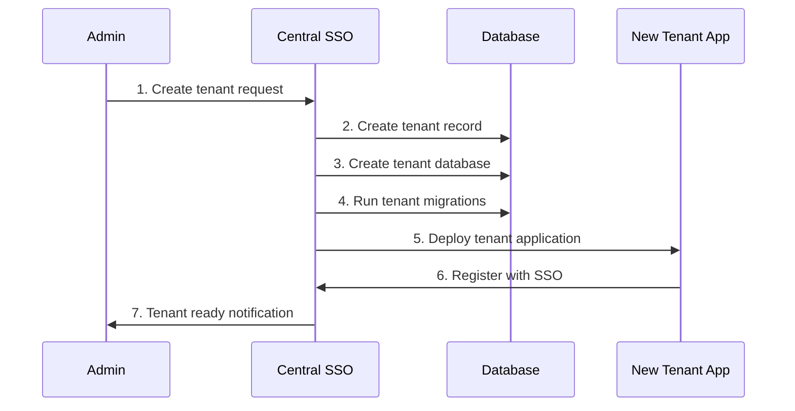

# Multi-Tenancy Design

Complete guide to the multi-tenant architecture, isolation strategies, and tenant management.

## 🏢 Architecture Overview

The SSO system implements a **database-per-tenant** approach with shared authentication services, providing complete data isolation while maintaining centralized user management.

```
┌─────────────────────────────────────────────────────────────────┐
│                    Multi-Tenant Architecture                   │
├─────────────────────────────────────────────────────────────────┤
│                                                                 │
│  ┌─────────────┐    ┌─────────────┐    ┌─────────────┐         │
│  │   Tenant 1  │    │   Tenant 2  │    │Central SSO  │         │
│  │ Application │    │ Application │    │   Server    │         │
│  │             │    │             │    │             │         │
│  │ ┌─────────┐ │    │ ┌─────────┐ │    │ ┌─────────┐ │         │
│  │ │tenant1  │ │    │ │tenant2  │ │    │ │sso_main │ │         │
│  │ │_db      │ │    │ │_db      │ │    │ │         │ │         │
│  │ └─────────┘ │    │ └─────────┘ │    │ │ Users   │ │         │
│  └─────────────┘    └─────────────┘    │ │ Tenants │ │         │
│                                        │ │ Mapping │ │         │
│                                        │ └─────────┘ │         │
│                                        └─────────────┘         │
└─────────────────────────────────────────────────────────────────┘
```

## 🔒 Isolation Strategies

### 1. **Database-Level Isolation**

Each tenant has its own dedicated database:

```
MariaDB Server
├── sso_main          # Central SSO data
│   ├── users         # All system users
│   ├── tenants       # Tenant definitions
│   ├── tenant_users  # User-tenant relationships
│   └── login_audits  # Cross-tenant audit logs
├── tenant1_db        # Tenant 1 isolated data
│   ├── users         # Local user mirrors
│   ├── sessions      # Tenant-specific sessions
│   └── app_data      # Application-specific data
└── tenant2_db        # Tenant 2 isolated data
    ├── users         # Local user mirrors
    ├── sessions      # Tenant-specific sessions
    └── app_data      # Application-specific data
```

### 2. **Application-Level Isolation**

Each tenant runs as a separate Laravel application:

```php
// Tenant 1 Configuration
APP_NAME="Tenant 1 Application"
DB_DATABASE=tenant1_db
TENANT_SLUG=tenant1

// Tenant 2 Configuration  
APP_NAME="Tenant 2 Application"
DB_DATABASE=tenant2_db
TENANT_SLUG=tenant2
```

### 3. **Network-Level Isolation**

Tenants operate on separate domains/ports:

- **Tenant 1**: localhost:8001 / tenant-one.poc.hi-dil.com
- **Tenant 2**: localhost:8002 / tenant-two.poc.hi-dil.com
- **Central SSO**: localhost:8000 / sso.poc.hi-dil.com

## 🏗️ Tenant Lifecycle Management

### Tenant Creation Process



### Tenant Database Setup

```sql
-- Create tenant database
CREATE DATABASE tenant3_db;

-- Create dedicated user (optional)
CREATE USER 'tenant3_user'@'%' IDENTIFIED BY 'secure_password';
GRANT ALL PRIVILEGES ON tenant3_db.* TO 'tenant3_user'@'%';

-- Run tenant-specific migrations
USE tenant3_db;
-- Laravel migrations run automatically
```

### Tenant Application Deployment

```yaml
# docker-compose.tenant3.yml
services:
  tenant3-app:
    build: ./tenant-template
    container_name: tenant3-app
    ports:
      - "8003:8000"
    environment:
      - APP_NAME=Tenant 3 Application
      - DB_DATABASE=tenant3_db
      - TENANT_SLUG=tenant3
      - CENTRAL_SSO_URL=http://central-sso:8000
    networks:
      - sso-network
```

## 👥 User-Tenant Relationships

### User Assignment Model

```php
// User Model (Central SSO)
class User extends Model
{
    public function tenants()
    {
        return $this->belongsToMany(Tenant::class, 'tenant_users')
                    ->withTimestamps();
    }
    
    public function hasAccessToTenant($tenantSlug)
    {
        return $this->tenants()
                    ->where('slug', $tenantSlug)
                    ->where('is_active', true)
                    ->exists();
    }
    
    public function getAccessibleTenants()
    {
        return $this->tenants()
                    ->where('is_active', true)
                    ->pluck('slug')
                    ->toArray();
    }
}
```

### Tenant Assignment Scenarios

```php
// Single-tenant user
$user = User::find(1);
$user->tenants()->attach('tenant1');

// Multi-tenant user
$superAdmin = User::find(2);
$superAdmin->tenants()->attach(['tenant1', 'tenant2']);

// Conditional access
$user->tenants()->attach('tenant1', [
    'role' => 'admin',
    'permissions' => json_encode(['users.manage', 'reports.view']),
    'expires_at' => now()->addMonths(6)
]);
```

## 🔄 Data Synchronization

### User Data Sync

When a user logs into a tenant application, their data is synchronized:

```php
// In tenant application
public function syncUserFromSSO($ssoUserData, $jwtToken)
{
    $localUser = User::where('sso_user_id', $ssoUserData['id'])->first();
    
    if (!$localUser) {
        // Create new local user
        $localUser = User::create([
            'sso_user_id' => $ssoUserData['id'],
            'name' => $ssoUserData['name'],
            'email' => $ssoUserData['email'],
            'created_at' => now(),
            'updated_at' => now()
        ]);
    } else {
        // Update existing user
        $localUser->update([
            'name' => $ssoUserData['name'],
            'email' => $ssoUserData['email'],
            'updated_at' => now()
        ]);
    }
    
    return $localUser;
}
```

### Audit Trail Synchronization

```php
// Login audit tracking across tenants
public function recordCrossTenantLogin($userId, $fromTenant, $toTenant)
{
    // Record in central audit log
    LoginAudit::create([
        'user_id' => $userId,
        'tenant_slug' => $toTenant,
        'success' => true,
        'login_method' => 'cross_tenant_sso',
        'metadata' => json_encode([
            'source_tenant' => $fromTenant,
            'target_tenant' => $toTenant,
            'access_type' => 'seamless'
        ])
    ]);
}
```

## 🎛️ Tenant Configuration

### Tenant-Specific Settings

```php
// Tenant Model
class Tenant extends Model
{
    protected $fillable = [
        'slug', 'name', 'domain', 'description',
        'is_active', 'settings'
    ];
    
    protected $casts = [
        'settings' => 'array',
        'is_active' => 'boolean'
    ];
    
    public function getSettings()
    {
        return array_merge([
            'session_timeout' => 120,
            'max_users' => 100,
            'features' => ['sso', 'audit'],
            'branding' => [
                'logo' => null,
                'primary_color' => '#007bff',
                'secondary_color' => '#6c757d'
            ]
        ], $this->settings ?? []);
    }
}
```

### Environment-Specific Configuration

```php
// Tenant application configuration
public function configureTenantEnvironment($tenantSlug)
{
    $tenant = Tenant::where('slug', $tenantSlug)->first();
    $settings = $tenant->getSettings();
    
    // Configure session timeout
    config(['session.lifetime' => $settings['session_timeout']]);
    
    // Configure branding
    config(['app.branding' => $settings['branding']]);
    
    // Configure features
    config(['features' => $settings['features']]);
    
    return $settings;
}
```

## 🔐 Security Considerations

### Tenant Data Isolation

```php
// Middleware to ensure tenant isolation
class EnsureTenantIsolation
{
    public function handle($request, Closure $next)
    {
        $currentTenant = config('app.tenant_slug');
        $userTenants = session('sso_user_data.tenants', []);
        
        // Verify user has access to current tenant
        if (!in_array($currentTenant, $userTenants)) {
            abort(403, 'Access denied to this tenant');
        }
        
        // Ensure database queries are tenant-scoped
        DB::listen(function ($query) use ($currentTenant) {
            // Log queries that might access cross-tenant data
            if (strpos($query->sql, 'tenant') === false) {
                Log::warning('Potential cross-tenant query detected', [
                    'sql' => $query->sql,
                    'bindings' => $query->bindings,
                    'tenant' => $currentTenant
                ]);
            }
        });
        
        return $next($request);
    }
}
```

### Cross-Tenant Attack Prevention

```php
// Prevent tenant ID manipulation
public function validateTenantAccess($requestedTenant, $authenticatedUser)
{
    $allowedTenants = $authenticatedUser->getAccessibleTenants();
    
    if (!in_array($requestedTenant, $allowedTenants)) {
        throw new UnauthorizedTenantAccessException(
            "User {$authenticatedUser->id} attempted to access unauthorized tenant {$requestedTenant}"
        );
    }
    
    // Log suspicious activity
    if (count($allowedTenants) === 1 && $allowedTenants[0] !== $requestedTenant) {
        Log::warning('Potential tenant manipulation attempt', [
            'user_id' => $authenticatedUser->id,
            'allowed_tenants' => $allowedTenants,
            'requested_tenant' => $requestedTenant,
            'ip_address' => request()->ip()
        ]);
    }
    
    return true;
}
```

## 📊 Tenant Monitoring & Analytics

### Per-Tenant Metrics

```php
// Tenant usage analytics
public function getTenantAnalytics($tenantSlug, $period = '30 days')
{
    return [
        'active_users' => $this->getActiveUsers($tenantSlug, $period),
        'login_attempts' => $this->getLoginAttempts($tenantSlug, $period),
        'session_duration' => $this->getAverageSessionDuration($tenantSlug, $period),
        'feature_usage' => $this->getFeatureUsage($tenantSlug, $period),
        'storage_usage' => $this->getStorageUsage($tenantSlug),
        'api_calls' => $this->getAPICallCount($tenantSlug, $period)
    ];
}

private function getActiveUsers($tenantSlug, $period)
{
    return LoginAudit::where('tenant_slug', $tenantSlug)
                    ->where('success', true)
                    ->where('created_at', '>', now()->sub($period))
                    ->distinct('user_id')
                    ->count();
}
```

### Resource Usage Monitoring

```php
// Monitor tenant resource consumption
public function monitorTenantResources()
{
    $tenants = Tenant::where('is_active', true)->get();
    
    foreach ($tenants as $tenant) {
        $usage = [
            'database_size' => $this->getDatabaseSize($tenant->slug),
            'active_sessions' => $this->getActiveSessionCount($tenant->slug),
            'daily_requests' => $this->getDailyRequestCount($tenant->slug),
            'storage_files' => $this->getStorageFileCount($tenant->slug)
        ];
        
        // Check against tenant limits
        $limits = $tenant->getSettings()['limits'] ?? [];
        
        foreach ($usage as $metric => $value) {
            if (isset($limits[$metric]) && $value > $limits[$metric]) {
                $this->alertTenantLimitExceeded($tenant, $metric, $value, $limits[$metric]);
            }
        }
        
        // Store metrics for reporting
        TenantMetric::create([
            'tenant_slug' => $tenant->slug,
            'metrics' => $usage,
            'recorded_at' => now()
        ]);
    }
}
```

## 🚀 Scaling Strategies

### Horizontal Scaling

```yaml
# Load-balanced tenant deployment
services:
  tenant1-app-1:
    image: tenant-app:latest
    environment:
      - TENANT_SLUG=tenant1
      - DB_DATABASE=tenant1_db
  
  tenant1-app-2:
    image: tenant-app:latest
    environment:
      - TENANT_SLUG=tenant1
      - DB_DATABASE=tenant1_db
  
  tenant1-lb:
    image: nginx:alpine
    depends_on:
      - tenant1-app-1
      - tenant1-app-2
```

### Database Scaling

```sql
-- Read replica for tenant database
CREATE REPLICA tenant1_db_replica FROM tenant1_db;

-- Horizontal partitioning for large tenants
CREATE TABLE tenant1_db.users_2024 PARTITION OF tenant1_db.users
FOR VALUES FROM ('2024-01-01') TO ('2025-01-01');
```

### Cache Strategy

```php
// Tenant-aware caching
public function getCachedData($key, $tenantSlug)
{
    $tenantKey = "tenant_{$tenantSlug}_{$key}";
    
    return Cache::remember($tenantKey, 3600, function () use ($tenantSlug) {
        // Tenant-specific data retrieval
        return $this->fetchTenantData($tenantSlug);
    });
}

// Cache invalidation
public function invalidateTenantCache($tenantSlug)
{
    $pattern = "tenant_{$tenantSlug}_*";
    
    foreach (Cache::getRedis()->keys($pattern) as $key) {
        Cache::forget($key);
    }
}
```

## 🧪 Testing Multi-Tenancy

### Tenant Isolation Tests

```php
public function test_tenant_data_isolation()
{
    // Create users in different tenants
    $tenant1User = $this->createTenantUser('tenant1');
    $tenant2User = $this->createTenantUser('tenant2');
    
    // Login as tenant1 user
    $this->loginAs($tenant1User, 'tenant1');
    
    // Attempt to access tenant2 data
    $response = $this->get('/api/tenant2/users');
    $response->assertStatus(403);
    
    // Verify tenant1 data is accessible
    $response = $this->get('/api/tenant1/users');
    $response->assertStatus(200);
}

public function test_cross_tenant_user_access()
{
    $user = User::factory()->create();
    $user->tenants()->attach(['tenant1', 'tenant2']);
    
    // Login to tenant1
    $this->loginAs($user, 'tenant1');
    $this->assertSee('Tenant 1 Dashboard');
    
    // Access tenant2 via SSO
    $response = $this->get('/auth/sso/tenant2');
    $response->assertRedirect()
             ->assertSessionHas('tenant_slug', 'tenant2');
}
```

## 📋 Tenant Onboarding Checklist

### New Tenant Setup Process

1. **Tenant Registration**
   - [ ] Create tenant record in central database
   - [ ] Generate tenant slug and configure domain
   - [ ] Set initial tenant settings and limits

2. **Database Setup**
   - [ ] Create dedicated tenant database
   - [ ] Run Laravel migrations
   - [ ] Set up database user permissions
   - [ ] Configure backup strategy

3. **Application Deployment**
   - [ ] Deploy tenant application container
   - [ ] Configure environment variables
   - [ ] Set up health checks and monitoring
   - [ ] Configure logging and error tracking

4. **Security Configuration**
   - [ ] Generate tenant-specific API keys
   - [ ] Configure SSL certificates
   - [ ] Set up rate limiting
   - [ ] Enable audit logging

5. **User Assignment**
   - [ ] Create initial admin users
   - [ ] Configure user-tenant relationships
   - [ ] Set up role-based permissions
   - [ ] Test authentication flows

6. **Integration Testing**
   - [ ] Test SSO authentication
   - [ ] Verify data isolation
   - [ ] Test cross-tenant access (if applicable)
   - [ ] Validate monitoring and alerts

---

## 🔗 Related Documentation

- **[Authentication Systems](authentication.md)** - Authentication flows and security
- **[Database Design](database-design.md)** - Schema and relationships
- **[Tenant Setup Guide](../guides/tenant-setup.md)** - How to add new tenants
- **[Security Guide](../guides/security.md)** - Security best practices