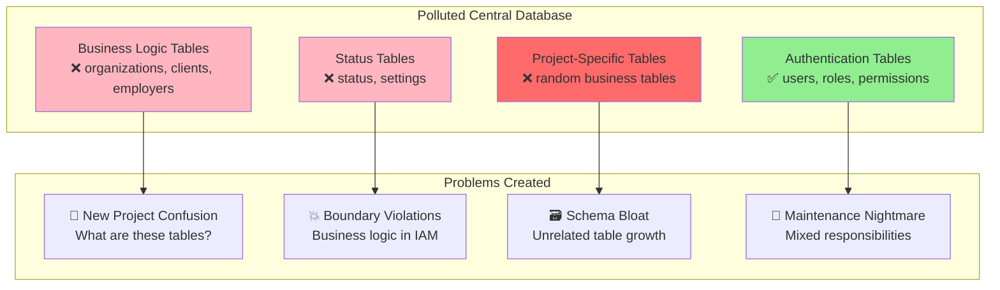

# Project Background & Motivation

## Why Was This SSO POC Developed?

This Single Sign-On (SSO) Proof of Concept was created to address critical architectural and security concerns with the previous system design. Understanding the original problems helps explain why this specific architecture was chosen and why separation of concerns is so important.

## 🚨 The Original Problem: Boundary Violations in Hybrid Architecture

### Understanding Hybrid Database Architecture Problems

**The original system** used a **hybrid approach** - projects had their own databases for business logic, but shared a central database for authentication. While this approach avoided the worst problems of fully shared databases, it created **specific boundary violation issues** that this POC was designed to solve.

### Why Shared Central Components Can Become Problematic

Even when projects have separate databases, **shared central components** (like authentication databases) can develop problems if boundaries aren't properly maintained:

#### 1. **Boundary Violation Problems**
```
❌ BOUNDARY VIOLATIONS IN HYBRID ARCHITECTURE
┌─────────────────────────────────────────────────────────────┐
│                    Hybrid System Issues                    │
├─────────────────────────────────────────────────────────────┤
│  Project A ───┐          Project B ───┐          Project C  │
│  (Own DB)     │          (Own DB)     │          (Own DB)   │
│               │                       │                     │
│               ▼                       ▼                     │
│         ┌─────────────────────────────────────────────┐     │
│         │         Shared Central Database             │     │
│         │ ┌─────────────┬─────────────────────────────┐│     │
│         │ │✅ Auth Tables│❌ Business Logic Tables    ││     │
│         │ │• users      │• organizations             ││     │
│         │ │• roles      │• clients                   ││     │
│         │ │• permissions│• employers                 ││     │
│         │ │             │• status                    ││     │
│         │ └─────────────┴─────────────────────────────┘│     │
│         └─────────────────────────────────────────────┘     │
└─────────────────────────────────────────────────────────────┘

Specific Problems with Boundary Violations:
🚨 Business logic tables mixed with authentication tables
🚨 Unclear what belongs in central vs project databases  
🚨 Direct database access for both auth AND business queries
🚨 Authentication system changes affected by business logic
🚨 Schema bloat made central database hard to understand
```

#### 2. **Architectural Boundary Confusion**
- **Mixed Responsibilities**: Authentication database handling business logic
- **Developer Confusion**: Where should new tables go?
- **"Convenience" Decisions**: Adding business tables to central DB for easy access
- **Growing Complexity**: More non-auth tables added over time
- **Maintenance Overhead**: Unclear ownership of mixed-purpose tables

#### 3. **Service Boundary Problems**
- **Tight Coupling**: Business logic changes affecting authentication
- **Testing Complexity**: Authentication tests mixed with business logic
- **Deployment Coupling**: Central database changes coordinated across projects
- **Service Isolation**: Authentication service couldn't evolve independently

### Industry Best Practices for Service Boundaries

**Modern architecture principles recommend clear service boundaries**:

```
✅ PROPER SERVICE BOUNDARY ARCHITECTURE
┌─────────────────────────────────────────────────────────────┐
│                 Clean Service Boundaries                   │
├─────────────────────────────────────────────────────────────┤
│                                                             │
│  ┌─────────┐     API     ┌─────────────────────────────┐    │
│  │Project A│◄───────────►│    Authentication Service   │    │
│  │         │             │  ┌─────────────────────────┐ │    │
│  └─────┬───┘             │  │ ONLY Auth Tables        │ │    │
│        │                 │  │ • users                 │ │    │
│        ▼                 │  │ • roles                 │ │    │
│  ┌─────────┐             │  │ • permissions           │ │    │
│  │Project A│             │  │ • tenants               │ │    │
│  │Database │             │  └─────────────────────────┘ │    │
│  │• business│             └─────────────────────────────┘    │
│  │• domain  │                                               │
│  │• specific│     API     ┌─────────────────────────────┐    │
│  └─────────┘  ┌─────────────►│    Authentication Service   │    │
│               │          │  │  (Same Clean Boundaries)   │    │
│  ┌─────────┐  │          └─────────────────────────────┘    │
│  │Project B│◄─┘                                             │
│  │         │                                                │
│  └─────┬───┘                                                │
│        ▼                                                    │
│  ┌─────────┐                                                │
│  │Project B│                                                │
│  │Database │                                                │
│  │• clients │                                               │
│  │• employers│                                              │
│  │• status  │                                               │
│  └─────────┘                                                │
└─────────────────────────────────────────────────────────────┘

Benefits:
✅ Clear responsibility boundaries per service
✅ Authentication service focuses ONLY on identity/access
✅ Business logic stays in appropriate project contexts
✅ API-driven communication prevents boundary violations
✅ Each service can evolve independently
```

### Real-World Impact of Boundary Violations

#### **Enterprise Examples of Service Boundary Problems**

**Mixed Responsibilities Creating Problems**:
- **Many Enterprise Systems**: Authentication systems that grew to include business logic become maintenance nightmares
- **Legacy Monoliths**: Central databases with mixed concerns are common source of technical debt
- **Startup Growth Pain**: "Convenience" decisions early on create scaling problems later

**Boundary Violation Consequences**:
- **Maintenance Overhead**: Changes to authentication require coordinating business logic changes
- **Developer Confusion**: New team members struggle to understand what belongs where
- **Testing Complexity**: Cannot test authentication independently of business features
- **Scaling Bottlenecks**: Cannot optimize authentication service independently

#### **Clean Service Boundary Pattern (Industry Standard)**

This is why modern architectures focus on **clear service boundaries**:

```
Industry Leaders Using Clean Boundaries:
🏢 Netflix    → Authentication service separate from content services
🏢 Amazon     → AWS IAM isolated from business services like S3, EC2
🏢 Google     → Google Identity separate from Gmail, Drive, etc.
🏢 Spotify    → User authentication separate from music catalog
🏢 GitHub     → Authentication service separate from repository services
```

**Key Principles for Service Boundaries**:
1. **Single Responsibility**: Each service has ONE clear purpose
2. **API-First Communication**: No direct database access between services
3. **Domain Boundaries**: Authentication vs Business Logic are separate domains
4. **Independent Evolution**: Services can change without affecting others
5. **Clear Data Ownership**: Each service owns only data relevant to its purpose

#### **Why Systems Develop Boundary Violations**

**Common Reasons (All Create Technical Debt)**:
- ❌ **"It's convenient"**: Adding business tables to central auth database for "easy access"
- ❌ **"Quick and dirty"**: Short-term decisions that create long-term maintenance problems
- ❌ **"Everything is related"**: Assuming authentication needs business logic data
- ❌ **"One database is simpler"**: Ignoring the complexity that grows over time
- ❌ **"Legacy evolution"**: Authentication system gradually accumulating non-auth responsibilities

### Original Hybrid Architecture Issues

The previous system used a **hybrid database approach** with both shared and project-specific databases. While this was better than a fully shared approach, it still created significant problems:

```
❌ ORIGINAL PROBLEMATIC HYBRID ARCHITECTURE
┌─────────────────────────────────────────────────────────────┐
│                    Hybrid Database System                  │
├─────────────────────────────────────────────────────────────┤
│                                                             │
│  ┌──────────────┐    ┌──────────────┐    ┌──────────────┐  │
│  │   Project A  │    │   Project B  │    │   Project C  │  │
│  └──────┬───────┘    └──────┬───────┘    └──────┬───────┘  │
│         │                   │                   │          │
│         ▼                   ▼                   ▼          │
│  ┌──────────────┐    ┌──────────────┐    ┌──────────────┐  │
│  │Project A DB  │    │Project B DB  │    │Project C DB  │  │
│  │• business    │    │• business    │    │• business    │  │
│  │• domain      │    │• domain      │    │• domain      │  │
│  │• specific    │    │• specific    │    │• specific    │  │
│  └──────────────┘    └──────────────┘    └──────────────┘  │
│                                                             │
│         │                   │                   │          │
│         └─────────────────┬─┼─────────────────┘            │
│                          │ │                               │
│                  ┌───────▼─▼──────┐                        │
│                  │  SHARED CENTRAL │                        │
│                  │    DATABASE     │                        │
│                  │ ┌─────────────┐ │                        │
│                  │ │ users       │ │ ← Authentication       │
│                  │ │ roles       │ │                        │
│                  │ │ permissions │ │                        │
│                  │ │ organizations│ │ ← ❌ Business Logic   │
│                  │ │ clients     │ │     (Wrong Place!)     │
│                  │ │ employers   │ │                        │
│                  │ │ status      │ │                        │
│                  │ │ ...         │ │                        │
│                  │ └─────────────┘ │                        │
│                  └─────────────────┘                        │
└─────────────────────────────────────────────────────────────┘
```

### Problems with the Hybrid Architecture

#### **1. Central Database Became a Dumping Ground**
While projects had their own databases for business logic, the **central database became polluted** with non-authentication tables:

- ✅ **Legitimate**: `users`, `roles`, `permissions`, `tenants` (authentication/authorization)
- ❌ **Problematic**: `organizations`, `clients`, `employers`, `status` (business logic)

#### **2. Boundary Confusion**
- **Developers confused** about what belongs in central vs project databases
- **"Convenience" decisions** led to putting business tables in shared central database
- **Growing complexity** as more non-auth tables were added to central database
- **Schema bloat** made the central database harder to understand and maintain

#### **3. Security & Governance Issues**
- **Shared access** to central database across all projects
- **Mixed concerns** in central database (authentication + business logic)
- **Audit complexity** - hard to determine which business logic belonged where
- **Coupling problems** - business logic changes affecting authentication system

#### **4. Operational Problems**
- **Migration coordination** required when central database schema changed
- **Testing complexity** - business logic tests mixed with authentication tests
- **Deployment coupling** - central database changes affected multiple projects
- **Maintenance overhead** - unclear ownership of business tables in central database

## 🗄️ Database Table Pollution Problem

### The Core Issue

The central database became a dumping ground for **non-authentication related tables** that didn't belong in an SSO/IAM system:

- `organizations` - Business entity management
- `clients` - Customer/client records  
- `employers` - Employment relationships
- `status` - Various status tracking
- Other business logic tables

### Why This Was Problematic



#### Developer Experience Problems

When new projects integrated with the system, developers would encounter:

1. **Confusion**: "What are all these `organization`, `client`, `employer` tables for?"
2. **Temptation**: "Should I add my business tables here too?"
3. **Coupling**: Business logic became tightly coupled with authentication
4. **Maintenance**: Changes to business logic affected authentication system

## ✅ The Solution: Clean API-Driven Architecture

### What This POC Achieves

This SSO POC was designed to solve the hybrid architecture problems by implementing **proper separation of concerns** with **API-driven authentication**:

```
✅ NEW CLEAN API-DRIVEN ARCHITECTURE
┌─────────────────────────────────────────────────────────────┐
│                  Clean SSO/IAM Service                     │
├─────────────────────────────────────────────────────────────┤
│                                                             │
│  ┌─────────────┐    API Calls    ┌─────────────────────┐    │
│  │ Project A   │◄────────────────►│   Central SSO      │    │
│  │ (Laravel)   │   (No Direct     │   (Laravel)        │    │
│  │             │   DB Access)     │                    │    │
│  └─────┬───────┘                  │ ┌─────────────────┐ │    │
│        │                          │ │ ONLY Auth Tables│ │    │
│        ▼                          │ │ • users         │ │    │
│  ┌─────────────┐                  │ │ • roles         │ │    │
│  │Project A DB │◄─────────────────┤ │ • permissions   │ │    │
│  │• business   │                  │ │ • tenants       │ │    │
│  │• domain     │                  │ │ • audit_logs    │ │    │
│  │• specific   │                  │ └─────────────────┘ │    │
│  └─────────────┘                  └─────────────────────┘    │
│                                                             │
│  ┌─────────────┐    API Calls    NO BUSINESS TABLES        │
│  │ Project B   │◄───────────────────────┐    IN CENTRAL!    │
│  │ (Laravel)   │                        │                   │
│  └─────┬───────┘                        │                   │
│        │                                │                   │
│        ▼                                │                   │
│  ┌─────────────┐                        │                   │
│  │Project B DB │                        │                   │
│  │• clients    │ ← Business logic       │                   │
│  │• employers  │   stays in project     │                   │
│  │• status     │   databases where      │                   │
│  │• orgs       │   it belongs!          │                   │
│  └─────────────┘                        │                   │
│                                         │                   │
│  ┌─────────────┐    API Calls           │                   │
│  │ Project C   │◄───────────────────────┘                   │
│  │ (Laravel)   │                                            │
│  └─────┬───────┘                                            │
│        │                                                    │
│        ▼                                                    │
│  ┌─────────────┐                                            │
│  │Project C DB │                                            │
│  │• domain     │                                            │
│  │• specific   │                                            │
│  └─────────────┘                                            │
└─────────────────────────────────────────────────────────────┘
```

## 🎯 Benefits Achieved

### 1. **Security Isolation**
- ✅ Each tenant/project has isolated data access
- ✅ No cross-project data exposure risk
- ✅ Centralized authentication with distributed authorization
- ✅ Clear audit trails per project

### 2. **Clean Separation of Concerns**
- ✅ SSO service handles **ONLY** authentication and identity management
- ✅ Business applications handle **ONLY** their domain-specific logic
- ✅ Clear boundaries between systems
- ✅ No table pollution in central SSO database

### 3. **Developer Experience**
- ✅ New projects see only relevant authentication APIs
- ✅ No confusion about unrelated business tables
- ✅ Clear integration patterns
- ✅ Self-contained business logic per project

### 4. **Scalability & Maintenance**
- ✅ SSO service can evolve independently
- ✅ Business applications don't break when SSO updates
- ✅ Each system can be scaled independently  
- ✅ Reduced coupling between systems

### 5. **Compliance & Governance**
- ✅ Clear data ownership per tenant/project
- ✅ Easier compliance auditing
- ✅ Proper data residency controls
- ✅ Centralized identity governance

## 🔄 Migration Benefits

### Before (Hybrid Architecture Problems)
```
Original Hybrid System Issues:
❌ Central database polluted with business tables (organizations, clients, employers)
❌ Boundary confusion - what belongs in central vs project databases?
❌ Direct database access across multiple projects
❌ Business logic changes affecting authentication system
❌ Schema bloat in central database
❌ Maintenance overhead for mixed-purpose central database
```

### After (This Clean SSO POC)
```
Clean API-Driven Solutions:
✅ Central SSO database contains ONLY authentication tables
✅ Clear API boundaries - no direct database access from projects
✅ Business logic stays in project-specific databases where it belongs
✅ Authentication system isolated from business logic changes
✅ Clean, focused SSO schema that's easy to understand
✅ API-first architecture with proper separation of concerns
✅ Each project owns and manages its own business data
```

## 🚀 Strategic Value

This POC demonstrates that proper **Identity and Access Management (IAM)** architecture requires:

1. **Single Responsibility**: SSO service handles authentication only
2. **API-First Design**: Clean interfaces between systems  
3. **Data Isolation**: Each tenant/project manages its own business data
4. **Security by Design**: Proper access controls and audit trails
5. **Developer Experience**: Clear, understandable system boundaries

## 📚 Related Documentation

- **[Challenges & Solutions](challenges-and-solutions.md)** - Current architectural challenges
- **[Multi-Tenancy Design](multi-tenancy.md)** - How tenant isolation works
- **[Authentication Systems](authentication.md)** - Complete authentication flows
- **[Security Guide](../guides/security.md)** - Security best practices

---

*This document explains the **why** behind the SSO POC architecture. The original shared database approach created security risks and architectural confusion that this clean, separated system resolves.*