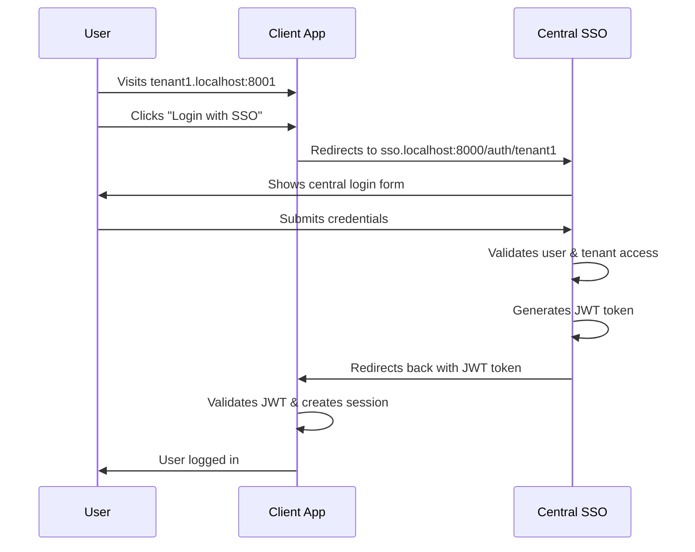
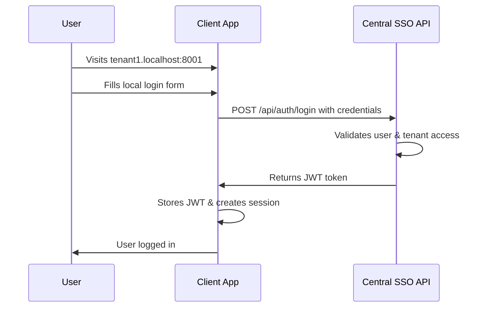
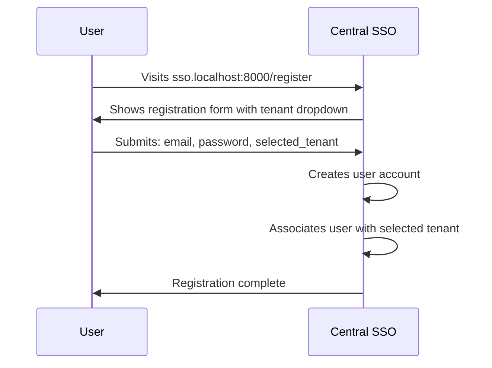
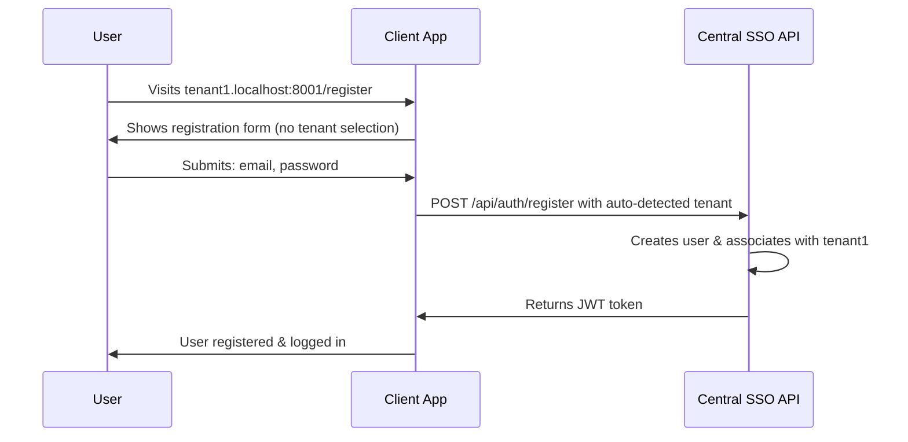

# Authentication Flow

## Authentication Methods

The system supports two authentication methods for maximum flexibility:

### Method 1: SSO Redirect Flow

**User Experience**: User clicks "Login with SSO" button



**Technical Flow:**
1. Client redirects to: `sso.localhost:8000/auth/{tenant_slug}?callback_url={client_url}`
2. Central SSO validates credentials
3. Generates JWT with tenant context
4. Redirects to: `{callback_url}?token={jwt_token}`
5. Client validates JWT and establishes session

### Method 2: Local Form with API Authentication

**User Experience**: User fills login form directly on client app



**Technical Flow:**
1. Client sends POST to: `sso.localhost:8000/api/auth/login`
2. Payload: `{email, password, tenant_slug}`
3. Central API validates and returns JWT
4. Client stores JWT for subsequent requests

## User Registration Flows

### Registration on Central SSO



**Features:**
- User selects tenant from dropdown
- Can be associated with multiple tenants later
- Central identity management

### Registration on Client App



**Features:**
- Tenant auto-detected from subdomain
- Seamless registration experience
- Immediate login after registration

## JWT Token Structure

### Token Payload
```json
{
  "sub": "user_id",
  "email": "user@example.com",
  "tenants": ["tenant1", "tenant2"],
  "current_tenant": "tenant1",
  "iat": 1640995200,
  "exp": 1641081600,
  "iss": "sso.localhost:8000"
}
```

### Token Validation

**Client-side validation:**
1. Verify JWT signature using public key
2. Check expiration time
3. Validate current tenant matches subdomain
4. Ensure user has access to current tenant

**API endpoints for validation:**
- `GET /api/auth/validate` - Validate token
- `GET /api/auth/user` - Get current user data
- `POST /api/auth/refresh` - Refresh expired token

## Session Management

### Client Application Sessions
- JWT stored in secure HTTP-only cookie
- Local session created after JWT validation
- Session invalidated when JWT expires

### Cross-Tenant Access
- Users can switch between tenants
- New JWT generated with different `current_tenant`
- Seamless experience across tenant applications

## Error Handling

### Authentication Errors
- Invalid credentials: Return to login with error message
- Expired JWT: Redirect to re-authentication
- Insufficient tenant access: Show access denied page

### Network Errors
- Central SSO unavailable: Show offline message
- API timeout: Retry mechanism with exponential backoff