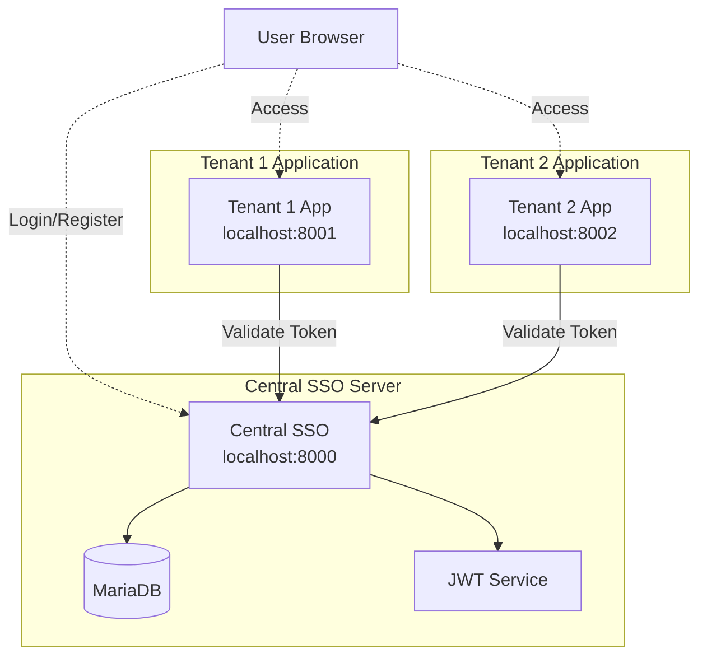
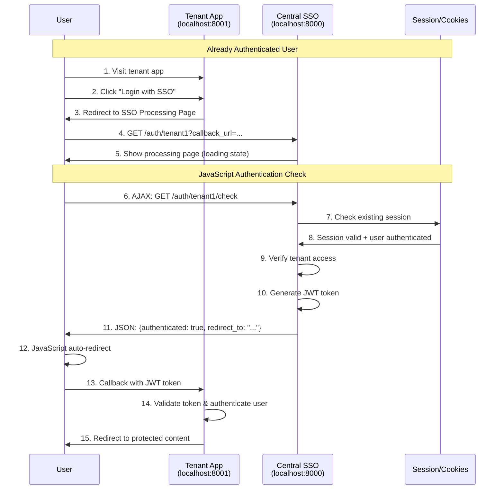
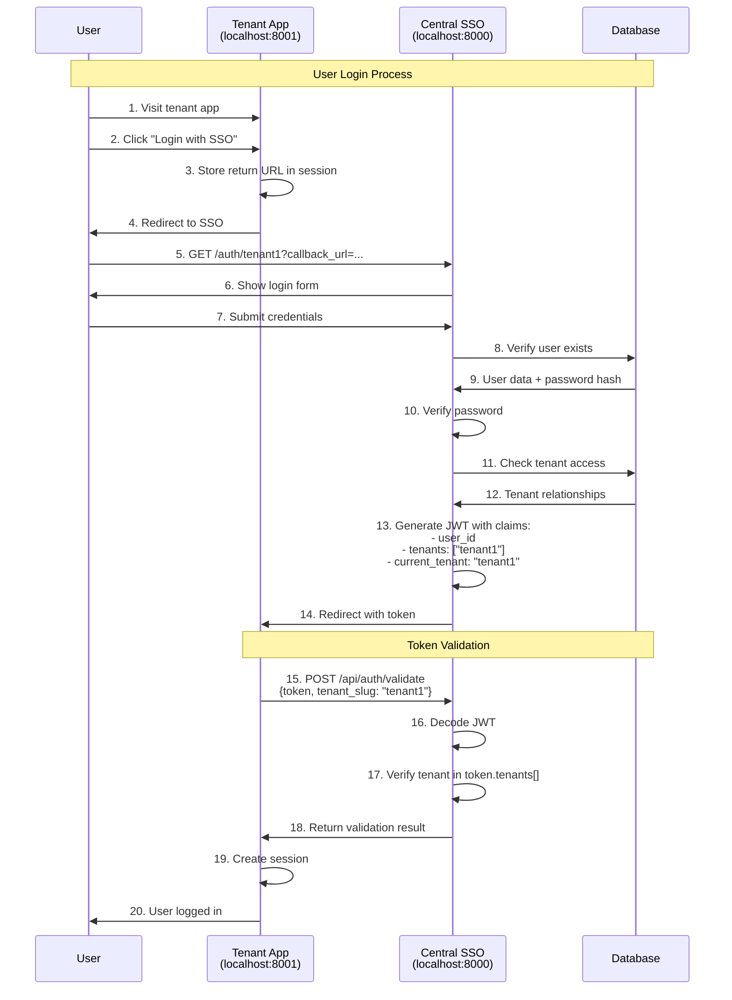
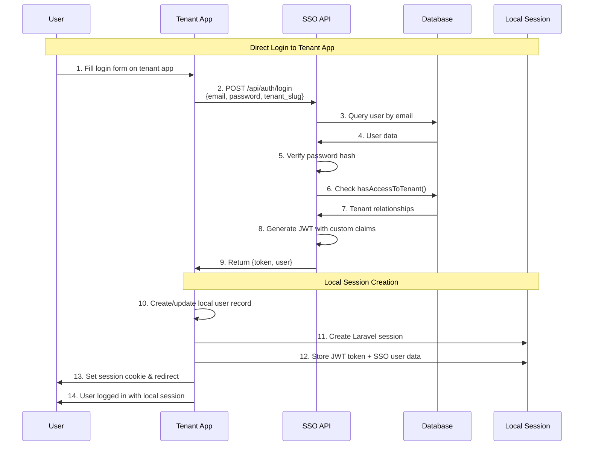
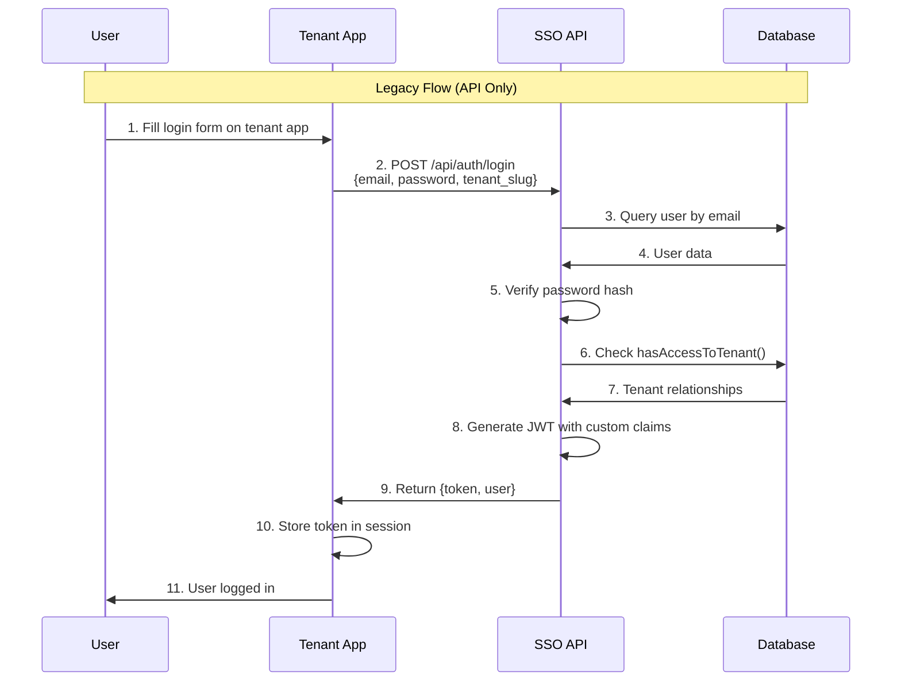
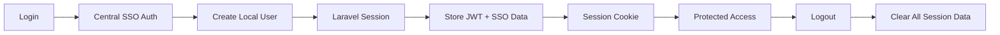
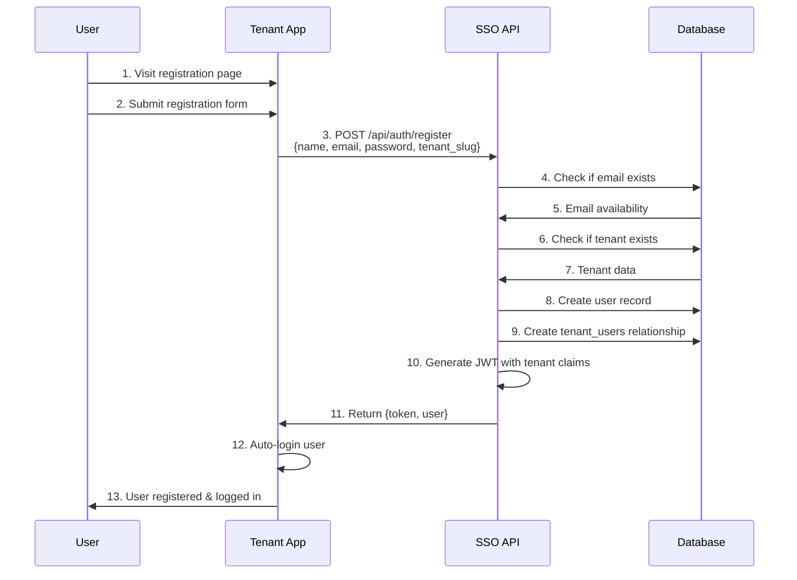
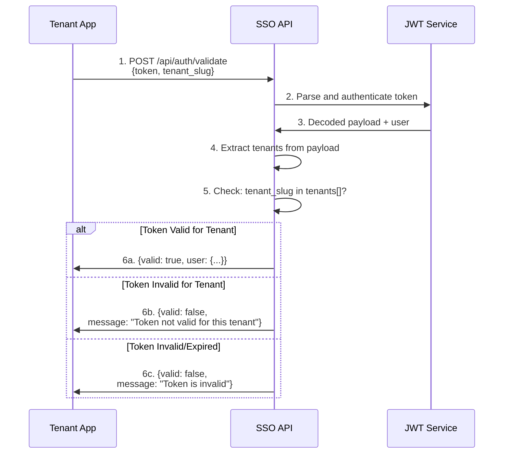
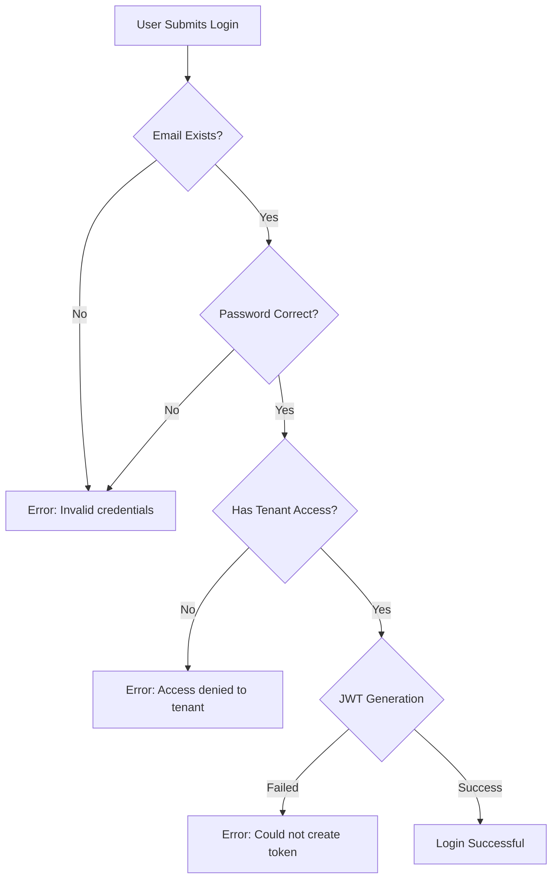
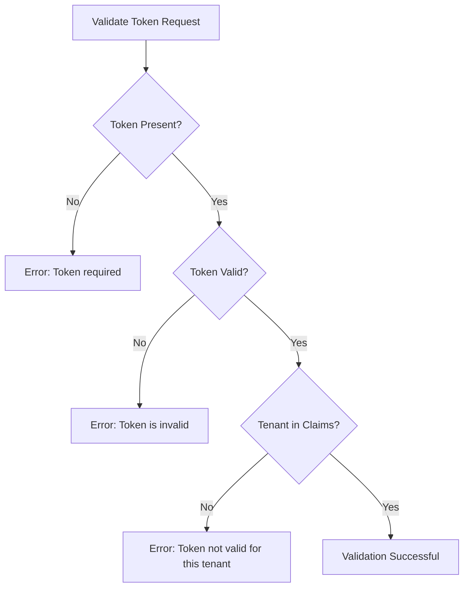

# Authentication Flow

## System Architecture Overview



## Authentication Flows

### 🔄 Seamless SSO Flow (New Implementation)



### 🎯 Processing Page Benefits

- **Seamless UX**: No unnecessary login forms for authenticated users
- **Fast Response**: JavaScript-based checking provides immediate feedback
- **Loading State**: Users see clear progress indication
- **Cross-Origin Compatible**: Works despite browser cookie isolation between ports
- **Graceful Fallback**: Always provides login form when needed
- **Security Maintained**: Proper tenant access validation and JWT generation

### 🔧 Technical Implementation

The processing page (`auth.sso-processing.blade.php`) uses JavaScript to:

1. **Show Loading State**: Immediate visual feedback to user
2. **AJAX Authentication Check**: Call `/auth/{tenant}/check` endpoint
3. **Handle Response States**:
   - `authenticated: true, redirect_to: "..."` → Auto-redirect
   - `authenticated: true, access_denied: true` → Show access denied
   - `authenticated: false` → Show login form
4. **Error Handling**: Network failures gracefully fall back to login form

## Standard Authentication Flow

### Complete Login Flow with Token Validation



### 🏗️ Dual-Session Architecture (Direct Login)



### 🔄 Dual-Session Benefits

- **🎯 Centralized Authentication**: All credentials validated by central SSO
- **⚡ Local Session Management**: Each tenant manages independent sessions
- **🚀 Performance**: Reduced API calls after initial authentication
- **🔄 User Data Sync**: Local users auto-sync with central SSO on login
- **📊 Audit Trail**: All authentications tracked in central audit system
- **🛡️ Security**: Consistent authentication across all tenant apps
- **🔧 Flexibility**: Tenant-specific session lifetimes and configurations

### API-Based Login Flow (Legacy)



## Session Management

### 🔄 Dual-Session Data Storage

In the dual-session architecture, each tenant app maintains both:

#### Local Laravel Session
```php
// Standard Laravel session data
session([
    '_token' => 'CSRF_TOKEN',
    'login_web_AUTH_ID' => 123,  // Local user ID
    'login_web_AUTH_PASSWORD_HASH' => 'hash',
    
    // SSO Integration Data
    'jwt_token' => 'eyJ0eXAiOiJKV1QiLCJhbGciOiJIUzI1NiJ9...',
    'sso_user_data' => [
        'id' => 25,           // Central SSO user ID
        'name' => 'Super Admin',
        'email' => 'superadmin@sso.com',
        'tenants' => ['tenant1', 'tenant2'],
        'current_tenant' => 'tenant1',
        'is_admin' => true
    ]
]);
```

#### Session Data Usage
- **Local User ID**: For Laravel authentication and database relations
- **JWT Token**: For API calls to central SSO (if needed)
- **SSO User Data**: Rich user information from central SSO
- **CSRF Protection**: Standard Laravel CSRF tokens
- **Session Security**: HTTP-only cookies with proper expiration

### Session Lifecycle


## JWT Token Structure

### Current Token Payload Example
```json
{
  "iss": "http://localhost:8000/api/auth/login",
  "iat": 1755262220,
  "exp": 1755265820,
  "nbf": 1755262220,
  "jti": "BYh8R81OjJrzOHH8",
  "sub": "2",
  "prv": "23bd5c8949f600adb39e701c400872db7a5976f7",
  "tenants": ["tenant1", "tenant2"],
  "current_tenant": "tenant1"
}
```

### Token Claims Explanation
- `sub`: User ID from central SSO
- `tenants`: Array of tenant slugs user has access to
- `current_tenant`: The tenant context for this session
- `exp`: Token expiration (1 hour by default)
- `prv`: Provider hash for user model verification

## User Registration Flow



## Token Validation Process



## Database Schema

### Users Table (MariaDB)
- `id`: Primary key (auto-increment)
- `name`: User's full name
- `email`: Unique email address
- `password`: Bcrypt hashed password
- `is_admin`: Boolean admin flag (0/1)
- `created_at`, `updated_at`: Timestamps

### Tenants Table (MariaDB)
- `id`: String primary key (e.g., "tenant1")
- `data`: JSON field (can be null or empty)
- `created_at`, `updated_at`: Timestamps

### Tenant_Users Table (Pivot)
- `user_id`: Foreign key to users table
- `tenant_id`: Foreign key to tenants table
- `created_at`, `updated_at`: Timestamps

### Database Access
```bash
# Connect to MariaDB
docker exec -it mariadb mysql -u sso_user -psso_password sso_main

# View users
SELECT id, email, name, is_admin FROM users;

# View tenant relationships
SELECT u.email, t.id as tenant_id 
FROM users u 
JOIN tenant_users tu ON u.id = tu.user_id 
JOIN tenants t ON tu.tenant_id = t.id;
```

## Error Scenarios

### Login Errors



### Token Validation Errors



## Security Considerations

1. **Password Security**
   - Passwords hashed using Bcrypt with 12 rounds
   - Never stored or transmitted in plain text

2. **JWT Security**
   - Tokens signed with HMAC-SHA256
   - 1-hour expiration by default
   - Contains minimal user information

3. **Tenant Isolation**
   - Users can only access tenants they're explicitly assigned to
   - Token validation enforces tenant boundaries
   - Each request validates tenant context

4. **Session Management**
   - Tokens can be invalidated on logout
   - Refresh tokens available for extended sessions
   - HTTP-only cookies recommended for token storage

## Development Tools

### Laravel Telescope
- **URL**: http://localhost:8000/telescope
- Monitor all API requests and responses
- Debug JWT token generation and validation
- Track database queries and performance

### Testing Credentials

| User | Password | Tenant Access | Role | Login Methods |
|------|----------|---------------|------|---------------|
| user@tenant1.com | password | tenant1 | User | SSO + Direct |
| admin@tenant1.com | password | tenant1 | Admin | SSO + Direct |
| user@tenant2.com | password | tenant2 | User | SSO + Direct |
| admin@tenant2.com | password | tenant2 | Admin | SSO + Direct |
| superadmin@sso.com | password | tenant1, tenant2 | Super Admin | SSO + Direct |

#### Login Method Examples

**Direct Login to Tenant Apps:**
- Visit `http://localhost:8001/login` or `http://localhost:8002/login`
- Use any valid credentials above
- Authentication happens through central SSO API
- Local Laravel session created automatically

**SSO Redirect Login:**
- Click "Login with Central SSO" button in tenant apps
- Redirected to central SSO for authentication
- Same result as direct login but different user flow

### Legacy Users (unknown passwords)
| User | Description |
|------|-------------|
| admin@example.com | Legacy admin user |
| multi@example.com | Legacy multi-tenant user |

## Common Issues and Solutions

### Issue: "Token not valid for this tenant"
**Cause**: Token's `tenants` array doesn't include the requested tenant
**Solution**: Ensure user has access to tenant in database, regenerate token

### Issue: "Access denied to tenant"
**Cause**: User not associated with tenant in tenant_users table
**Solution**: Add user-tenant relationship or use correct credentials

### Issue: "Could not create token"
**Cause**: JWT service configuration issue
**Solution**: Check JWT secret key in .env, ensure JWT package is installed

### Issue: Token expires too quickly
**Cause**: Default TTL is 60 minutes
**Solution**: Adjust JWT_TTL in .env file or implement refresh token flow

### Issue: "Invalid credentials" with correct password
**Cause**: Using wrong database (SQLite vs MariaDB)
**Solution**: Ensure using MariaDB in Docker, not local SQLite

### Issue: User not found errors
**Cause**: Database not seeded with test users
**Solution**: Run `docker exec central-sso php artisan db:seed --class=AddTestUsersSeeder`