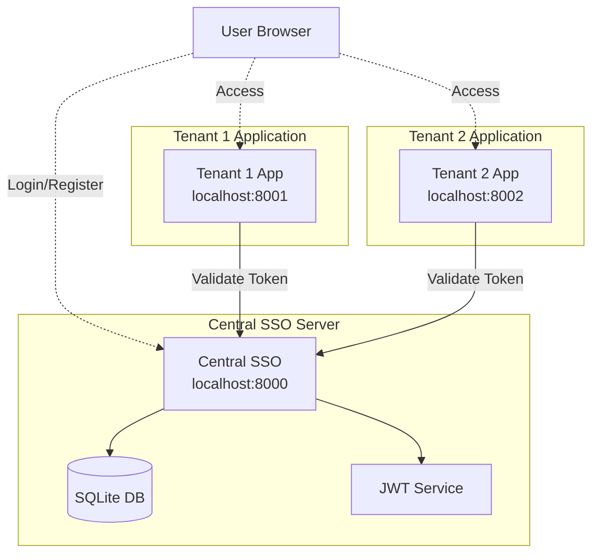
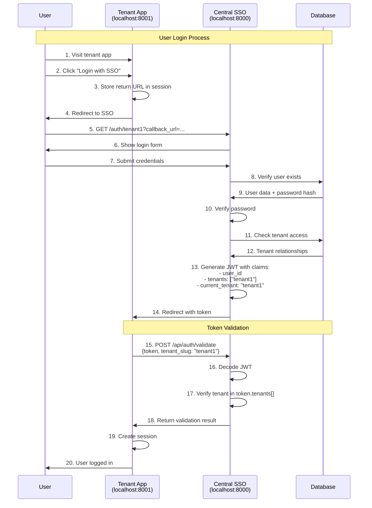
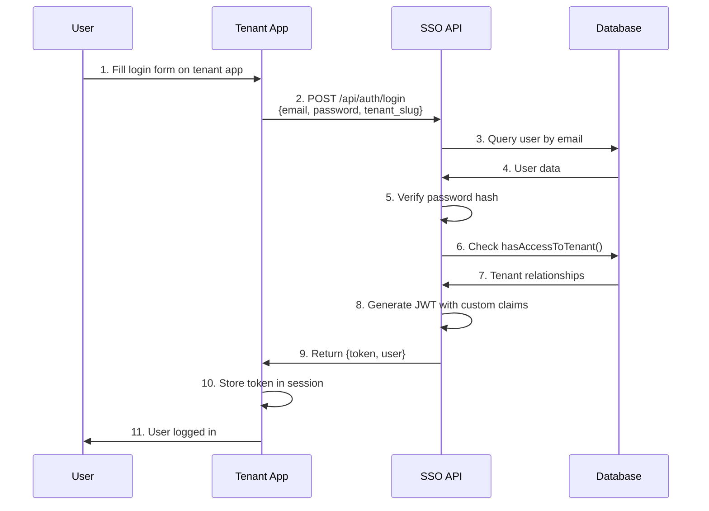
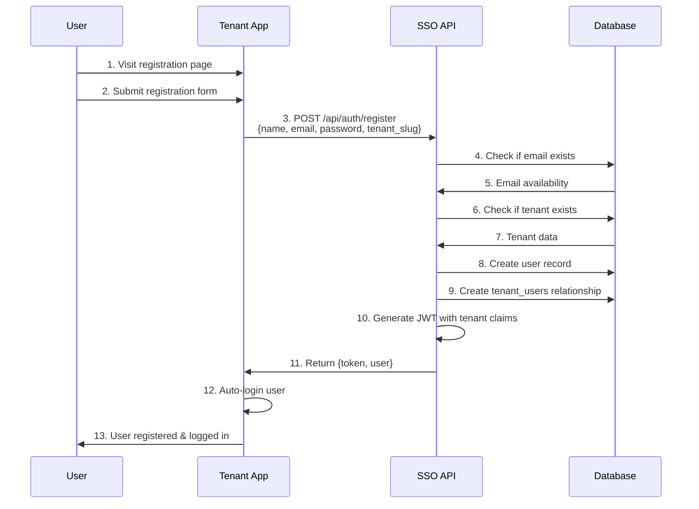
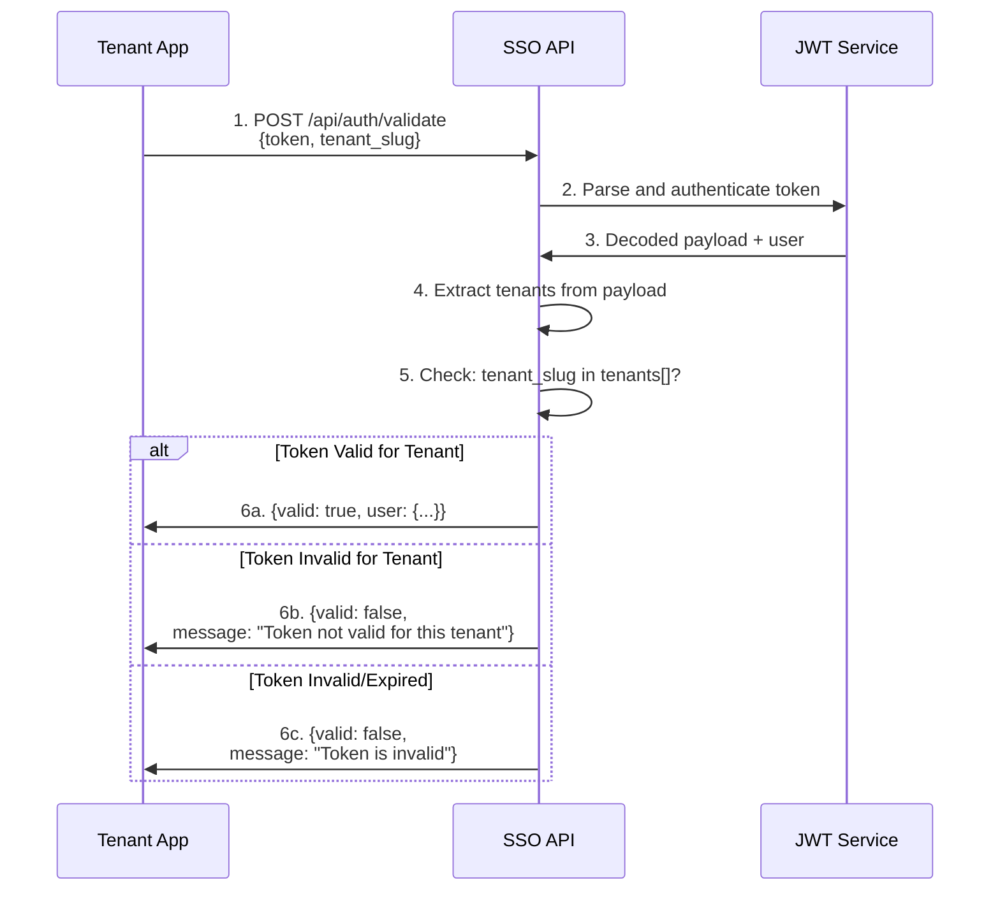
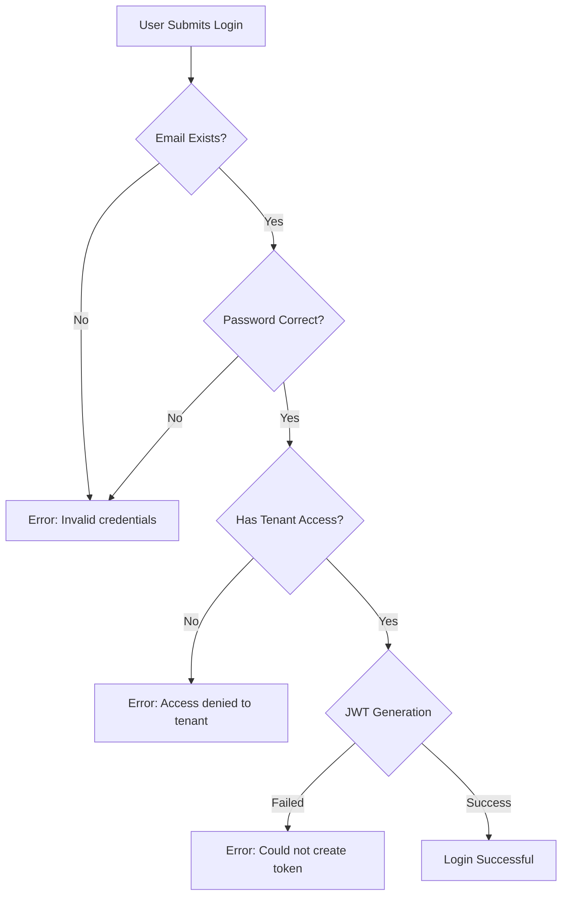
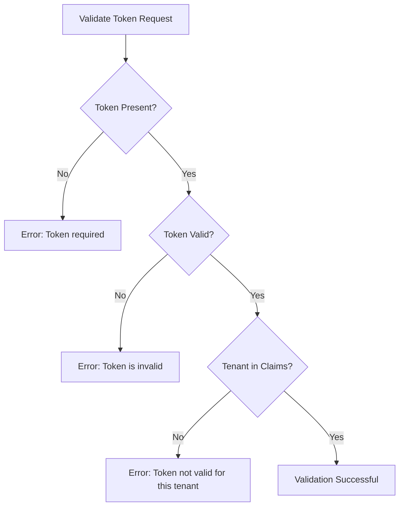

# Authentication Flow

## System Architecture Overview



## Current Implementation - Authentication Flow

### Complete Login Flow with Token Validation



### API-Based Login Flow (Alternative)



## JWT Token Structure

### Current Token Payload Example
```json
{
  "iss": "http://localhost:8000/api/auth/login",
  "iat": 1755262220,
  "exp": 1755265820,
  "nbf": 1755262220,
  "jti": "BYh8R81OjJrzOHH8",
  "sub": "2",
  "prv": "23bd5c8949f600adb39e701c400872db7a5976f7",
  "tenants": ["tenant1", "tenant2"],
  "current_tenant": "tenant1"
}
```

### Token Claims Explanation
- `sub`: User ID
- `tenants`: Array of tenant slugs user has access to
- `current_tenant`: The tenant context for this session
- `exp`: Token expiration (1 hour by default)
- `prv`: Provider hash for user model verification

## User Registration Flow



## Token Validation Process



## Database Schema

### Users Table
- `id`: Primary key
- `name`: User's full name
- `email`: Unique email address
- `password`: Bcrypt hashed password
- `is_admin`: Boolean admin flag
- `created_at`, `updated_at`: Timestamps

### Tenants Table
- `id`: String primary key (e.g., "tenant1")
- `data`: JSON field containing:
  - `name`: Tenant display name
  - `slug`: URL-safe identifier
  - `domain`: Tenant domain
- `created_at`, `updated_at`: Timestamps

### Tenant_Users Table (Pivot)
- `user_id`: Foreign key to users
- `tenant_id`: Foreign key to tenants
- `created_at`, `updated_at`: Timestamps

## Error Scenarios

### Login Errors



### Token Validation Errors



## Security Considerations

1. **Password Security**
   - Passwords hashed using Bcrypt with 12 rounds
   - Never stored or transmitted in plain text

2. **JWT Security**
   - Tokens signed with HMAC-SHA256
   - 1-hour expiration by default
   - Contains minimal user information

3. **Tenant Isolation**
   - Users can only access tenants they're explicitly assigned to
   - Token validation enforces tenant boundaries
   - Each request validates tenant context

4. **Session Management**
   - Tokens can be invalidated on logout
   - Refresh tokens available for extended sessions
   - HTTP-only cookies recommended for token storage

## Development Tools

### Laravel Telescope
- **URL**: http://localhost:8000/telescope
- Monitor all API requests and responses
- Debug JWT token generation and validation
- Track database queries and performance

### Testing Credentials

| User | Password | Tenant Access |
|------|----------|---------------|
| user@tenant1.com | tenant123 | tenant1 |
| admin@tenant1.com | admin123 | tenant1 |
| user@tenant2.com | tenant456 | tenant2 |
| admin@tenant2.com | admin456 | tenant2 |
| superadmin@sso.com | super123 | tenant1, tenant2 |

## Common Issues and Solutions

### Issue: "Token not valid for this tenant"
**Cause**: Token's `tenants` array doesn't include the requested tenant
**Solution**: Ensure user has access to tenant in database, regenerate token

### Issue: "Access denied to tenant"
**Cause**: User not associated with tenant in tenant_users table
**Solution**: Add user-tenant relationship or use correct credentials

### Issue: "Could not create token"
**Cause**: JWT service configuration issue
**Solution**: Check JWT secret key in .env, ensure JWT package is installed

### Issue: Token expires too quickly
**Cause**: Default TTL is 60 minutes
**Solution**: Adjust JWT_TTL in .env file or implement refresh token flow