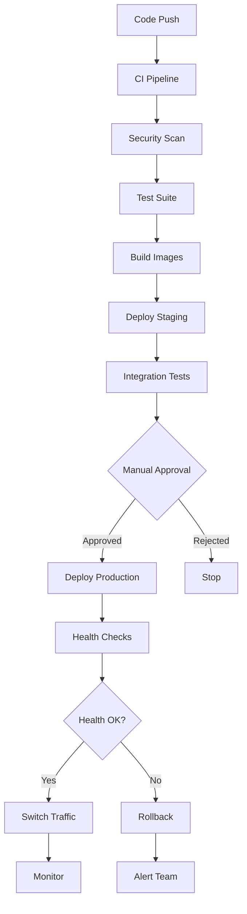

# Deployment Guide

Production deployment strategies, infrastructure setup, and operational procedures for the multi-tenant SSO system.

## 📖 Documentation in This Section

### **[Cloudflare Tunnel Deployment](cloudflare-tunnel.md)**
🌐 **Production deployment** - Complete guide for Cloudflare Tunnel integration
- Zero-trust architecture setup
- SSL/TLS termination
- Docker-based tunnel configuration
- DNS management and domain routing

### **[CI/CD Pipeline](cicd-pipeline.md)**
🚀 **Automated deployment** - GitHub Actions CI/CD with blue-green deployments
- Automated testing and security scanning
- Blue-green deployment strategy
- Environment management (staging/production)
- Rollback procedures

### **[Monitoring Setup](monitoring.md)**
📊 **Observability** - Prometheus, Grafana, and application monitoring
- Metrics collection and storage
- Dashboard configuration
- Alerting rules and notifications
- Performance monitoring

## 🎯 Deployment Strategy Overview

### Recommended Deployment Order

1. **[Manual Setup First](cloudflare-tunnel.md#manual-setup)** (1-2 hours)
   - Validate infrastructure configuration
   - Test Cloudflare Tunnel connectivity
   - Verify SSO functionality end-to-end

2. **[CI/CD Pipeline Setup](cicd-pipeline.md)** (30-60 minutes)
   - Automate the proven manual process
   - Enable team collaboration
   - Add deployment safety measures

3. **[Monitoring Implementation](monitoring.md)** (2-3 hours)
   - Add observability and alerting
   - Enable proactive issue detection
   - Set up performance tracking

### Production Architecture

```
┌─────────────────────────────────────────────────────────────────┐
│                    Production Infrastructure                   │
├─────────────────────────────────────────────────────────────────┤
│                                                                 │
│ Internet → Cloudflare → Tunnel → Docker Network → Applications │
│                                                                 │
│  ┌─────────────┐    ┌─────────────┐    ┌─────────────┐         │
│  │   Domain    │    │   Domain    │    │   Domain    │         │
│  │ sso.poc.    │    │tenant-one.  │    │tenant-two.  │         │
│  │ hi-dil.com  │    │poc.hi-dil.  │    │poc.hi-dil.  │         │
│  │             │    │com          │    │com          │         │
│  └─────┬───────┘    └─────┬───────┘    └─────┬───────┘         │
│        │                  │                  │                 │
│        └──────────────────┼──────────────────┘                 │
│                           │                                    │
│  ┌─────────────────────────┴─────────────────────────┐         │
│  │            Cloudflare Tunnel                     │         │
│  │ ┌─────────────┐ ┌─────────────┐ ┌─────────────┐ │         │
│  │ │Central SSO  │ │ Tenant 1    │ │ Tenant 2    │ │         │
│  │ │ Container   │ │ Container   │ │ Container   │ │         │
│  │ └─────────────┘ └─────────────┘ └─────────────┘ │         │
│  └─────────────────────────────────────────────────┘         │
│                           │                                    │
│  ┌─────────────────────────┴─────────────────────────┐         │
│  │              Infrastructure                       │         │
│  │ ┌─────────────┐ ┌─────────────┐ ┌─────────────┐ │         │
│  │ │  MariaDB    │ │ Prometheus  │ │   Grafana   │ │         │
│  │ │  Database   │ │ Monitoring  │ │ Dashboard   │ │         │
│  │ └─────────────┘ └─────────────┘ └─────────────┘ │         │
│  └─────────────────────────────────────────────────┘         │
└─────────────────────────────────────────────────────────────────┘
```

## 🌍 Environment Management

### Production Environment
- **Domains**: `*.poc.hi-dil.com`
- **SSL**: Automatic via Cloudflare
- **Database**: Persistent volumes with backups
- **Monitoring**: Full Prometheus/Grafana stack
- **Deployments**: Blue-green with manual approval

### Staging Environment  
- **Domains**: `staging-*.poc.hi-dil.com`
- **SSL**: Automatic via Cloudflare
- **Database**: Isolated staging data
- **Monitoring**: Basic health checks
- **Deployments**: Automatic on staging branch

### Development Environment
- **Domains**: `localhost:800x`
- **SSL**: Optional self-signed certificates
- **Database**: Local MariaDB container
- **Monitoring**: Laravel Telescope only
- **Deployments**: Direct code changes

## 🔒 Security Considerations

### Production Security Checklist

- [ ] **SSL/TLS**: Enforced HTTPS with HSTS headers
- [ ] **Authentication**: Strong passwords and JWT secrets
- [ ] **Database**: Secure credentials and connection encryption
- [ ] **Network**: Cloudflare protection and rate limiting
- [ ] **Monitoring**: Security event logging and alerting
- [ ] **Backups**: Encrypted database backups
- [ ] **Updates**: Regular security patches and updates

### Security Architecture

```
┌─────────────────────────────────────────────────────────────────┐
│                       Security Layers                          │
├─────────────────────────────────────────────────────────────────┤
│ 1. Cloudflare Protection (DDoS, WAF, Rate Limiting)            │
│ 2. Cloudflare Tunnel (Zero-trust, No exposed ports)            │
│ 3. Application Security (CSRF, XSS, Input validation)          │
│ 4. Authentication Security (JWT, Password hashing)             │
│ 5. Database Security (Encryption, Access control)              │
│ 6. Network Security (Docker networks, Isolation)               │
└─────────────────────────────────────────────────────────────────┘
```

## ⚡ Performance Optimization

### Application Performance
- **Container Optimization**: Multi-stage Docker builds
- **Database Optimization**: Connection pooling and indexing
- **Caching Strategy**: Redis for sessions and data caching
- **Asset Optimization**: Static asset compression and CDN

### Infrastructure Performance
- **Load Balancing**: Multiple container instances
- **Database Scaling**: Read replicas for high-traffic tenants
- **Monitoring**: Real-time performance metrics
- **Auto-scaling**: Container scaling based on metrics

## 🔄 Deployment Workflows

### Standard Deployment Flow



### Emergency Procedures

#### Rollback Process
```bash
# Quick rollback using blue-green deployment
./scripts/blue-green-switch.sh blue

# Or manual container restart to previous version
docker-compose -f infrastructure/docker/compose/docker-compose.production.yml \
  restart central-sso-blue tenant1-app-blue tenant2-app-blue
```

#### Emergency Contact
- **On-call Engineer**: Check team communication channels
- **Monitoring Alerts**: Slack notifications and email alerts
- **Status Page**: Update status.poc.hi-dil.com (if available)

## 📊 Operational Metrics

### Key Performance Indicators (KPIs)

#### System Health
- **Uptime**: Target 99.9% availability
- **Response Time**: < 200ms for API endpoints
- **Error Rate**: < 0.1% of requests
- **Database Performance**: < 50ms query time

#### Security Metrics
- **Failed Login Rate**: Monitor for brute force attempts
- **Authentication Latency**: Track SSO performance
- **Certificate Expiry**: Monitor SSL certificate status
- **Security Scan Results**: Track vulnerability findings

#### Business Metrics
- **Active Users**: Daily/monthly active users per tenant
- **Login Success Rate**: Authentication success percentage
- **Feature Usage**: Most used application features
- **Tenant Growth**: New tenant onboarding rate

## 🛠️ Maintenance Procedures

### Regular Maintenance Tasks

#### Weekly
- [ ] Review monitoring dashboards and alerts
- [ ] Check application and database logs
- [ ] Verify backup integrity
- [ ] Update security patches if available

#### Monthly
- [ ] Database optimization and cleanup
- [ ] SSL certificate renewal check
- [ ] Performance baseline review
- [ ] Security audit and assessment

#### Quarterly
- [ ] Disaster recovery testing
- [ ] Infrastructure cost optimization review
- [ ] Security penetration testing
- [ ] Technology stack updates evaluation

### Backup and Recovery

```bash
# Database backup (automated daily)
docker exec mariadb mysqldump -u root -p \
  --all-databases --single-transaction > backup_$(date +%Y%m%d).sql

# Application configuration backup
tar -czf config_backup_$(date +%Y%m%d).tar.gz \
  infrastructure/ docs/ scripts/ .env.example

# Recovery procedure
# 1. Restore database from backup
# 2. Deploy last known good configuration
# 3. Run health checks
# 4. Update DNS if needed
```

## 🎯 Quick Start Deployment

For immediate deployment to production:

1. **[Follow Cloudflare Setup](cloudflare-tunnel.md#quick-setup)** (30 minutes)
2. **[Configure CI/CD Secrets](cicd-pipeline.md#github-secrets)** (15 minutes)
3. **[Deploy and Test](cicd-pipeline.md#first-deployment)** (30 minutes)

Total time: **~75 minutes** from zero to production

## 🔗 Related Documentation

- **[Getting Started](../getting-started/README.md)** - Local development setup
- **[Architecture Overview](../architecture/README.md)** - System design
- **[Security Guide](../guides/security.md)** - Security best practices
- **[Troubleshooting](../reference/troubleshooting.md)** - Common issues and solutions