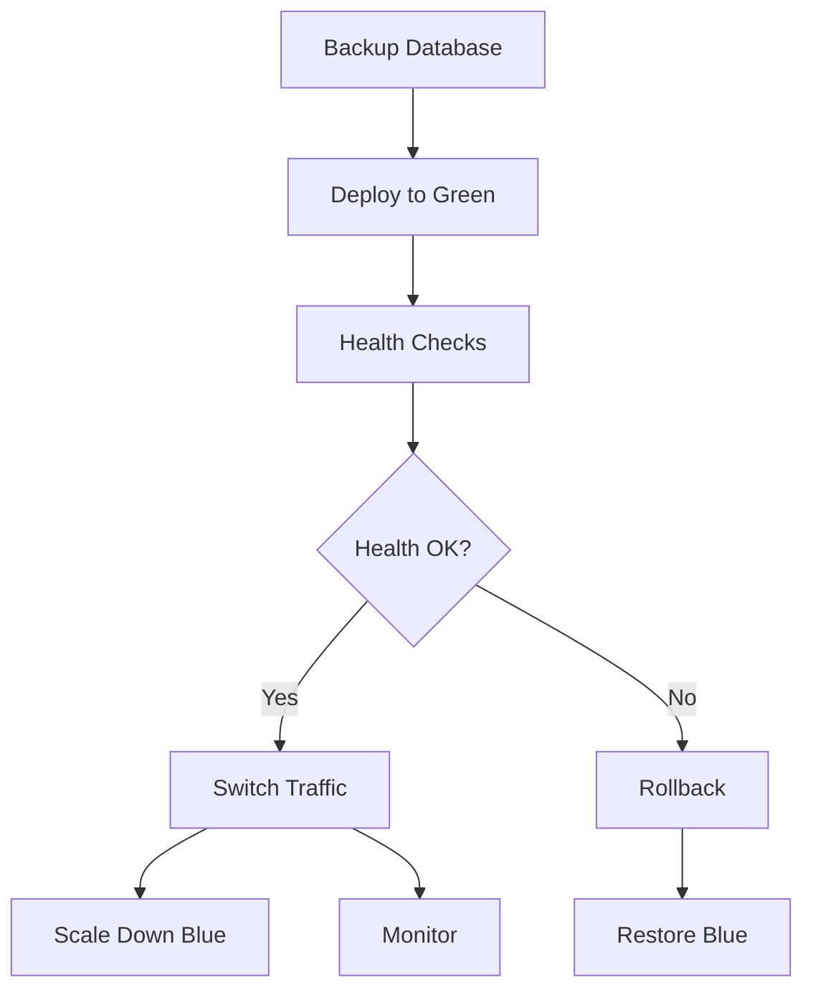

# CI/CD Deployment Guide for Multi-Tenant SSO System

## Overview

This guide provides comprehensive documentation for the CI/CD pipeline designed for the multi-tenant SSO system with Cloudflare Tunnel deployment. The pipeline supports automated testing, building, and deployment across staging and production environments with zero-downtime blue-green deployments.

## Architecture Overview

```
┌─────────────────────────────────────────────────────────────┐
│                     CI/CD Pipeline Flow                    │
├─────────────────────────────────────────────────────────────┤
│ 1. Code Push/PR → Security Scan → Testing Matrix           │
│ 2. Build Images → Push to Registry → Deploy to Staging     │
│ 3. Staging Tests → Manual Approval → Blue-Green Production │
│ 4. Health Checks → Traffic Switch → Monitoring             │
└─────────────────────────────────────────────────────────────┘
```

### Pipeline Stages

1. **Security & Quality**: Code scanning, vulnerability assessment
2. **Testing Matrix**: Unit, Feature, Integration tests across PHP versions
3. **SSO Integration**: Cross-tenant authentication flow testing
4. **Build & Push**: Docker image building and registry push
5. **Staging Deployment**: Automated deployment to staging environment
6. **Production Deployment**: Blue-green deployment with manual approval
7. **Post-Deployment**: Monitoring and health verification

## Repository Structure

```
sso-poc-claude3/
├── .github/
│   └── workflows/
│       └── ci-cd-pipeline.yml          # Main CI/CD workflow
├── central-sso/
│   ├── Dockerfile.prod                 # Production Dockerfile
│   └── docker/prod/                    # Production configurations
├── tenant1-app/
│   ├── Dockerfile.prod                 # Production Dockerfile
│   └── docker/prod/                    # Production configurations
├── tenant2-app/
│   ├── Dockerfile.prod                 # Production Dockerfile
│   └── docker/prod/                    # Production configurations
├── scripts/
│   ├── setup-cloudflare-tunnel-docker.sh
│   ├── blue-green-switch.sh           # Blue-green deployment
│   ├── test-sso-flow.sh               # SSO flow testing
│   └── backup-production-db.sh        # Database backup
├── docker-compose.staging.yml         # Staging environment
├── docker-compose.production.yml      # Production environment
└── docs/
    └── cicd-deployment-guide.md        # This document
```

## Environment Configuration

### Required Secrets

Configure these secrets in your GitHub repository:

#### Cloudflare Configuration
```
CLOUDFLARE_API_TOKEN          # Cloudflare API token with Zone:Edit permissions
CLOUDFLARE_EMAIL              # Cloudflare account email
```

#### Database Configuration
```
DB_USERNAME                   # Database username
DB_PASSWORD                   # Database password
MYSQL_ROOT_PASSWORD          # MySQL root password
```

#### Application Secrets
```
JWT_SECRET                   # JWT signing secret (32+ characters)
REDIS_PASSWORD              # Redis password
TENANT1_API_KEY             # Tenant 1 API key for secure communication
TENANT2_API_KEY             # Tenant 2 API key for secure communication
TENANT1_HMAC_SECRET         # HMAC secret for tenant 1
TENANT2_HMAC_SECRET         # HMAC secret for tenant 2
```

#### Email Configuration
```
MAIL_HOST                   # SMTP host
MAIL_PORT                   # SMTP port (default: 587)
MAIL_USERNAME               # SMTP username
MAIL_PASSWORD               # SMTP password
MAIL_FROM_ADDRESS           # From email address
```

#### External Services
```
SENTRY_DSN                  # Sentry error tracking DSN (optional)
GRAFANA_PASSWORD            # Grafana admin password
AWS_ACCESS_KEY_ID           # AWS access key for backups
AWS_SECRET_ACCESS_KEY       # AWS secret key for backups
S3_BACKUP_BUCKET           # S3 bucket for database backups
```

#### Notifications
```
SLACK_WEBHOOK_URL           # Slack webhook for deployment notifications
```

### Environment Variables

#### Staging Environment (.env.staging)
```env
# Application URLs
CENTRAL_SSO_URL=https://staging-sso.poc.hi-dil.com
TENANT1_URL=https://staging-tenant-one.poc.hi-dil.com
TENANT2_URL=https://staging-tenant-two.poc.hi-dil.com

# Database
DB_DATABASE=sso_staging
DB_USERNAME=sso_user
DB_PASSWORD=staging_password

# Redis
REDIS_PASSWORD=staging_redis_password

# Session Domain
SESSION_DOMAIN=.staging.poc.hi-dil.com

# Cloudflare Tunnel
TUNNEL_NAME=sso-staging-tunnel
```

#### Production Environment (.env.production)
```env
# Application URLs
CENTRAL_SSO_URL=https://sso.poc.hi-dil.com
TENANT1_URL=https://tenant-one.poc.hi-dil.com
TENANT2_URL=https://tenant-two.poc.hi-dil.com

# Database
DB_DATABASE=sso_main
DB_USERNAME=sso_user
DB_PASSWORD=${DB_PASSWORD}

# Redis
REDIS_PASSWORD=${REDIS_PASSWORD}

# Session Domain
SESSION_DOMAIN=.poc.hi-dil.com

# Cloudflare Tunnel
TUNNEL_NAME=sso-poc-tunnel
```

## CI/CD Pipeline Workflow

### 1. Security and Code Quality

#### Triggers
- Pull requests to `main` or `develop`
- Pushes to `main`, `develop`, or `staging` branches
- Release publications

#### Security Scans
```yaml
- name: Run Trivy vulnerability scanner
  uses: aquasecurity/trivy-action@master
  with:
    scan-type: 'fs'
    format: 'sarif'

- name: Security audit - All Applications
  run: |
    cd central-sso && composer audit
    cd ../tenant1-app && composer audit
    cd ../tenant2-app && composer audit
```

### 2. Testing Matrix

#### Multi-Version Testing
- **PHP Versions**: 8.1, 8.2
- **Applications**: central-sso, tenant1-app, tenant2-app
- **Test Suites**: Unit, Feature, Integration

#### Database Services
```yaml
services:
  mysql:
    image: mariadb:10.11
    env:
      MYSQL_DATABASE: sso_test
      MYSQL_USER: sso_user
      MYSQL_PASSWORD: sso_password
  
  redis:
    image: redis:7-alpine
```

#### Test Execution
```bash
# Per application, per PHP version, per test suite
php artisan test --testsuite=Unit --coverage-clover=coverage-unit.xml
php artisan test --testsuite=Feature --coverage-clover=coverage-feature.xml
php artisan test --testsuite=Integration --coverage-clover=coverage-integration.xml
```

### 3. SSO Integration Testing

#### Cross-Tenant Authentication
```bash
# Run complete SSO integration test suite
./run_tests.sh --integration

# Test authentication flows across all tenants
docker exec central-sso php artisan test:sso-integration
docker exec tenant1-app php artisan test:tenant-integration
docker exec tenant2-app php artisan test:tenant-integration

# Test API authentication flows
docker exec central-sso php artisan test:api-integration
```

### 4. Build and Push Images

#### Multi-Stage Docker Builds
```yaml
- name: Build and push images
  uses: docker/build-push-action@v5
  with:
    context: ./${{ matrix.application }}
    file: ./${{ matrix.application }}/Dockerfile.prod
    push: true
    tags: ${{ steps.meta.outputs.tags }}
    cache-from: type=gha,scope=${{ matrix.application }}
    cache-to: type=gha,mode=max,scope=${{ matrix.application }}
```

#### Image Registry
- **Registry**: GitHub Container Registry (ghcr.io)
- **Naming**: `ghcr.io/owner/sso-poc-central-sso:tag`
- **Tags**: `latest`, `main-sha`, `version`, `branch-name`

### 5. Staging Deployment

#### Automatic Deployment
- **Trigger**: Push to `staging` branch
- **Environment**: staging.poc.hi-dil.com
- **Approval**: No manual approval required

#### Deployment Steps
```bash
# 1. Setup Cloudflare Tunnel for staging
export TUNNEL_NAME="sso-staging-tunnel"
./scripts/setup-cloudflare-tunnel-docker.sh

# 2. Deploy staging environment
docker-compose -f docker-compose.yml -f docker-compose.staging.yml up -d

# 3. Run database migrations
docker exec central-sso php artisan migrate --force
docker exec tenant1-app php artisan migrate --force
docker exec tenant2-app php artisan migrate --force

# 4. Seed staging data
docker exec central-sso php artisan db:seed --class=StagingDataSeeder --force

# 5. Run staging health checks
./scripts/test-sso-flow.sh staging
```

### 6. Production Deployment

#### Blue-Green Deployment
- **Trigger**: Push to `main` branch or release publication
- **Environment**: poc.hi-dil.com
- **Approval**: Manual approval required

#### Deployment Process


#### Step-by-Step Process
```bash
# 1. Backup production database
./scripts/backup-production-db.sh

# 2. Determine deployment colors
CURRENT_COLOR=$(detect_current_deployment)
NEW_COLOR=$([ "$CURRENT_COLOR" = "blue" ] && echo "green" || echo "blue")

# 3. Deploy to new color
docker-compose -f docker-compose.production.yml up -d \
  central-sso-$NEW_COLOR tenant1-app-$NEW_COLOR tenant2-app-$NEW_COLOR

# 4. Run database migrations
docker exec central-sso-$NEW_COLOR php artisan migrate --force

# 5. Health checks
./scripts/test-sso-flow.sh production
./scripts/test-api-endpoints.sh production

# 6. Switch traffic
./scripts/blue-green-switch.sh $NEW_COLOR

# 7. Verify and monitor
./scripts/comprehensive-health-check.sh
./scripts/monitor-error-rates.sh 300

# 8. Scale down old deployment
docker-compose stop central-sso-$CURRENT_COLOR
```

### 7. Rollback Procedures

#### Automatic Rollback Triggers
- Health check failures
- API endpoint failures
- Database migration errors
- Traffic switch verification failures

#### Manual Rollback
```bash
# Immediate rollback to previous deployment
./scripts/blue-green-switch.sh blue  # or green

# Or using Docker Compose
docker-compose -f docker-compose.production.yml up -d \
  central-sso-blue tenant1-app-blue tenant2-app-blue
```

## Monitoring and Alerting

### Health Check Endpoints

#### Application Health
```
GET /health
Response: {"status": "healthy", "checks": {...}, "timestamp": "..."}
```

#### Tunnel Metrics
```
GET http://localhost:9090/metrics
# Prometheus-format metrics for tunnel status
```

### Monitoring Stack

#### Prometheus Configuration
```yaml
# monitoring/prometheus.yml
global:
  scrape_interval: 15s

scrape_configs:
  - job_name: 'central-sso'
    static_configs:
      - targets: ['central-sso:8000']
    metrics_path: '/metrics'
  
  - job_name: 'cloudflare-tunnel'
    static_configs:
      - targets: ['cloudflared:9090']
```

#### Grafana Dashboards
- **SSO System Overview**: Application health, response times, error rates
- **Infrastructure Metrics**: CPU, memory, disk usage
- **Cloudflare Tunnel**: Tunnel status, traffic metrics
- **Database Performance**: Query performance, connection counts

### Alerting Rules

#### Critical Alerts
```yaml
# Application down
- alert: ApplicationDown
  expr: up{job="central-sso"} == 0
  for: 1m
  
# High error rate
- alert: HighErrorRate
  expr: rate(http_requests_total{status=~"5.."}[5m]) > 0.1

# Database issues
- alert: DatabaseConnectionIssues
  expr: mysql_up == 0
  for: 30s
```

## Branch Strategy

### Branch Flow
```
main (production)
├── staging (staging environment)
├── develop (development)
└── feature/* (feature branches)
```

### Deployment Mapping
- **feature/*** → No automatic deployment
- **develop** → No automatic deployment (manual testing)
- **staging** → Automatic deployment to staging
- **main** → Manual approval → Production deployment
- **releases** → Automatic production deployment

### Pull Request Requirements
- All tests must pass
- Security scans must pass
- Code review approval required
- Branch must be up to date with target

## Testing Strategy

### Test Types

#### Unit Tests
```bash
# Fast, isolated tests
php artisan test --testsuite=Unit
# Coverage: Business logic, utilities, models
```

#### Feature Tests
```bash
# Full application tests
php artisan test --testsuite=Feature
# Coverage: HTTP endpoints, authentication flows
```

#### Integration Tests
```bash
# Cross-service tests
php artisan test --testsuite=Integration
# Coverage: SSO flows, database interactions, API calls
```

#### End-to-End Tests
```bash
# Full user journey tests
./scripts/test-sso-flow.sh staging
# Coverage: Complete authentication workflows
```

### Test Data Management

#### Test Database Setup
```sql
-- Create separate test databases
CREATE DATABASE sso_test;
CREATE DATABASE tenant1_test;
CREATE DATABASE tenant2_test;

-- Test user data
INSERT INTO users (email, password) VALUES 
('test@example.com', '$2y$10$...');
```

#### Data Seeding
```bash
# Staging data seeder
php artisan db:seed --class=StagingDataSeeder

# Test data seeder
php artisan db:seed --class=TestDataSeeder
```

## Performance Optimization

### Docker Optimizations

#### Multi-Stage Builds
```dockerfile
# Build stage
FROM php:8.2-fpm-alpine AS base
RUN composer install --no-dev --optimize-autoloader

# Production stage
FROM base AS production
COPY --from=base /var/www /var/www
RUN php artisan config:cache
```

#### Image Caching
```yaml
# GitHub Actions cache
- uses: docker/build-push-action@v5
  with:
    cache-from: type=gha,scope=${{ matrix.application }}
    cache-to: type=gha,mode=max,scope=${{ matrix.application }}
```

### Database Optimizations

#### Production Configuration
```ini
# MariaDB production settings
innodb_buffer_pool_size = 4G
innodb_log_file_size = 512M
max_connections = 500
query_cache_size = 256M
```

#### Migration Strategy
```bash
# Zero-downtime migrations
php artisan migrate --force
php artisan config:cache
php artisan route:cache
```

## Security Considerations

### Secrets Management
- All secrets stored in GitHub Secrets
- No secrets in code or configuration files
- Regular secret rotation

### Image Security
```yaml
# Vulnerability scanning
- name: Run Trivy scanner
  uses: aquasecurity/trivy-action@master
  with:
    image-ref: ${{ env.REGISTRY }}/${{ env.IMAGE_NAME }}:${{ github.sha }}
```

### Runtime Security
- Non-root container execution
- Read-only root filesystem where possible
- Security context constraints

## Troubleshooting

### Common Issues

#### Build Failures
```bash
# Check build logs
docker logs <container_id>

# Debug locally
docker build -t debug-image .
docker run -it debug-image /bin/sh
```

#### Deployment Failures
```bash
# Check service status
docker-compose ps

# Check health checks
docker exec central-sso /usr/local/bin/health-check.sh

# Check logs
docker-compose logs central-sso
```

#### Database Issues
```bash
# Check database connectivity
docker exec central-sso php artisan tinker
# DB::connection()->getPdo();

# Check migrations
docker exec central-sso php artisan migrate:status
```

### Debug Commands

#### Container Debugging
```bash
# Enter container
docker exec -it central-sso /bin/sh

# Check processes
docker exec central-sso ps aux

# Check file permissions
docker exec central-sso ls -la /var/www/storage
```

#### Application Debugging
```bash
# Laravel commands
docker exec central-sso php artisan route:list
docker exec central-sso php artisan config:show
docker exec central-sso php artisan queue:work --once
```

## Maintenance Procedures

### Regular Maintenance

#### Weekly Tasks
```bash
# Update base images
docker-compose pull
docker system prune -f

# Database optimization
docker exec mariadb mysql -e "OPTIMIZE TABLE users, tenants, audit_logs;"

# Log rotation
find ./logs -name "*.log" -mtime +30 -delete
```

#### Monthly Tasks
```bash
# Security updates
docker exec central-sso composer audit
docker exec central-sso npm audit

# Backup verification
./scripts/verify-backups.sh

# Performance review
./scripts/performance-analysis.sh
```

### Backup Procedures

#### Database Backups
```bash
# Automated daily backups
#!/bin/bash
DATE=$(date +%Y%m%d_%H%M%S)
mysqldump -h mariadb sso_main | gzip > backup_$DATE.sql.gz
aws s3 cp backup_$DATE.sql.gz s3://backup-bucket/
```

#### Application Backups
```bash
# Configuration backups
tar -czf config_backup_$DATE.tar.gz \
  cloudflare/ \
  .env.production \
  docker-compose.production.yml
```

This comprehensive CI/CD pipeline provides automated testing, secure deployments, and zero-downtime production updates for your multi-tenant SSO system with Cloudflare Tunnel integration.