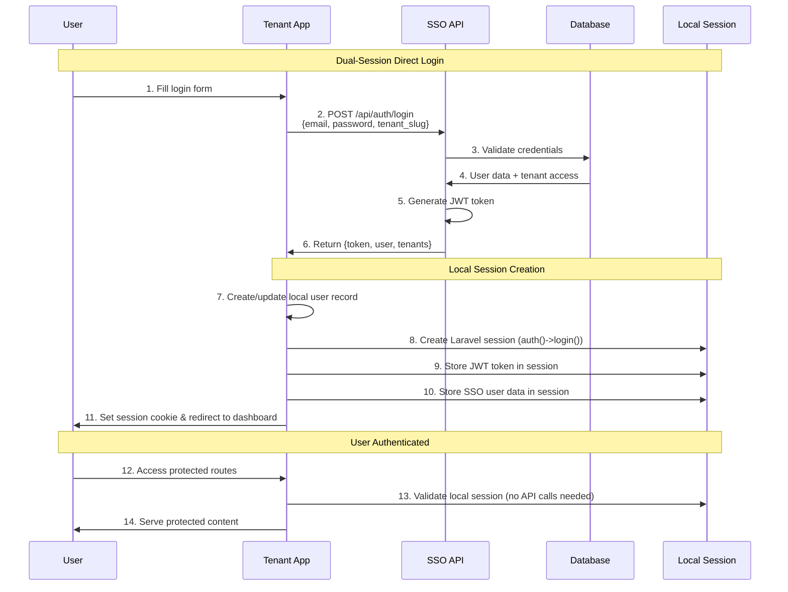

# Dual-Session Architecture

## Overview

The SSO system implements a **dual-session architecture** that combines the benefits of centralized authentication with local session management. This architecture allows users to login directly to tenant applications while maintaining centralized credential validation and user management.

## Architecture Components

### 🏗️ System Design

```
┌─────────────────────────────────────────────────────────────────┐
│                    Dual-Session Architecture                    │
├─────────────────────────────────────────────────────────────────┤
│                                                                 │
│  Direct Login  →  Central SSO API  →  Local Session Creation    │
│      ↓               ↓                      ↓                   │
│  User Form     →  JWT + User Data   →  Laravel Auth System      │
│                                                                 │
└─────────────────────────────────────────────────────────────────┘

    Tenant App                           Central SSO
┌─────────────────┐     API Call      ┌─────────────────┐
│                 │ ←──────────────── │                 │
│ ┌─────────────┐ │                   │ ┌─────────────┐ │
│ │ Login Form  │ │     Response      │ │ JWT Service │ │
│ └─────────────┘ │ ──────────────→   │ └─────────────┘ │
│       ↓         │                   │                 │
│ ┌─────────────┐ │                   │ ┌─────────────┐ │
│ │Local Session│ │                   │ │User Validator│ │
│ │+ JWT Token  │ │                   │ │             │ │
│ │+ SSO Data   │ │                   │ └─────────────┘ │
│ └─────────────┘ │                   │                 │
└─────────────────┘                   └─────────────────┘
```

## Authentication Flow

### 🔄 Direct Login Process



## Session Management

### 🔧 Session Data Structure

```php
// Laravel Session Storage
session([
    // Standard Laravel Auth
    '_token' => 'CSRF_TOKEN',
    'login_web_AUTH_ID' => 123,  // Local user ID
    'login_web_AUTH_PASSWORD_HASH' => 'hash',
    
    // SSO Integration Data
    'jwt_token' => 'eyJ0eXAiOiJKV1QiLCJhbGciOiJIUzI1NiJ9...',
    'sso_user_data' => [
        'id' => 25,           // Central SSO user ID
        'name' => 'Super Admin',
        'email' => 'superadmin@sso.com',
        'tenants' => ['tenant1', 'tenant2'],
        'current_tenant' => 'tenant1',
        'is_admin' => true
    ]
]);
```

### Session Usage Patterns

#### Protected Route Access
```php
// In tenant app controllers
public function dashboard()
{
    $localUser = auth()->user();  // Laravel session user
    $ssoData = session('sso_user_data');  // Rich SSO data
    
    return view('dashboard', [
        'user' => $localUser,
        'tenants' => $ssoData['tenants'] ?? [],
        'is_admin' => $ssoData['is_admin'] ?? false
    ]);
}
```

#### API Calls to Central SSO (if needed)
```php
// Use stored JWT for API calls
$token = session('jwt_token');
$response = Http::withToken($token)
    ->get(config('app.central_sso_url') . '/api/user/profile');
```

## Implementation Benefits

### 🚀 Performance Benefits

- **Reduced API Calls**: Authentication happens once, subsequent requests use local session
- **Fast Route Access**: No API validation needed for protected routes after login
- **Cached User Data**: Rich user information available without API calls
- **Independent Operation**: Tenant apps work even if central SSO is temporarily unavailable

### 🔒 Security Benefits

- **Centralized Credentials**: All passwords validated by central SSO
- **Consistent Security**: Same security standards across all applications
- **Token Security**: JWT tokens stored in secure HTTP-only session cookies
- **Audit Trail**: All authentications logged in central audit system

### 👩‍💻 Developer Benefits

- **Familiar Laravel Auth**: Standard `auth()->user()` works as expected
- **Rich User Data**: Access to both local and central SSO information
- **Clear Separation**: Authentication (central) vs. authorization (local) clearly separated
- **Easy Integration**: Minimal changes needed to existing Laravel applications

### 👤 User Benefits

- **Seamless Experience**: No difference between login methods from user perspective
- **Consistent Access**: Same credentials work across all tenant applications
- **Fast Loading**: Local sessions provide fast access to protected content
- **Flexible Options**: Can choose between direct login or SSO redirect

## Technical Implementation

### 🔧 Core Components

#### 1. SSOService (Tenant Apps)
```php
class SSOService
{
    public function login($email, $password, $tenantSlug)
    {
        // Make API call to central SSO
        $response = Http::post($this->centralSSOUrl . '/api/auth/login', [
            'email' => $email,
            'password' => $password,
            'tenant_slug' => $tenantSlug
        ]);
        
        return $response->json();
    }
}
```

#### 2. AuthController (Tenant Apps)
```php
class AuthController extends Controller
{
    public function login(Request $request)
    {
        // Always authenticate through central SSO
        $result = $this->ssoService->login(
            $request->email,
            $request->password,
            env('TENANT_SLUG')
        );

        if ($result['success']) {
            // Create/update local user
            $localUser = User::updateOrCreate(
                ['email' => $result['user']['email']],
                [
                    'name' => $result['user']['name'],
                    'sso_user_id' => $result['user']['id'],
                ]
            );
            
            // Create local session
            auth()->login($localUser);
            session(['jwt_token' => $result['token']]);
            session(['sso_user_data' => $result['user']]);
            
            return redirect('/dashboard');
        }
        
        return back()->withErrors(['email' => $result['message']]);
    }
}
```

#### 3. User Synchronization
```php
// Automatic user sync on every login
$localUser = User::updateOrCreate(
    ['email' => $ssoUser['email']],
    [
        'name' => $ssoUser['name'],
        'sso_user_id' => $ssoUser['id'],
        'password' => bcrypt(Str::random(32)), // Random - not used
    ]
);
```

## Migration from Other Architectures

### From Password Sync Architecture
- **Before**: Local passwords synced with central SSO
- **After**: No local passwords, all authentication via API
- **Benefits**: Eliminates password sync complexity, ensures consistency

### From Pure API Architecture
- **Before**: Every request validates token with central SSO
- **After**: Authentication once, local sessions for subsequent requests
- **Benefits**: Better performance, reduced API load

### From Local-Only Authentication
- **Before**: Each tenant manages its own users and passwords
- **After**: Centralized user management with local sessions
- **Benefits**: Single source of truth, consistent security

## Audit and Monitoring

### 📊 Authentication Tracking

All authentications are tracked in the central audit system:

```sql
-- Login audit record for dual-session authentication
INSERT INTO login_audits (
    user_id,        -- Central SSO user ID
    tenant_id,      -- Tenant slug (e.g., 'tenant1')
    login_method,   -- 'api' for dual-session direct login
    is_successful,  -- true/false
    ip_address,     -- User's IP
    user_agent,     -- Browser info
    login_at        -- Timestamp
) VALUES (25, 'tenant1', 'api', 1, '127.0.0.1', 'Mozilla/5.0...', NOW());
```

### Monitoring Dashboard

Access authentication analytics at `http://localhost:8000/admin/analytics`:
- **Real-time Statistics**: Active users, today's logins, session counts
- **Authentication Methods**: Breakdown of direct vs. SSO vs. API logins
- **Tenant Activity**: Login distribution across tenant applications
- **User Patterns**: Individual user authentication history

## Troubleshooting

### Common Issues

#### Issue: Direct login not working
**Cause**: SSOService not configured properly
**Solution**: 
```bash
# Check environment variables
docker exec tenant1-app php artisan tinker
>>> config('app.central_sso_url')
>>> config('app.tenant_slug')
```

#### Issue: User data not syncing
**Cause**: Local user creation failing
**Solution**: Check tenant app logs and user table structure

#### Issue: Session not persisting
**Cause**: Laravel session configuration
**Solution**: 
```bash
# Check session configuration
docker exec tenant1-app php artisan config:cache
docker exec tenant1-app php artisan session:table  # if using database sessions
```

### Debugging Tools

#### Laravel Telescope
- **URL**: `http://localhost:8001/telescope` (for tenant1)
- Monitor API calls to central SSO
- Debug session creation and storage
- Track user authentication flow

#### Central SSO Logs
```bash
# View authentication API calls
docker exec central-sso tail -f storage/logs/laravel.log | grep "auth/login"
```

#### Database Queries
```sql
-- Check recent authentication events
SELECT user_id, tenant_id, login_method, is_successful, login_at 
FROM login_audits 
WHERE tenant_id = 'tenant1' 
ORDER BY login_at DESC 
LIMIT 10;

-- Check user-tenant relationships
SELECT u.email, tu.tenant_id 
FROM users u 
JOIN tenant_users tu ON u.id = tu.user_id 
WHERE u.email = 'superadmin@sso.com';
```

## Best Practices

### 🎯 Implementation Guidelines

1. **Always Use API Authentication**: Never bypass central SSO for credential validation
2. **Sync User Data**: Update local user records on every authentication
3. **Store Rich Data**: Cache SSO user data for UI personalization
4. **Handle Failures Gracefully**: Provide clear error messages for authentication failures
5. **Audit Everything**: Ensure all authentication events are logged

### Security Considerations

1. **JWT Storage**: Store tokens in secure session cookies, not localStorage
2. **Session Timeout**: Implement appropriate session lifetime limits
3. **Token Validation**: Validate stored JWT tokens before using for API calls
4. **User Data Privacy**: Only cache necessary user data in sessions
5. **Logout Cleanup**: Clear all session data on logout

### Performance Optimization

1. **Minimize API Calls**: Use cached session data when possible
2. **Efficient User Sync**: Only update changed user fields
3. **Session Management**: Use appropriate session drivers (Redis for scale)
4. **Database Optimization**: Index frequently queried columns
5. **Connection Pooling**: Optimize database connections for API calls

## Future Enhancements

### Potential Improvements

1. **Token Refresh**: Implement automatic JWT token refresh
2. **Session Sharing**: Enable session sharing across tenant applications
3. **Offline Mode**: Enhanced offline capabilities with cached credentials
4. **Advanced Caching**: Redis-based user data caching
5. **Health Monitoring**: Automated monitoring of SSO API availability

### Scalability Considerations

1. **Load Balancing**: Distribute authentication load across multiple SSO instances
2. **Database Sharding**: Separate user data by tenant for large deployments
3. **Caching Layers**: Implement multi-tier caching for user data
4. **API Rate Limiting**: Protect central SSO from excessive authentication requests
5. **Geographic Distribution**: Deploy SSO instances closer to tenant applications