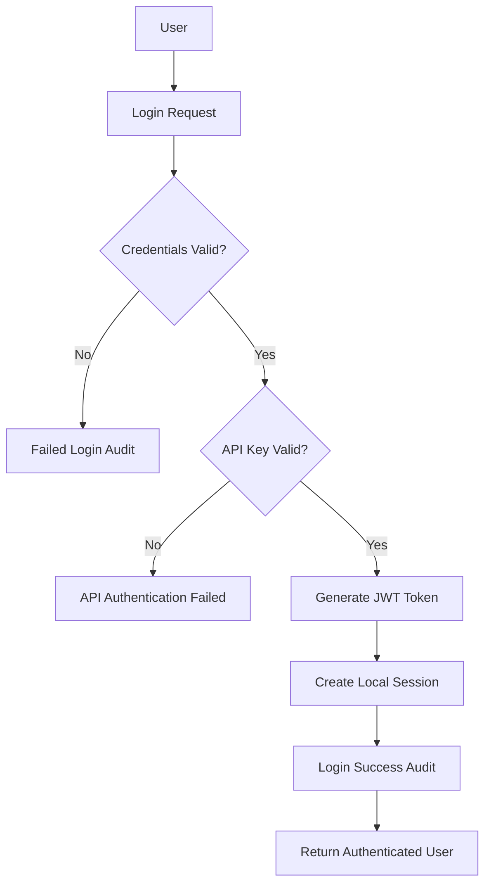

# Security Architecture Guide

This document provides a comprehensive overview of the security architecture implemented in the SSO proof of concept system.

## Table of Contents

1. [Security Overview](#security-overview)
2. [Authentication & Authorization](#authentication--authorization)
3. [Network Security](#network-security)
4. [API Security](#api-security)
5. [Database Security](#database-security)
6. [Request Security](#request-security)
7. [Monitoring & Audit](#monitoring--audit)
8. [Configuration Management](#configuration-management)
9. [Threat Model](#threat-model)
10. [Security Controls Matrix](#security-controls-matrix)

## Security Overview

The SSO system implements a defense-in-depth security model with multiple layers of protection:

```
┌─────────────────────────────────────────────────────────────┐
│                    Client Applications                      │
└─────────────────────┬───────────────────────────────────────┘
                      │ HTTPS/TLS 1.2+
┌─────────────────────┴───────────────────────────────────────┐
│                   Load Balancer/Proxy                      │
│              (Rate Limiting, WAF, SSL)                     │
└─────────────────────┬───────────────────────────────────────┘
                      │ Encrypted Internal Network
┌─────────────────────┴───────────────────────────────────────┐
│                     API Gateway                            │
│         (Authentication, Rate Limiting, Logging)           │
└─────────────────────┬───────────────────────────────────────┘
                      │ API Key + HMAC Signed Requests
┌─────────────────────┴───────────────────────────────────────┐
│                  Application Layer                         │
│     (Central SSO + Tenant Apps with JWT + Session)         │
└─────────────────────┬───────────────────────────────────────┘
                      │ Encrypted DB Connection
┌─────────────────────┴───────────────────────────────────────┐
│                   Database Layer                           │
│              (SSL, User Isolation, Audit)                  │
└─────────────────────────────────────────────────────────────┘
```

### Security Principles

1. **Zero Trust Architecture**: No implicit trust between components
2. **Least Privilege**: Minimal permissions for all operations
3. **Defense in Depth**: Multiple security layers
4. **Fail Secure**: Secure defaults and error handling
5. **Auditability**: Comprehensive logging and monitoring

## Authentication & Authorization

### Multi-Factor Authentication Architecture



### JWT Token Security

- **Algorithm**: HS256 (HMAC with SHA-256)
- **Expiry**: 1 hour (configurable)
- **Claims**: User ID, tenant access, role data
- **Refresh**: Automatic refresh on activity
- **Validation**: Signature and expiry checking

### Session Management

- **Storage**: Database-backed sessions
- **Security**: HTTP-only, Secure, SameSite=Strict
- **Timeout**: 2 hours of inactivity
- **Regeneration**: On privilege escalation

## Network Security

### SSL/TLS Configuration

```yaml
SSL Configuration:
  Protocol: TLS 1.2+
  Cipher Suites: ECDHE+AESGCM:ECDHE+CHACHA20:DHE+AESGCM
  Certificate Validation: Strict
  HSTS: max-age=31536000; includeSubDomains
  Certificate Pinning: Implemented for API calls
```

### Network Isolation

- **Docker Networks**: Isolated bridge networks
- **Service Discovery**: Internal DNS resolution
- **Port Exposure**: Minimal external ports (80, 443, 3306)
- **Firewall Rules**: Container-level network policies

## API Security

### API Key Authentication

```
API Key Format: {tenant}_{40_char_hash}
Storage: Environment variables
Validation: HMAC-SHA256 verification
Scope: Tenant-specific permissions
Rotation: Manual (documented procedure)
```

### Request Signing (HMAC)

```javascript
// Canonical Request Format
canonical_request = 
    HTTP_METHOD + "\n" +
    URI_PATH + "\n" +
    "" + "\n" +  // Query string (empty)
    canonical_headers + "\n" +
    signed_headers + "\n" +
    hex(sha256(body))

signature = hex(hmac_sha256(hmac_secret, canonical_request))
```

#### Signed Headers
- `content-type`
- `x-timestamp`
- `x-tenant-id`
- `x-request-id`

#### Security Features
- **Timestamp Validation**: 5-minute window
- **Replay Protection**: Request ID uniqueness
- **Body Integrity**: SHA256 body hash
- **Algorithm Agility**: Configurable HMAC algorithm

### Rate Limiting

```yaml
Default Limits:
  Authentication: 10 requests/minute
  API Calls: 60 requests/minute
  Audit Endpoints: 100 requests/minute

Tenant-Specific Limits:
  Tenant1: 100 requests/minute
  Tenant2: 80 requests/minute

Rate Limiting Strategies:
  - IP-based limiting
  - API key-based limiting
  - Sliding window algorithm
  - Redis-backed counters
```

## Database Security

### Connection Security

```yaml
Database Configuration:
  SSL/TLS: Required
  Certificate Validation: Enabled
  Connection Encryption: AES-256
  Authentication: Certificate + Password
  
Security Settings:
  bind-address: 0.0.0.0 (Docker network only)
  require-secure-transport: ON
  local-infile: OFF
  skip-show-database: ON
```

### Access Control

- **User Isolation**: Separate database users per application
- **Privilege Limitation**: Minimal required permissions
- **Connection Pooling**: Limited concurrent connections
- **Query Monitoring**: Slow query logging enabled

### Data Protection

- **Encryption at Rest**: InnoDB table encryption
- **Password Hashing**: Bcrypt with 12 rounds
- **Sensitive Data**: Encrypted in transit and at rest
- **PII Handling**: Minimal data collection and retention

## Request Security

### Request ID Tracking

Every request receives a unique identifier for audit trails:

```
Format: req_YYYYMMDD_HHMMSS_UUID_RANDOM
Example: req_20241216_143052_f47ac10b-58cc-4372-a567-0e02b2c3d479_a1b2c3d4
```

### Security Headers

```yaml
Response Headers:
  X-Content-Type-Options: nosniff
  X-Frame-Options: DENY
  X-XSS-Protection: 1; mode=block
  Strict-Transport-Security: max-age=31536000; includeSubDomains
  Referrer-Policy: strict-origin-when-cross-origin
  Content-Security-Policy: default-src 'none'; frame-ancestors 'none'
```

### Input Validation

- **Request Size Limits**: 16MB maximum
- **Content Type Validation**: JSON/form data only
- **Parameter Sanitization**: SQL injection protection
- **CSRF Protection**: Token-based validation

## Monitoring & Audit

### Comprehensive Audit Logging

```yaml
Audit Events:
  - Authentication attempts (success/failure)
  - API key usage and failures
  - Rate limit violations
  - Request signature failures
  - Privilege escalations
  - Data access patterns
  - Administrative actions
```

### Security Event Structure

```json
{
  "timestamp": "2024-12-16T14:30:52Z",
  "request_id": "req_20241216_143052_...",
  "event_type": "authentication_failure",
  "severity": "warning",
  "source_ip": "192.168.1.100",
  "user_agent": "Mozilla/5.0...",
  "user_id": null,
  "tenant_id": "tenant1",
  "details": {
    "reason": "invalid_credentials",
    "attempts_count": 3,
    "locked_until": null
  },
  "metadata": {
    "api_version": "v1",
    "environment": "production"
  }
}
```

### Real-Time Monitoring

- **Failed Authentication Tracking**: 10 attempts in 15 minutes = 1 hour block
- **Rate Limit Monitoring**: Real-time violation alerts
- **Anomaly Detection**: Unusual access patterns
- **Performance Monitoring**: Response time tracking

## Configuration Management

### Environment Configuration

```yaml
Security Configuration Hierarchy:
  1. Environment Variables (highest priority)
  2. Configuration Files (.env.security)
  3. Application Defaults (lowest priority)

Secret Management:
  - API Keys: Environment variables only
  - Database Passwords: Docker secrets
  - SSL Certificates: Mounted volumes
  - HMAC Secrets: Environment variables
```

### Configuration Validation

```php
// Security Configuration Validation
$required_security_configs = [
    'TENANT1_API_KEY',
    'TENANT2_API_KEY', 
    'HMAC_SECRET',
    'JWT_SECRET',
    'SSL_VERIFY'
];

foreach ($required_security_configs as $config) {
    if (empty(env($config))) {
        throw new SecurityConfigurationException("Missing: $config");
    }
}
```

## Threat Model

### Identified Threats and Mitigations

| Threat | Severity | Mitigation | Status |
|--------|----------|------------|---------|
| **Authentication Bypass** | High | Multi-factor auth, JWT validation, API keys | ✅ Implemented |
| **Session Hijacking** | High | HTTPS only, secure cookies, session regeneration | ✅ Implemented |
| **Man-in-the-Middle** | High | TLS 1.2+, certificate pinning, HSTS | ✅ Implemented |
| **API Replay Attacks** | Medium | Request signatures, timestamps, nonces | ✅ Implemented |
| **Rate Limit Bypass** | Medium | Multi-layer rate limiting, IP + API key | ✅ Implemented |
| **SQL Injection** | High | Parameterized queries, input validation | ✅ Implemented |
| **XSS Attacks** | Medium | CSP headers, input sanitization | ✅ Implemented |
| **CSRF Attacks** | Medium | CSRF tokens, SameSite cookies | ✅ Implemented |
| **Information Disclosure** | Low | Minimal error messages, log sanitization | ✅ Implemented |
| **Privilege Escalation** | High | Role-based access, permission validation | ✅ Implemented |

### Attack Scenarios

#### Scenario 1: Malicious Tenant Application
**Attack**: Compromised tenant app attempts to access other tenant data
**Mitigation**: 
- API key validation limits access to specific tenant
- JWT tokens include tenant-specific claims
- Database-level tenant isolation

#### Scenario 2: API Key Compromise
**Attack**: Stolen API key used for unauthorized access
**Mitigation**: 
- Request signing prevents key-only access
- Rate limiting reduces impact
- Audit logging detects unusual patterns
- API key rotation procedures

#### Scenario 3: Network Eavesdropping
**Attack**: Attacker intercepts network traffic
**Mitigation**: 
- TLS encryption for all communications
- Certificate validation
- No sensitive data in URLs

## Security Controls Matrix

### Authentication Controls

| Control | Implementation | Testing | Monitoring |
|---------|---------------|---------|------------|
| **Multi-Factor Auth** | JWT + Session + API Key | ✅ Unit tests | Login audit logs |
| **Password Policy** | Bcrypt, 8+ chars, complexity | ✅ Automated | Failed attempts |
| **Session Management** | DB storage, HTTP-only | ✅ Integration tests | Session analytics |
| **Token Validation** | Signature + expiry check | ✅ API tests | Token usage logs |

### Network Controls

| Control | Implementation | Testing | Monitoring |
|---------|---------------|---------|------------|
| **TLS Encryption** | TLS 1.2+, strong ciphers | ✅ SSL tests | Certificate expiry |
| **Certificate Validation** | Strict validation | ✅ Connection tests | SSL handshake logs |
| **Network Isolation** | Docker networks | ✅ Network tests | Traffic analysis |
| **Port Security** | Minimal exposure | ✅ Port scans | Open port monitoring |

### Application Controls

| Control | Implementation | Testing | Monitoring |
|---------|---------------|---------|------------|
| **Input Validation** | Type checking, sanitization | ✅ Fuzz testing | Validation failures |
| **Output Encoding** | Context-aware encoding | ✅ XSS tests | Error responses |
| **Error Handling** | Generic error messages | ✅ Error tests | Error frequency |
| **Audit Logging** | Comprehensive event logging | ✅ Log tests | Audit completeness |

### Infrastructure Controls

| Control | Implementation | Testing | Monitoring |
|---------|---------------|---------|------------|
| **Access Control** | RBAC, least privilege | ✅ Permission tests | Access violations |
| **Rate Limiting** | Multi-layer limiting | ✅ Load tests | Rate limit hits |
| **Backup Security** | Encrypted backups | ✅ Restore tests | Backup integrity |
| **Update Management** | Automated security updates | ✅ Vulnerability scans | Patch status |

## Implementation Phases

### Phase 1: Critical Security (✅ Completed)
- API key authentication
- HTTPS/TLS implementation
- HMAC request signing
- Basic rate limiting
- SSL certificate generation

### Phase 2: Enhanced Security (✅ Completed)
- Advanced rate limiting
- Database security hardening
- Request ID tracking
- Comprehensive audit logging
- Backup and recovery procedures

### Phase 3: Advanced Security (📋 Documented for Future)
- Real-time threat detection
- Advanced intrusion detection
- Automated incident response
- Compliance reporting
- Third-party security integrations

## Security Testing Strategy

### Automated Security Testing

```yaml
Security Test Suite:
  - API authentication tests
  - Rate limiting verification
  - SSL/TLS configuration tests
  - Input validation tests
  - Session security tests
  - RBAC permission tests
  - Audit logging verification
```

### Manual Security Testing

```yaml
Penetration Testing Areas:
  - Authentication bypass attempts
  - Session manipulation
  - API fuzzing
  - Network reconnaissance
  - Social engineering simulation
```

### Compliance Validation

```yaml
Security Frameworks:
  - OWASP Top 10
  - NIST Cybersecurity Framework
  - ISO 27001 controls
  - SOC 2 Type II requirements
```

## Security Maintenance

### Regular Security Tasks

```yaml
Daily:
  - Review audit logs
  - Monitor rate limit violations
  - Check SSL certificate status

Weekly:
  - Analyze authentication patterns
  - Review failed login attempts
  - Update threat intelligence

Monthly:
  - Rotate API keys
  - Review user permissions
  - Update security documentation
  - Conduct security training

Quarterly:
  - Penetration testing
  - Security architecture review
  - Compliance assessment
  - Incident response testing
```

### Emergency Procedures

#### Security Incident Response

1. **Detection**: Automated alerts + manual review
2. **Assessment**: Impact and scope analysis
3. **Containment**: Isolate affected systems
4. **Eradication**: Remove threat and vulnerabilities
5. **Recovery**: Restore normal operations
6. **Lessons Learned**: Post-incident review

#### API Key Compromise

1. Immediately revoke compromised key
2. Generate new API key
3. Update tenant application configuration
4. Review audit logs for unauthorized access
5. Notify affected parties
6. Document incident

## Conclusion

This security architecture provides comprehensive protection for the SSO system through multiple layers of security controls. The implementation follows industry best practices and provides defense against common attack vectors while maintaining usability and performance.

Regular security reviews and updates ensure the architecture remains effective against evolving threats. The modular design allows for incremental security improvements and adaptation to new requirements.

For questions or security concerns, refer to the incident response procedures or contact the security team.