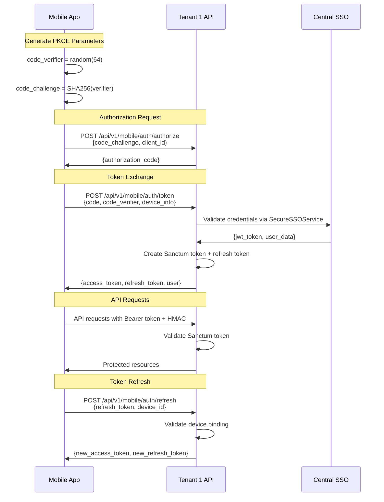

# 📱 Tenant 1 Mobile API Documentation

## Overview

This documentation covers the secure implementation of Tenant 1's mobile API that enables native mobile applications (iOS, Android, React Native) to authenticate and interact with tenant-specific resources. The system implements OAuth 2.0 with PKCE, Laravel Sanctum for token management, and multi-layer security without the complexity of certificate pinning.

## Architecture

```
┌─────────────────────────────────────────────────────────────┐
│                     Mobile Applications                      │
├─────────────────────────────────────────────────────────────┤
│ • iOS App (Swift)                                           │
│ • Android App (Kotlin/Java)                                │
│ • React Native App (TypeScript/JavaScript)                 │
└────────────────┬───────────────────────────────────────────┘
                 │ HTTPS + HMAC Signing
                 ▼
┌─────────────────────────────────────────────────────────────┐
│              Tenant 1 Mobile API Gateway                    │
├─────────────────────────────────────────────────────────────┤
│ • OAuth 2.0 + PKCE Authorization                           │
│ • Laravel Sanctum Token Management                         │
│ • Request Signing (HMAC-SHA256)                           │
│ • Rate Limiting & Device Binding                          │
│ • Mobile Security Middleware                               │
└────────────────┬───────────────────────────────────────────┘
                 │ SecureSSOService
                 ▼
┌─────────────────────────────────────────────────────────────┐
│                  Central SSO Server                         │
├─────────────────────────────────────────────────────────────┤
│ • User Authentication Validation                           │
│ • JWT Token Generation                                     │
│ • Audit Logging                                           │
│ • Multi-Tenant User Management                             │
└─────────────────────────────────────────────────────────────┘
```

## Key Features

### 🔐 Security Without Complexity
- **OAuth 2.0 with PKCE**: Industry-standard mobile authentication
- **HMAC Request Signing**: Prevents tampering and replay attacks
- **Device Binding**: Tokens are bound to specific devices
- **No Certificate Pinning**: Simplified operations while maintaining security
- **Laravel Sanctum**: Simple yet secure token management

### 📱 Mobile-Optimized
- **Device Registration**: Automatic device tracking and management
- **Fingerprinting**: Additional layer of device validation
- **Secure Storage**: Integration with iOS Keychain and Android Keystore
- **Push Notifications**: Token-based notification delivery
- **Offline Support**: Long-lived refresh tokens for seamless experience

### 🚀 Production Ready
- **Rate Limiting**: Protection against abuse and DoS attacks
- **Monitoring**: Comprehensive metrics and audit logging
- **Jailbreak/Root Detection**: Security warnings for compromised devices
- **Version Management**: Support for multiple app versions
- **Graceful Degradation**: Fallback options for various scenarios

## Authentication Flow



## Quick Start

### 1. Backend Setup
```bash
# Install dependencies in tenant1-app
composer require laravel/sanctum
composer require firebase/php-jwt

# Run migrations
php artisan migrate

# Configure environment
echo "MOBILE_API_ENABLED=true" >> .env
echo "MOBILE_HMAC_SECRET=$(openssl rand -hex 32)" >> .env
```

### 2. Mobile Implementation
Choose your platform:
- [📱 iOS Implementation](client-sdks/ios-implementation.md)
- [🤖 Android Implementation](client-sdks/android-implementation.md)
- [⚛️ React Native Implementation](client-sdks/react-native-implementation.md)

### 3. Test the Integration
```bash
# Test authorization endpoint
curl -X POST https://tenant1.example.com/api/v1/mobile/auth/authorize \
  -H "Content-Type: application/json" \
  -d '{"client_id":"mobile_app","code_challenge":"xyz123","code_challenge_method":"S256"}'
```

## Documentation Structure

### Implementation Guides
- [📖 Implementation Guide](implementation-guide.md) - Backend setup with Laravel Sanctum
- [🔒 Security Configuration](security-configuration.md) - Security setup without cert pinning
- [📋 API Reference](api-reference.md) - Complete endpoint documentation

### Client SDKs
- [🍎 iOS Implementation](client-sdks/ios-implementation.md) - Swift with Keychain integration
- [🤖 Android Implementation](client-sdks/android-implementation.md) - Kotlin with secure storage
- [⚛️ React Native Implementation](client-sdks/react-native-implementation.md) - TypeScript with cross-platform security

### Operations
- [🧪 Testing Guide](testing-guide.md) - Unit and integration testing
- [📊 Monitoring & Analytics](monitoring-and-analytics.md) - Metrics and dashboards
- [🚀 Deployment Checklist](deployment-checklist.md) - Production deployment

## API Endpoints Overview

### Authentication
```
POST /api/v1/mobile/auth/authorize    - Generate authorization code
POST /api/v1/mobile/auth/token       - Exchange code for tokens
POST /api/v1/mobile/auth/refresh     - Refresh access token
POST /api/v1/mobile/auth/login       - Direct login (alternative)
POST /api/v1/mobile/auth/logout      - Revoke tokens
```

### Protected Resources
```
GET  /api/v1/mobile/profile          - User profile
PUT  /api/v1/mobile/profile          - Update profile
GET  /api/v1/mobile/devices          - List registered devices
DELETE /api/v1/mobile/devices/{id}   - Revoke device
```

## Security Highlights

### Multi-Layer Defense
1. **Transport Security**: HTTPS with strong TLS configuration
2. **Request Integrity**: HMAC-SHA256 signatures prevent tampering
3. **Replay Protection**: Timestamp validation with 5-minute tolerance
4. **Device Binding**: Tokens tied to specific device fingerprints
5. **Rate Limiting**: Graduated limits by IP, device, and endpoint
6. **Token Security**: Short-lived access tokens (30 min) with secure refresh

### Why No Certificate Pinning?
- **Operational Simplicity**: No certificate rotation headaches
- **User Experience**: No app lockouts during cert changes
- **Equivalent Security**: HMAC signing provides similar protection
- **Maintenance Burden**: Reduced operational complexity
- **Corporate Friendly**: Works with enterprise proxy setups

## Environment Requirements

### Backend
- Laravel 11+
- PHP 8.2+
- MariaDB/MySQL 8.0+
- Redis (optional, for caching)

### Mobile
- iOS 14+ (Xcode 12+)
- Android API 24+ (Android 7.0+)
- React Native 0.70+
- Flutter 3.0+

## Getting Help

### Common Issues
- [🔧 Troubleshooting](../troubleshooting/quick-reference-csrf-fix.md)
- [📖 Main Documentation](../README.md)
- [🏗️ Architecture Guide](../architecture/README.md)

### Support
For implementation questions or issues:
1. Check the troubleshooting guide
2. Review the API reference
3. Examine the client SDK examples
4. Test with the provided code samples

---

**Next Steps**: Start with the [Implementation Guide](implementation-guide.md) to set up your backend, then proceed to the appropriate client SDK documentation for your mobile platform.